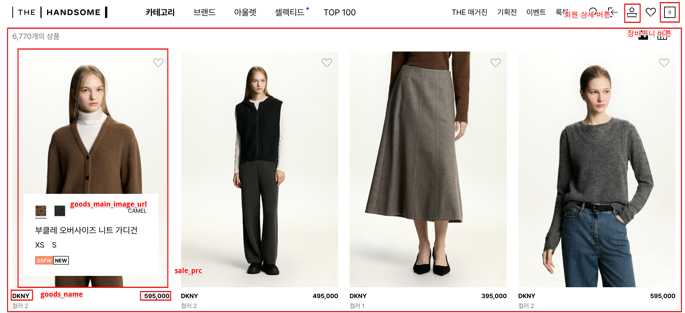
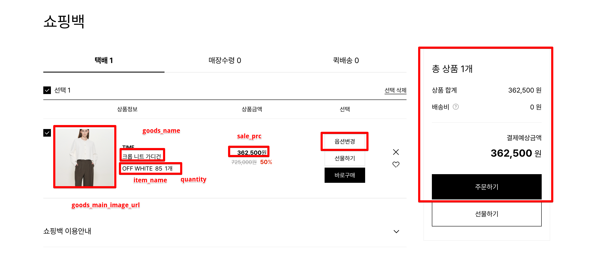
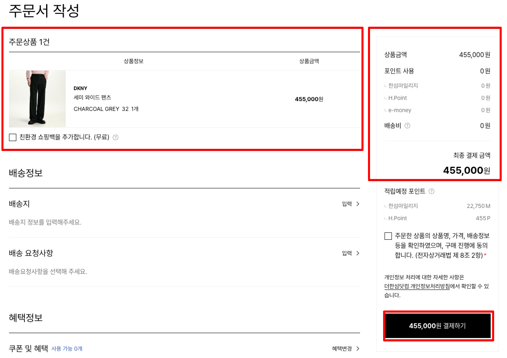
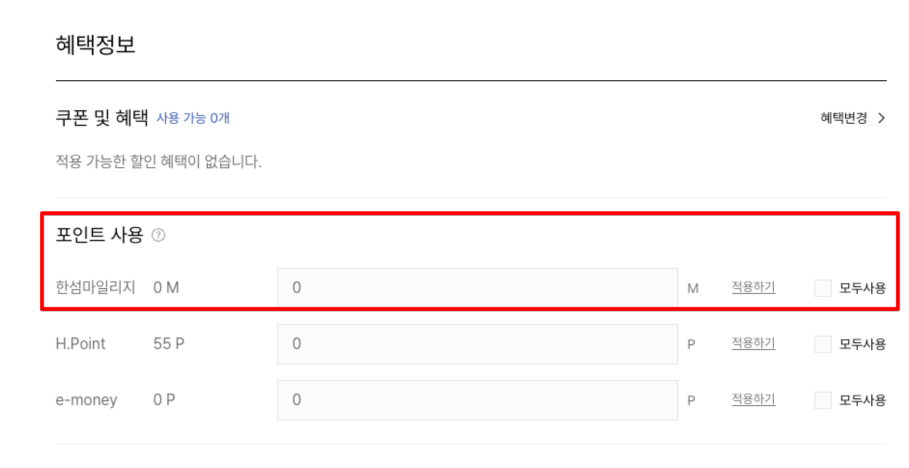
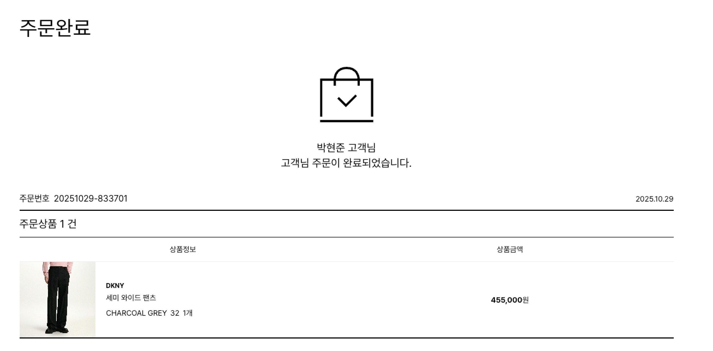
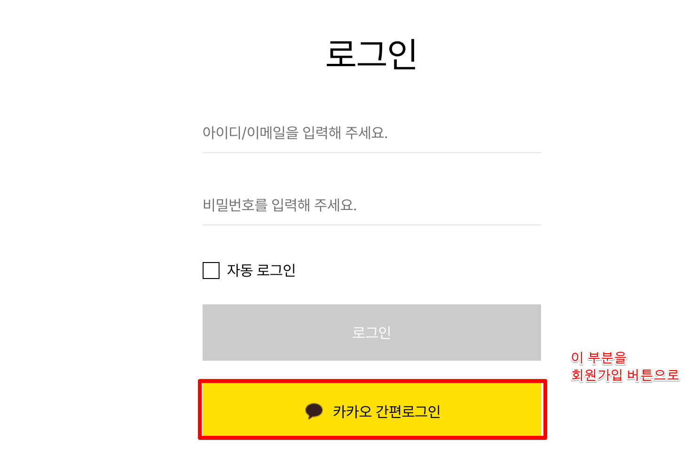
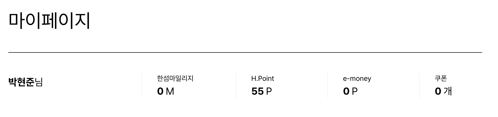
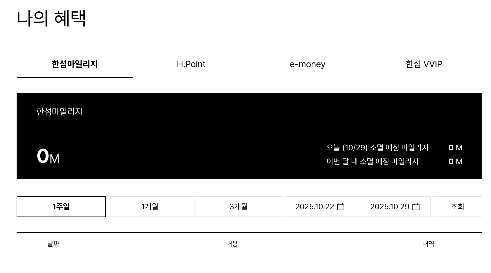

| 메인 화면 | 장바구니버튼클릭 | 장바구니 화면 | 주문하기버튼클릭 | 주문서 화면 | 결제하기 버튼 클릭 | PG 결제, 주문 성공 | 주문완료 화면 | 이어서 쇼핑하기 클릭 | 메인 화면 |
| --- | --- | --- | --- | --- | --- | --- | --- | --- | --- |
|  |  |  |  |  |  |  |  | 주문목록 클릭 | 회원상세 화면 |
|  |  |  |  |  |  | PG 결제, 주문 실패 | 주문실패 화면 | 주문실패모달 | 장바구니 화면 |
|  | 회원상세버튼 클릭 | 로그인상태 | 회원상세 화면 |  |  |  |  |  |  |
|  |  | 비로그인인상태 | 로그인 화면 | 회원가입버튼 클릭 | 회원가면 화면 |  |  |  |  |
|  |  |  |  | 로그릭 버튼클릭 | 로그인 성공 | 회원상세 화면 |  |  |  |
|  |  |  |  |  | 로그인 실패 | 로그인 화면 |  |  |  |

### 메인화면
상품 목록 노출

### 장바구니 화면

### 주문서 화면

### 주문완료 화면

### 로그인 화면

### 회원가입 화면
로그인 화면과 비슷한 UI 로.

### 회원상세 화면

위 3개의 화면이 한 화면에 순차적으로 있는 느낌으로.
