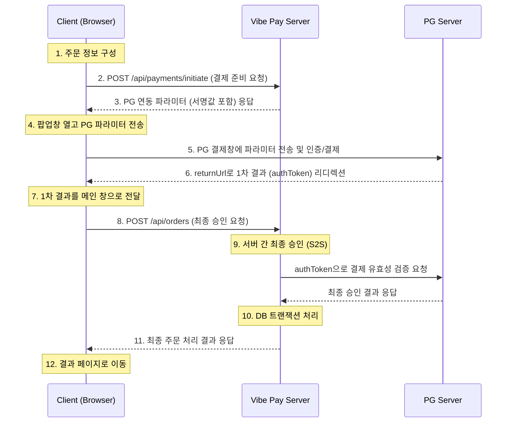

# Vibe Pay 기술 설계 명세서 (The Technical Blueprint)

이 문서는 Vibe Pay 프로젝트의 클라이언트와 서버를 구현하는 모든 개발자를 위한 최종 기술 설계 명세서입니다. 이 문서는 특정 기술 스택에 종속되지 않으며, 명세된 규약과 로직을 따르면 Vibe Pay의 결제 기능을 동일하게 구현할 수 있습니다.

---

## Part 1: 시스템 아키텍처 및 데이터 흐름

결제 프로세스는 **Client (Browser)**, **Vibe Pay Server (Backend)**, **PG Server (Payment Gateway)** 3개의 액터 간의 상호작용으로 구성됩니다.



---

## Part 2: 데이터베이스 스키마 (`schema.sql` 기준)

| 테이블명 | 컬럼명 | 데이터 타입 | 제약조건 | 설명 |
| :--- | :--- | :--- | :--- | :--- |
| **orders** | order_id | VARCHAR(17) | PK | 주문번호 (YYYYMMDD + O + 8자리 시퀀스) |
| | member_id | BIGINT | FK | 회원 ID |
| | status | VARCHAR(50) | NOT NULL | 주문 상태 (PAID, CANCELLED 등) |
| **payment** | payment_id | VARCHAR(17) | PK | 결제번호 (YYYYMMDD + P + 8자리 시퀀스) |
| | order_id | VARCHAR(17) | FK | 주문번호 |
| | amount | DOUBLE | NOT NULL | 결제/환불 금액 |
| | pg_company | VARCHAR(50) | | PG사 (INICIS, NICEPAY) |
| | transaction_id | VARCHAR(255) | | PG사 거래 ID (TID) |
| | status | VARCHAR(50) | NOT NULL | 결제 상태 (COMPLETED, CANCELLED) |
| | pay_type | VARCHAR(20) | PK | 트랜잭션 타입 (PAYMENT, REFUND) |
| **payment_interface_request_log** | log_id | BIGSERIAL | PK | 로그 ID |
| | payment_id | VARCHAR(17) | | 결제번호 |
| | request_type | VARCHAR(50)| NOT NULL | 요청 타입 (e.g., INICIS_AUTH, NICEPAY_CANCEL) |
| | request_payload | TEXT | | PG사에 보낸 요청 전문 |
| | response_payload| TEXT | | PG사로부터 받은 응답 전문 |

*(핵심 테이블 외 `member`, `product` 등은 생략)*

---

## Part 3: 백엔드 API 명세 및 핵심 로직

### 3.1. `POST /api/payments/initiate`

-   **설명**: 클라이언트로부터 주문 정보를 받아, 연동할 PG사를 결정하고 해당 PG사에 필요한 암호화된 파라미터를 생성하여 반환합니다.
-   **요청 본문 (Request Body)**:

| 필드명 | 타입 | 필수 | 설명 |
| :--- | :--- | :--- | :--- |
| `memberId` | Long | Y | 회원 ID |
| `amount` | Long | Y | 포인트 사용 전 총 주문 금액 |
| `usedMileage`| Long | Y | 사용할 포인트 금액 |
| `pgCompany` | String | Y | `INICIS`, `NICEPAY`, `WEIGHTED` 중 하나 |
| `goodName` | String | Y | PG 결제창에 표시될 상품명 |
| `buyerName` | String | Y | 구매자 이름 |
| `buyerTel` | String | Y | 구매자 연락처 |
| `buyerEmail` | String | Y | 구매자 이메일 |
| `orderId` | String | Y | 클라이언트에서 미리 채번한 주문번호 |

-   **핵심 로직 (의사코드)**:
    ```
    function initiatePayment(request):
      1. 요청 파라미터 유효성 검증 (금액, 회원 존재 여부 등)
      2. pgCompany가 'WEIGHTED'이면, 설정된 가중치에 따라 'INICIS' 또는 'NICEPAY'로 결정
      3. 최종 결제 금액 계산: finalAmount = request.amount - request.usedMileage
      4. PG사별 로직 분기:
         if pgCompany == 'INICIS':
           timestamp = 현재 시간
           // signature: SHA256 해시(oid + price + timestamp + secretKey)
           signature = createInicisSignature(request.orderId, finalAmount, timestamp)
           return { mid, oid, price, timestamp, signature, ... }
         if pgCompany == 'NICEPAY':
           ediDate = 현재 시간 (YYYYMMDDHHMMSS)
           // SignData: SHA256 해시(ediDate + mid + amt + secretKey)
           signData = createNicePaySignData(ediDate, mid, finalAmount)
           return { MID, Moid, Amt, EdiDate, SignData, ... }
    ```
-   **성공 응답 (200 OK)**: PG사별 요청 파라미터 객체 (JSON)

### 3.2. `POST /api/orders`

-   **설명**: PG 결제 성공 후, 서버 간 통신으로 결제를 최종 검증/승인하고, 관련 데이터를 DB에 트랜잭션으로 저장합니다.
-   **요청 본문 (Request Body)**:

| 필드명 | 타입 | 필수 | 설명 |
| :--- | :--- | :--- | :--- |
| `orderNumber`| String | Y | `initiate` 단계에서 사용된 주문번호 |
| `memberId` | Long | Y | 회원 ID |
| `items` | List | Y | 주문 상품 배열. `[{ "productId": Long, "quantity": Integer }]` |
| `netCancel` | Boolean| Y | `true`일 경우, 망취소 테스트를 위해 DB 저장을 강제 실패시킴 |
| `paymentMethods`| List | Y | 실제 결제/사용한 수단 정보 배열 |

-   **`paymentMethods` 상세**:

| 필드명 | 타입 | 필수 | 설명 |
| :--- | :--- | :--- | :--- |
| `paymentMethod`| String | Y | `POINT` 또는 `CREDIT_CARD` |
| `amount` | Long | Y | 해당 수단으로 결제/사용한 금액 |
| `pgCompany` | String | N | `CREDIT_CARD`일 경우 필수. `INICIS` 또는 `NICEPAY` |
| `authToken` | String | N | `CREDIT_CARD`일 경우 필수. PG로부터 받은 승인용 토큰 |

-   **핵심 로직 (의사코드)**:
    ```
    function createOrder(request):
      // --- 1. 서버 간 결제 검증 및 승인 (S2S) ---
      creditCardPayment = request.paymentMethods.find(p -> p.paymentMethod == 'CREDIT_CARD')
      if creditCardPayment:
        // PG사 API 명세에 따라 승인 요청 API 호출
        // 예: INICIS의 경우, authToken을 사용하여 https://iniapi.inicis.com/api/v1/payment 승인 요청
        isSuccess, pgResponse = callPgAuthApi(creditCardPayment.pgCompany, creditCardPayment.authToken)

        // 요청/응답 전체를 payment_interface_request_log 테이블에 저장
        logPgInterface(request.orderNumber, pgResponse)

        // 검증 실패 시: PG사에 즉시 취소 요청(망취소) 후 예외 발생
        if not isSuccess or pgResponse.amount != creditCardPayment.amount:
          callPgCancelApi(creditCardPayment.pgCompany, pgResponse.transactionId)
          throw new PaymentVerificationFailedException()

      // --- 2. 데이터베이스 트랜잭션 --- 
      try:
        // @Transactional 시작
        1. orders 테이블에 주문 정보 INSERT
        2. request.items를 순회하며 order_item 테이블에 INSERT
        3. request.paymentMethods를 순회하며 payment 테이블에 INSERT (POINT, CREDIT_CARD 각각)
        4. 포인트 사용 시, reward_points 테이블 UPDATE 및 point_history 테이블 INSERT

        // 망취소 테스트 로직
        if request.netCancel == true: throw new IntentionalException()

        // @Transactional 커밋
      catch (Exception e):
        // @Transactional 롤백
        // DB 저장 실패 시, 이미 승인된 PG 결제를 취소 (망취소)
        if creditCardPayment: callPgCancelApi(creditCardPayment.pgCompany, pgResponse.transactionId)
        throw new OrderCreationException()

      return 생성된 주문 정보
    ```
-   **성공 응답 (200 OK)**: `List<Order>` (생성된 주문 정보 객체 배열)

---

## Part 4: 클라이언트 구현 명세

1.  **주문 UI 구성**: 상품, 수량, 포인트 등 주문 정보를 관리할 클라이언트 상태(State)를 구현합니다.
2.  **결제 버튼 이벤트 핸들러 구현**:
    1.  `POST /api/payments/initiate`를 호출합니다.
    2.  응답으로 받은 PG 파라미터를 변수에 저장합니다.
    3.  `window.open()`으로 팝업창을 열고, `window.postMessage`로 PG 파라미터를 팝업창에 전달합니다.
    4.  `window.addEventListener('message', ...)`로 팝업창으로부터 올 결과를 수신 대기합니다.
3.  **팝업창 로직 구현**:
    1.  부모창으로부터 `message` 이벤트를 수신 대기합니다.
    2.  PG 파라미터를 받으면, 해당 PG사(Inicis/NicePay)에 맞는 HTML `<form>`을 동적으로 생성하고 파라미터를 채웁니다.
    3.  PG사의 결제 SDK JS 라이브러리(`INIStdPay.pay()` 또는 `goPay()`)를 호출하여 form을 submit합니다.
4.  **PG 리턴 처리 로직 구현**:
    1.  PG사가 리디렉션하는 `returnUrl`에 해당하는 페이지를 구현합니다.
    2.  이 페이지는 PG로부터 받은 결과 데이터(POST body 또는 URL 파라미터)를 분석합니다.
    3.  `window.postMessage`를 사용해 분석된 결과(성공/실패, `authToken` 등)를 부모창으로 전달합니다.
    4.  `window.close()`로 스스로 창을 닫습니다.
5.  **최종 처리 핸들러 구현**:
    1.  메인 창의 `message` 이벤트 리스너가 팝업으로부터 성공 결과를 수신하면, `POST /api/orders` API를 호출합니다.
    2.  API 호출 결과에 따라, 라우팅 기능으로 성공 또는 실패 페이지로 사용자를 안내합니다.