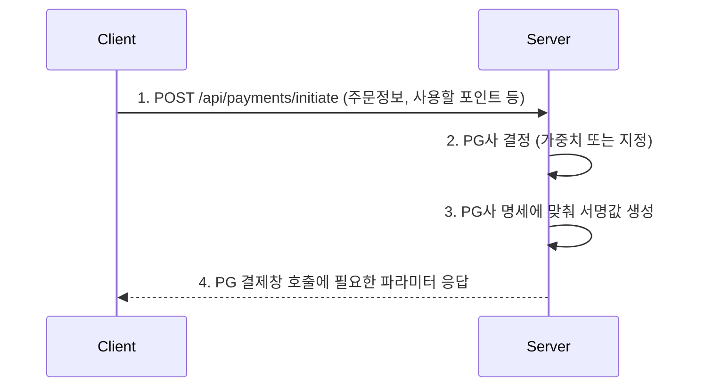
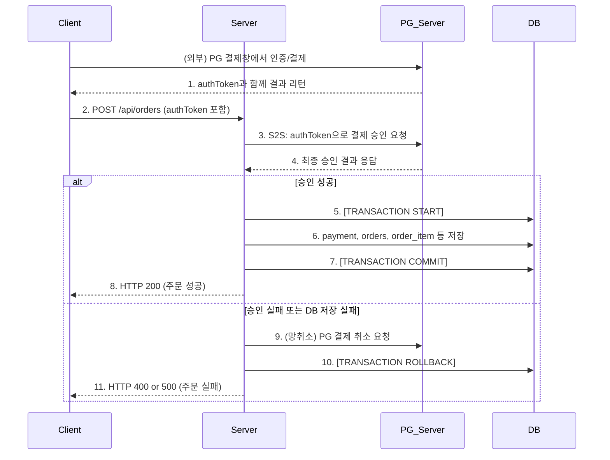
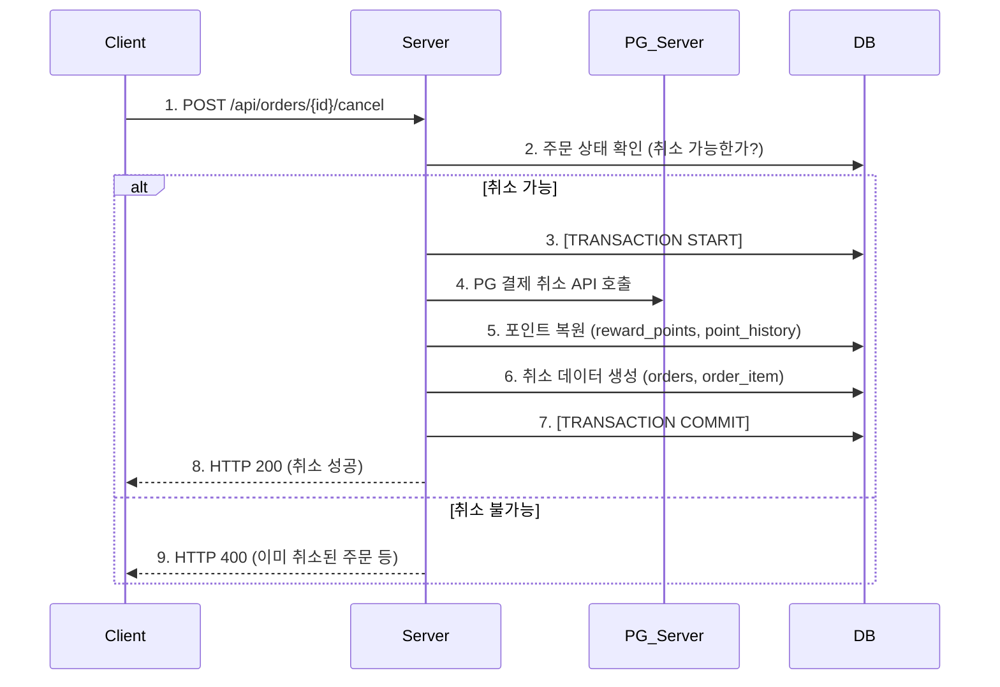

# Vibe Pay 개발 사양서: 1. 기능 요구사항

이 문서는 Vibe Pay 시스템의 핵심 기능 요구사항을 정의한다. 각 기능은 목적, 입/출력 데이터, 비즈니스 규칙, 사용자 흐름, 그리고 성공/실패 조건으로 나누어 설명된다.

## 1. 결제 준비 (Payment Initiation)

- **API Endpoint**: `POST /api/payments/initiate`

### 1.1. 목적
사용자가 결제를 시작하기 전, 실제 결제가 이루어질 PG(결제 게이트웨이)를 결정하고, 해당 PG의 결제창 호출에 필요한 파라미터들을 안전하게 생성하여 클라이언트에게 전달하는 것을 목적으로 한다. 이 과정을 통해 민감한 정보(상점 키 등)를 서버에만 보관하고, 각 거래에 대한 고유 서명값을 생성하여 위변조를 방지한다.

### 1.2. 입력/출력

- **입력 (Request Body)**: `PaymentInitiateRequest`

  ```json
  {
    "memberId": 123,
    "amount": 50000,
    "usedMileage": 5000,
    "pgCompany": "WEIGHTED", // "INICIS", "NICEPAY", "WEIGHTED" 중 하나
    "goodName": "Vibe 티셔츠 외 1건",
    "buyerName": "김바이브",
    "buyerTel": "010-1234-5678",
    "buyerEmail": "test@vibe.com",
    "orderId": "20251015O00000001" // 클라이언트에서 채번한 주문번호
  }
  ```

- **출력 (Response Body)**: `PaymentInitResponse`

  ```json
  // 예시: INICIS로 결정된 경우
  {
    "success": true,
    "selectedPgCompany": "INICIS",
    "paymentId": "20251015P00000001",
    "inicis": {
        "mid": "INIpayTest",
        "oid": "20251015O00000001",
        "price": "45000",
        "timestamp": "1665806400000",
        "signature": "a1b2c3d4e5f6...",
        "gopaymethod": "Card",
        "returnUrl": "http://localhost:3000/order/progress-popup",
        "closeUrl": "http://localhost:3000/order/popup"
    },
    "nicepay": null
  }
  ```

### 1.3. 비즈니스 규칙

1.  **PG사 결정**: `pgCompany` 필드 값에 따라 연동할 PG사를 결정한다.
    -   `INICIS` 또는 `NICEPAY`: 명시된 PG사로 진행한다.
    -   `WEIGHTED`: `application.yml`에 정의된 가중치(`payment.weight`)에 따라 서버가 확률적으로 PG사를 선택한다. 이는 A/B 테스트나 PG사 트래픽 분산에 사용된다.
2.  **최종 결제 금액 계산**: 최종 카드 결제 금액은 `amount` - `usedMileage`로 계산된다.
3.  **서명 생성**: PG사별 명세에 따라 거래 위변조 방지를 위한 서명(Signature/Hash)을 생성한다. 이 서명은 서버에만 저장된 `signKey` 또는 `merchantKey`를 사용하여 해싱되므로 클라이언트에서 임의로 생성할 수 없다.
4.  **주문번호 일관성**: 클라이언트에서 생성한 `orderId`는 결제 준비부터 최종 승인까지 동일하게 유지되어야 한다.

### 1.4. 사용자 흐름



### 1.5. 성공/실패 조건

-   **성공**: HTTP `200 OK`와 함께 `PaymentInitResponse` 객체를 반환한다. 객체 내 `success` 필드는 `true`이며, 선택된 PG사에 해당하는 필드(`inicis` 또는 `nicepay`)에 파라미터가 채워져 있다.
-   **실패**: HTTP `400 Bad Request`를 반환한다. 요청 파라미터 검증 실패, 존재하지 않는 PG사 요청, PG사 연동 파라미터 생성 실패 시 발생할 수 있다.

---

## 2. 주문 생성 및 결제 승인

- **API Endpoint**: `POST /api/orders`

### 2.1. 목적

클라이언트가 PG 결제창에서 인증을 완료한 후, 서버 간 통신(S2S)을 통해 해당 결제를 최종적으로 검증 및 승인하고, 관련 데이터(주문, 상품, 결제, 포인트)를 하나의 트랜잭션으로 데이터베이스에 기록하는 것을 목적으로 한다. 이 과정에서 발생할 수 있는 문제(PG 승인 후 DB 저장 실패 등)에 대한 데이터 정합성을 보장하는 것이 핵심이다.

### 2.2. 입력/출력

- **입력 (Request Body)**: `OrderRequest`

  ```json
  {
    "orderNumber": "20251015O00000001",
    "memberId": 123,
    "items": [
      { "productId": 1, "quantity": 1 },
      { "productId": 2, "quantity": 1 }
    ],
    "paymentMethods": [
      {
        "paymentMethod": "POINT",
        "amount": 5000
      },
      {
        "paymentMethod": "CREDIT_CARD",
        "amount": 45000,
        "pgCompany": "INICIS",
        "authToken": "ax2511..."
      }
    ],
    "netCancel": false // 망취소 테스트용 플래그
  }
  ```

- **출력 (Response Body)**: `List<Order>`

  ```json
  [
    {
      "orderId": "20251015O00000001",
      "ordSeq": 1,
      "ordProcSeq": 1,
      "memberId": 123,
      "totalAmount": 25000,
      "status": "ORDERED",
      "orderDate": "2025-10-15T12:00:00"
    },
    {
      "orderId": "20251015O00000001",
      "ordSeq": 2,
      "ordProcSeq": 1,
      "memberId": 123,
      "totalAmount": 20000,
      "status": "ORDERED",
      "orderDate": "2025-10-15T12:00:00"
    }
  ]
  ```

### 2.3. 비즈니스 규칙

1.  **원자적 트랜잭션**: 전체 프로세스는 `@Transactional`로 묶여, 하나라도 실패하면 모든 DB 변경사항이 롤백되어야 한다.
2.  **서버 간 결제 승인 (S2S)**: `paymentMethods`에 포함된 `CREDIT_CARD` 정보의 `authToken`을 사용하여, 백엔드 서버가 직접 PG사 서버에 결제 승인을 요청한다. 이는 클라이언트의 결제 결과가 위변조되지 않았는지 검증하는 필수 단계다.
3.  **결제 금액 검증**: S2S 승인 응답으로 받은 결제 금액이 요청된 `amount`와 일치하는지 반드시 확인해야 한다.
4.  **데이터베이스 기록**: S2S 승인 성공 시, 다음 순서로 DB에 데이터를 기록한다.
    -   `payment` 테이블: 포인트 사용, 카드 결제 내역 기록
    -   `orders`, `order_item` 테이블: 주문 및 주문 상품 정보 기록
    -   `reward_points`, `point_history` 테이블: 포인트 사용에 따른 차감 및 이력 기록
5.  **망취소 (Net-Cancellation) 처리**: S2S 승인이 성공했으나 DB 기록 과정에서 오류가 발생할 경우, 이미 승인된 PG 결제를 즉시 취소해야 한다. 이는 사용자에게 요금이 청구되었으나 주문은 생성되지 않는 치명적인 상황을 방지하기 위함이다.
    -   `netCancel: true` 요청은 이 망취소 로직을 테스트하기 위한 개발용 기능이다.

### 2.4. 사용자 흐름



### 2.5. 성공/실패 조건

-   **성공**: 모든 S2S 승인과 DB 저장이 성공적으로 완료되면 HTTP `200 OK`와 함께 생성된 `Order` 객체 리스트를 반환한다.
-   **실패 (결제 승인 실패)**: S2S 승인/검증 단계에서 실패하면(금액 불일치, 유효하지 않은 토큰 등), 망취소 후 HTTP `400 Bad Request`를 반환한다.
-   **실패 (DB 저장 실패)**: S2S 승인 후 DB 저장 단계에서 실패하면, 망취소 시도 후 HTTP `500 Internal Server Error`를 반환하여 서버 내부 문제임을 알린다.

---

## 3. 주문 취소

- **API Endpoint**: `POST /api/orders/{id}/cancel`

### 3.1. 목적

이미 완료된 주문을 사용자의 요청에 따라 취소하고, 결제된 금액을 환불하며 사용된 포인트를 복원하는 것을 목적으로 한다. 모든 취소 과정은 추적이 가능해야 하며, 데이터 정합성을 유지해야 한다.

### 3.2. 입력/출력

- **입력**: `orderId` (URL Path Variable)
- **출력**: `Order` (생성된 취소 `Order` 객체 중 첫 번째 항목)

### 3.3. 비즈니스 규칙

1.  **취소 가능 상태 확인**: 취소하려는 주문(`orderId`)이 존재하는지, 그리고 이미 취소된 주문은 아닌지 확인한다. (`ord_proc_seq` > 1 인 데이터 존재 여부로 체크)
2.  **클레임 ID 생성**: 취소 트랜잭션을 식별하기 위한 고유한 `claimId`를 채번한다.
3.  **취소 데이터 생성**: 원본 주문 데이터를 기반으로, 금액(`totalAmount`)과 수량(`quantity`)을 음수(-)로 변환한 새로운 `order` 및 `order_item` 레코드를 생성하여 DB에 저장한다. 이 레코드들은 새로 생성된 `claimId`를 가진다.
4.  **결제 수단별 환불 처리**: 원본 주문에 사용된 `payment` 기록을 조회하여 각 결제 수단에 맞는 환불 절차를 진행한다.
    -   `CREDIT_CARD`: PG사의 결제 취소 API를 호출하여 승인된 결제를 취소/환불한다.
    -   `POINT`: `reward_points` 테이블에 사용된 포인트를 다시 더해주고, `point_history`에 포인트 적립(취소로 인한 복원) 이력을 기록한다.

### 3.4. 사용자 흐름



### 3.5. 성공/실패 조건

-   **성공**: 모든 환불 절차와 DB 기록이 성공적으로 완료되면 HTTP `200 OK`와 함께 생성된 취소 `Order` 객체를 반환한다.
-   **실패**: 주문이 존재하지 않거나 이미 취소된 상태일 경우, HTTP `400 Bad Request`를 반환한다. PG사 환불 실패 등 로직 수행 중 오류 발생 시 트랜잭션이 롤백되고 예외가 발생한다.
