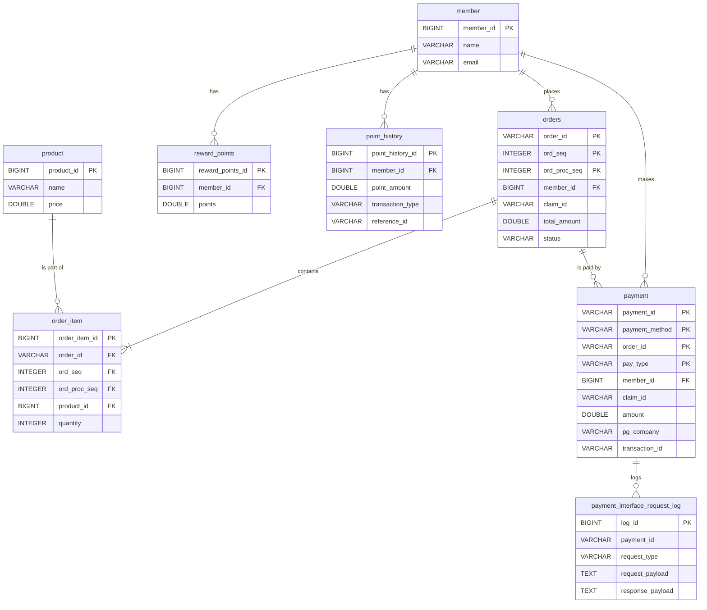

# Vibe Pay 개발 사양서: 2. 데이터 모델

이 문서는 Vibe Pay 시스템의 데이터베이스 스키마, 엔티티 관계, 그리고 데이터 관리 정책을 정의한다.

## 1. 엔티티 관계도 (ERD)

## 2. 테이블 및 필드 정의

### 2.1. `orders`
주문 정보를 저장하는 핵심 테이블. 하나의 주문은 여러 상품(`ord_seq`)과 여러 처리 단계(`ord_proc_seq`)를 가질 수 있다.

-   **Primary Key**: `(order_id, ord_seq, ord_proc_seq)` (복합 키)
-   **주요 필드**:
    -   `order_id` (VARCHAR(17)): 주문 식별자. `YYYYMMDD` + `O` + 8자리 시퀀스.
    -   `ord_seq` (INTEGER): 동일 `order_id` 내에서 각 주문 상품을 구분하는 순번. 장바구니에 상품이 3개 담겼다면, 3개의 `ord_seq`(1, 2, 3)가 생성된다.
    -   `ord_proc_seq` (INTEGER): 주문 처리 단계를 나타낸다.
        -   `1`: 원본 주문
        -   `2`: 주문 취소
        -   `3` 이상: 향후 반품, 교환 등 추가 클레임에 사용될 수 있도록 예약됨.
    -   `claim_id` (VARCHAR(17)): 취소/반품 등 클레임 발생 시 채번되는 ID. 동일한 취소 트랜잭션에 속한 `orders`와 `payment` 레코드를 그룹핑하는 데 사용된다.
    -   `total_amount` (DOUBLE): 해당 `ord_seq`의 총 금액. 취소 시에는 음수(-) 값을 가진다.
    -   `status` (VARCHAR(50)): 주문 상태. `ORDERED`, `CANCELLED` 등.

### 2.2. `order_item`
주문에 포함된 개별 상품 정보를 저장한다.

-   **Foreign Key**: `(order_id, ord_seq, ord_proc_seq)`가 `orders` 테이블을 참조해야 하나, 스키마 상에는 직접적인 FK 제약이 설정되어 있지 않다. 애플리케이션 레벨에서 관계를 보장해야 한다.
-   **주요 필드**:
    -   `product_id` (BIGINT): `product` 테이블의 외래 키.
    -   `quantity` (INTEGER): 상품 수량. 취소 시에는 음수(-) 값을 가진다.
    -   `price_at_order` (DOUBLE): 주문 시점의 상품 가격. 상품 가격이 변동되더라도 과거 주문 내역에 영향을 주지 않기 위해 기록한다.

### 2.3. `payment`
결제 및 환불 정보를 저장한다. 하나의 주문은 여러 결제 수단(포인트+카드)으로 구성될 수 있다.

-   **Primary Key**: `(payment_id, payment_method, order_id, pay_type)` (복합 키)
-   **주요 필드**:
    -   `payment_id` (VARCHAR(17)): 결제 식별자. `YYYYMMDD` + `P` + 8자리 시퀀스.
    -   `order_id` (VARCHAR(17)): 연관된 주문 ID.
    -   `payment_method` (VARCHAR(50)): 결제 수단. `POINT`, `CREDIT_CARD` 등.
    -   `pay_type` (VARCHAR(20)): 트랜잭션 타입. `PAYMENT`(결제), `REFUND`(환불).
    -   `amount` (DOUBLE): 결제/환불 금액. 환불 시에는 양수 값을 사용하며 `pay_type`으로 구분한다.
    -   `pg_company` (VARCHAR(50)): PG사. `INICIS`, `NICEPAY` 등. 포인트 결제 시에는 `NULL`.
    -   `transaction_id` (VARCHAR(255)): PG사에서 발급한 고유 거래 ID (TID).

### 2.4. `reward_points` / `point_history`
회원의 포인트 잔액과 변동 이력을 관리한다.

-   `reward_points`: 현재 사용 가능한 포인트 잔액을 저장한다.
-   `point_history`: 포인트의 모든 변동(적립, 사용, 환불로 인한 복원) 내역을 기록한다.
    -   `point_amount`: 변동된 포인트. 사용 시 음수(-), 적립/복원 시 양수(+).
    -   `balance_after`: 변동 후 최종 잔액.
    -   `reference_id`: 어떤 결제/주문으로 인해 발생한 변동인지 추적하기 위한 ID (`payment_id` 등).

### 2.5. `payment_interface_request_log`
PG사와의 모든 서버 간 통신(S2S) 내역을 기록한다. 디버깅 및 문제 추적에 필수적이다.

-   **주요 필드**:
    -   `request_type` (VARCHAR(50)): 요청 종류. `INICIS_AUTH`, `NICEPAY_CANCEL` 등.
    -   `request_payload` (TEXT): PG사로 보낸 요청 전문(JSON/Form-data).
    -   `response_payload` (TEXT): PG사로부터 받은 응답 전문.

## 3. 데이터 생명주기 및 관리 정책

### 3.1. ID 채번 규칙
-   `order_id`, `payment_id`, `claim_id`는 `YYYYMMDD` 형식의 날짜 접두사와 DB 시퀀스(`order_id_seq` 등)를 조합하여 생성된다.
-   이는 ID만으로도 생성 시점을 유추할 수 있게 하며, 시퀀스는 `CYCLE` 옵션을 통해 고갈되지 않도록 설정되어 있다.

### 3.2. 주문과 취소 데이터의 관계
-   **주문 취소는 `UPDATE`나 `DELETE`가 아닌 `INSERT`로 처리된다.** 이는 모든 금융 거래 기록을 원본 그대로 보존하기 위함이다.
-   **원본 주문**: `ord_proc_seq = 1`, `total_amount`와 `quantity`는 양수.
-   **취소 주문**: `ord_proc_seq = 2`, `total_amount`와 `quantity`는 음수.
-   특정 주문(`order_id`, `ord_seq`)의 현재 상태를 계산하려면, 해당 키를 가진 모든 `ord_proc_seq`의 `total_amount`를 합산(`SUM`)하면 된다. 합계가 0이면 완전히 취소된 상태이다.

### 3.3. 인덱스 및 성능 고려사항
-   `orders`, `payment`, `order_item` 등 주요 트랜잭션 테이블은 복합 기본 키를 사용하여 데이터 무결성을 보장하고, 해당 키를 통한 조회 성능을 최적화한다.
-   `member_id`, `order_id` 등 조회의 시작점이 되는 컬럼에는 외래 키 제약 또는 별도의 인덱스를 설정하여 조인 성능을 확보해야 한다. (현재 스키마에는 일부 누락되어 있어 애플리케이션 레벨에서 보완 또는 스키마 수정 필요)
-   `payment_interface_request_log`는 쓰기 작업이 빈번하므로, 기본 키 인덱스 외에 과도한 인덱스는 쓰기 성능을 저하시킬 수 있어 주의해야 한다.
