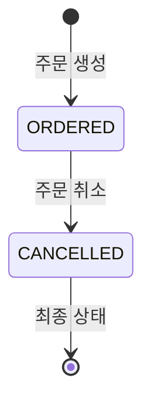
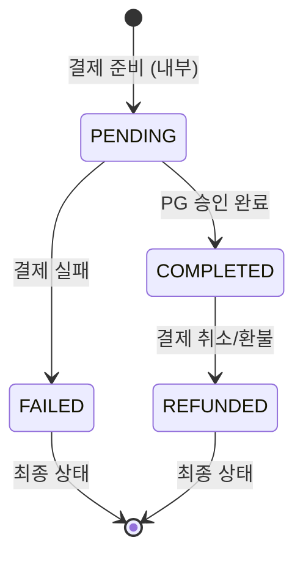

# Vibe Pay 개발 사양서: 4. 비즈니스 로직 정책

이 문서는 Vibe Pay 시스템의 핵심 비즈니스 로직과 정책을 정의한다. 이는 결제, 주문, 취소와 관련된 모든 계산, 상태 관리, 데이터 일관성 유지 방안을 포함한다.

## 1. 계산 공식 및 알고리즘

### 1.1. 최종 결제 금액 계산
-   **공식**: `최종 결제 금액 = 총 주문 금액 (amount) - 사용 포인트 (usedMileage)`
-   **적용 시점**: `PaymentService.initiatePayment` 단계에서 PG사에 전달할 금액을 계산할 때, 그리고 `OrderService.createOrder` 단계에서 실제 결제 승인 요청 시 사용된다.

### 1.2. PG사 선택 알고리즘 (가중치 기반)
-   **목적**: `pgCompany`가 `WEIGHTED`로 요청될 경우, 설정된 가중치에 따라 PG사를 동적으로 선택한다.
-   **알고리즘**: `PgWeightSelector` 클래스에서 구현되며, 각 PG사에 할당된 가중치(예: Inicis 50, NicePay 50)에 비례하여 무작위로 PG사를 선택한다.
-   **설정**: `application.yml` 파일의 `payment.weight` 섹션에서 각 PG사의 가중치를 설정할 수 있다.

### 1.3. 주문/클레임 번호 채번
-   **형식**: `YYYYMMDD` + `타입 코드` + `8자리 시퀀스`
    -   `타입 코드`: `O` (주문), `C` (클레임/취소), `P` (결제)
-   **예시**: `20251015O00000001` (2025년 10월 15일 생성된 첫 번째 주문)
-   **생성 주체**: 백엔드(`OrderService.generateOrderNumber`, `OrderService.generateClaimNumber`)에서 DB 시퀀스를 통해 고유하게 채번한다.

### 1.4. 취소 금액 및 수량 계산
-   **원칙**: 모든 취소 거래는 원본 거래의 역(逆)으로 기록된다.
-   **공식**: `취소 금액 = -1 * 원본 주문 금액`, `취소 수량 = -1 * 원본 주문 수량`
-   **적용**: `OrderService.cancelOrder`에서 `orders` 및 `order_item` 테이블에 취소 레코드를 `INSERT`할 때 사용된다.

## 2. 상태 전이 규칙 (State Machine)

### 2.1. 주문 상태 (`orders.status`)

-   **ORDERED**: 결제가 성공적으로 완료되고 주문이 생성된 초기 상태.
-   **CANCELLED**: 주문이 취소된 상태. 이 상태의 주문 레코드는 `total_amount`가 음수이며 `ord_proc_seq`가 2 이상이다.

### 2.2. 결제 상태 (`payment.status`)

-   **PENDING**: 결제 준비 단계 또는 PG사 인증 대기 중인 상태 (DB에 명시적으로 저장되지는 않음).
-   **COMPLETED**: PG사로부터 최종 승인이 완료된 상태.
-   **REFUNDED**: 결제가 취소되어 환불이 완료된 상태.
-   **FAILED**: 결제 과정에서 오류가 발생하여 실패한 상태.

### 2.3. 주문 처리 순서 (`orders.ord_proc_seq`)
-   `1`: 최초 주문 생성 시 할당되는 값.
-   `2`: 주문 취소 시 할당되는 값. 동일 `order_id`와 `ord_seq`를 가지는 원본 주문(`ord_proc_seq=1`)에 대한 취소 건임을 나타낸다.
-   `3` 이상: 향후 반품, 교환 등 추가적인 클레임 처리 시 사용될 수 있도록 확장성을 고려하여 설계되었다.

## 3. 트랜잭션 경계 및 일관성 규칙

### 3.1. 주문 생성 및 결제 승인 (`OrderService.createOrder`)
-   **트랜잭션 범위**: `OrderService.createOrder` 메서드 전체가 `@Transactional`로 묶여 하나의 원자적 단위로 처리된다.
-   **일관성 규칙**:
    1.  **PG사 S2S 승인 우선**: DB에 주문 정보를 기록하기 전에 반드시 PG사와의 서버 간 통신(S2S)을 통해 결제를 최종 승인받아야 한다.
    2.  **금액 검증**: S2S 승인 응답으로 받은 금액과 시스템이 계산한 최종 결제 금액이 일치하는지 엄격하게 검증한다.
    3.  **망취소 (Net-Cancellation)**: PG사 S2S 승인은 성공했으나, 이후 DB에 주문/결제 정보를 기록하는 과정에서 오류가 발생할 경우, 이미 승인된 PG 결제를 즉시 취소(환불)하고 DB 트랜잭션을 롤백한다. 이는 사용자에게 요금이 청구되었으나 주문이 생성되지 않는 데이터 불일치 상황을 방지한다.

### 3.2. 주문 취소 (`OrderService.cancelOrder`)
-   **트랜잭션 범위**: `OrderService.cancelOrder` 메서드 전체가 `@Transactional`로 묶여 처리된다.
-   **일관성 규칙**:
    1.  **원본 보존**: 주문 취소는 `UPDATE`나 `DELETE`가 아닌 새로운 `INSERT` 레코드(음수 금액/수량)를 생성하여 모든 거래 이력을 보존한다.
    2.  **결제 수단별 환불**: 카드 결제는 PG사 환불 API 호출, 포인트 사용은 포인트 잔액 복원 및 이력 기록 등 각 결제 수단에 맞는 환불 로직을 수행한다.
    3.  **클레임 ID**: 취소와 관련된 모든 `orders` 및 `payment` 레코드는 동일한 `claim_id`를 가져야 한다.

## 4. 동시성 처리 방식

-   **RDBMS 트랜잭션**: PostgreSQL의 트랜잭션 격리 수준(기본 `READ COMMITTED`)을 활용하여 동시성 문제를 부분적으로 해결한다. 특히 `UPDATE` 및 `INSERT` 작업 시 데이터베이스의 락(Lock) 메커니즘을 통해 데이터 무결성을 보장한다.
-   **시퀀스 기반 ID 채번**: `order_id`, `payment_id` 등 고유 ID는 데이터베이스 시퀀스를 통해 채번되므로, 동시 요청 시에도 중복 없이 고유한 ID가 할당된다.
-   **포인트 잔액 관리**: `reward_points` 테이블의 `points` 필드 업데이트 시, `UPDATE ... SET points = points - ? WHERE member_id = ?`와 같은 방식으로 직접적인 값 계산 대신 상대적인 값 변경을 통해 동시성 문제를 완화한다. (낙관적/비관적 락은 명시적으로 구현되지 않음)

## 5. 권한 및 접근 제어 정책

-   제공된 코드베이스(`*Controller.java`)에서는 명시적인 권한 및 접근 제어 로직(예: Spring Security `@PreAuthorize` 어노테이션)이 구현되어 있지 않다.
-   **가정**: 현재 시스템은 API Gateway 또는 별도의 인증/인가 서버를 통해 사용자 인증 및 기본적인 접근 제어가 이루어지고 있거나, 내부 시스템 간의 호출로 간주하여 별도의 권한 검증이 필요 없다고 가정한다.
-   **향후 확장**: 사용자 역할(관리자, 일반 사용자)에 따른 API 접근 제한이 필요할 경우, Spring Security와 같은 프레임워크를 활용하여 권한 검증 로직을 추가해야 한다.
