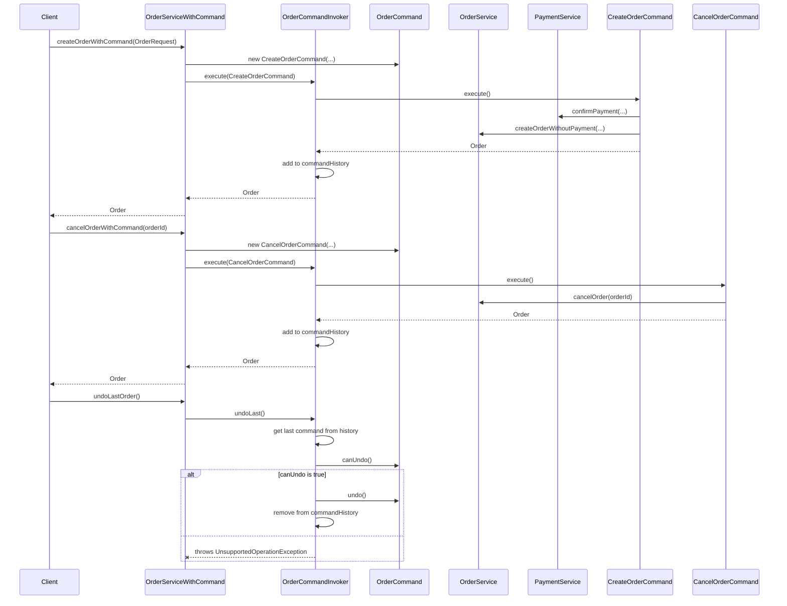

# Order Processing Technical Specification

## 1. 개요
- **목적**: 본 문서는 VibePay 시스템의 주문 처리 기능에 대한 기술 사양을 정의합니다. 이 기능은 사용자의 상품 주문 생성, 주문 상품 관리, 주문 상태 변경(취소 포함), 그리고 주문 상세 정보 조회 등을 담당합니다. 또한, 결제 모듈과의 연동을 통해 주문 생성 시 결제 승인을 처리하고, 주문 취소 시 결제 환불을 연동합니다.
- **System Design에서의 위치**: VibePay 백엔드 서비스의 핵심 모듈 중 하나로, 상품(Product) 모듈로부터 상품 정보를 조회하고, 결제(Payment) 모듈과 연동하여 결제 및 환불을 처리합니다. 회원(Member) 모듈과 연동하여 회원별 주문 정보를 제공합니다.
- **관련 컴포넌트 및 의존성**:
    - `OrderController`: 주문 관련 API 엔드포인트 제공
    - `OrderService`: 주문 비즈니스 로직 처리
    - `OrderServiceWithCommand`: Command 패턴을 적용한 주문 서비스 (주문 생성/취소)
    - `OrderMapper`: 주문 데이터베이스 CRUD
    - `OrderItemMapper`: 주문 상품 데이터베이스 CRUD
    - `Order`, `OrderItem`: 주문 및 주문 상품 엔티티
    - `OrderRequest`, `OrderItemRequest`: 주문 생성 요청 DTO
    - `PaymentMethodRequest`: 주문 생성 시 결제 수단 정보 DTO
    - `OrderDetailDto`, `OrderItemDto`: 주문 상세 조회 응답 DTO
    - `OrderCommand` 인터페이스 및 구현체 (`CreateOrderCommand`, `CancelOrderCommand`): Command 패턴을 위한 인터페이스 및 구체 클래스
    - `OrderCommandInvoker`: Command 객체를 실행하고 이력을 관리하는 인보커
    - `ProductService`: 상품 정보 조회
    - `PaymentService`: 결제 승인 및 환불 처리
    - `PaymentProcessorFactory`, `PaymentGatewayFactory`: 결제 모듈의 팩토리
    - `OrderException`: 주문 관련 비즈니스 예외
    - `common.Constants`: 날짜 포맷, 시퀀스 패딩 길이 등 공통 상수

## 2. 프로세스 흐름

### 2.1. 주문 번호 채번 (generateOrderNumber)
```mermaid
sequenceDiagram
    participant Client
    participant OrderController
    participant OrderService
    participant OrderMapper
    database Database

    Client->>OrderController: GET /api/orders/generateOrderNumber
    OrderController->>OrderService: generateOrderNumber()
    OrderService->>OrderMapper: getNextOrderSequence()
    OrderMapper-->>OrderService: sequenceNumber
    OrderService-->>OrderController: orderNumber (YYYYMMDDOXXXXXXXX)
    OrderController-->>Client: 200 OK (orderNumber)
```

**단계별 상세 설명:**
1.  **Client -> OrderController**: 클라이언트는 주문 생성을 위해 고유한 주문 번호가 필요할 때 `/api/orders/generateOrderNumber` 엔드포인트로 GET 요청을 보냅니다.
2.  **OrderController -> OrderService**: `OrderController`는 `OrderService.generateOrderNumber()` 메서드를 호출합니다.
3.  **OrderService -> OrderMapper**: `OrderService`는 `OrderMapper.getNextOrderSequence()`를 호출하여 데이터베이스 시퀀스로부터 다음 주문 시퀀스 번호를 가져옵니다.
4.  **OrderService**: 현재 날짜(`YYYYMMDD`)와 "O" 접두사, 그리고 8자리로 패딩된 시퀀스 번호를 조합하여 최종 주문 번호(`YYYYMMDDOXXXXXXXX`)를 생성합니다.
5.  **OrderService -> OrderController**: 생성된 주문 번호를 `OrderController`로 반환합니다.
6.  **OrderController -> Client**: `OrderController`는 주문 번호를 클라이언트에게 200 OK 응답으로 반환합니다.

### 2.2. 주문 생성 (createOrder)
```mermaid
sequenceDiagram
    participant Client
    participant OrderController
    participant OrderService
    participant PaymentService
    participant PaymentProcessor
    participant OrderMapper
    participant OrderItemMapper
    participant ProductService
    participant PaymentGatewayAdapter
    database Database

    Client->>OrderController: POST /api/orders (OrderRequest)
    OrderController->>OrderService: createOrder(orderRequest)
    OrderService->>PaymentService: confirmPayment(paymentConfirmRequest) (for each paymentMethod)
    PaymentService->>PaymentProcessor: processPayment(paymentConfirmRequest)
    PaymentProcessor->>PaymentGatewayAdapter: confirm(paymentConfirmRequest)
    PaymentGatewayAdapter-->>PaymentProcessor: PaymentConfirmResponse
    PaymentProcessor-->>PaymentService: Payment
    PaymentService-->>OrderService: (void)
    loop for each OrderItemRequest
        OrderService->>ProductService: getProductById(productId)
        ProductService-->>OrderService: Product
        OrderService->>Order: create Order entity
        OrderService->>OrderItem: create OrderItem entity
    end
    OrderService->>OrderMapper: insert(order) (for each order)
    OrderService->>OrderItemMapper: insert(orderItem) (for each orderItem)
    OrderService-->>OrderController: List<Order>
    OrderController-->>Client: 200 OK (List<Order>)

    alt Payment Approval Failed
        PaymentService--xOrderService: throws PaymentException
        OrderService--xOrderController: throws RuntimeException
        OrderController--xClient: 400 Bad Request
    end
    alt Order Creation Failed After Payment Approval
        OrderService--xOrderService: (catch exception)
        OrderService->>PaymentProcessor: netCancel(paymentNetCancelRequest) (for each paymentMethod)
        PaymentProcessor->>PaymentGatewayAdapter: netCancel(paymentNetCancelRequest)
        PaymentGatewayAdapter-->>PaymentProcessor: (void)
        OrderService--xOrderController: throws RuntimeException
        OrderController--xClient: 500 Internal Server Error
    end
```

**단계별 상세 설명:**
1.  **Client -> OrderController**: 클라이언트는 주문 상품 목록, 결제 수단 정보 등을 담은 `OrderRequest`를 `/api/orders` 엔드포인트로 POST 요청합니다.
2.  **OrderController -> OrderService**: `OrderController`는 `OrderService.createOrder()` 메서드를 호출합니다.
3.  **OrderService -> PaymentService (결제 승인)**:
    *   `OrderService`는 `OrderRequest`에 포함된 각 `PaymentMethodRequest`에 대해 반복합니다.
    *   각 `PaymentMethodRequest`로부터 `PaymentConfirmRequest`를 구성하고 `PaymentService.confirmPayment()`를 호출하여 결제 승인을 요청합니다.
    *   `PaymentService`는 내부적으로 `PaymentProcessor`와 `PaymentGatewayAdapter`를 통해 PG사에 결제 승인 API를 호출하고, 성공 시 결제 정보를 DB에 저장합니다.
    *   결제 승인 중 실패하면 `PaymentException`이 발생하고, `OrderService`는 이를 catch하여 망취소(Net Cancel)를 시도합니다.
4.  **OrderService (주문 생성)**:
    *   모든 결제 승인이 성공하면, `OrderService`는 `OrderRequest`의 `items` 목록을 순회합니다.
    *   각 `OrderItemRequest`에 대해 `ProductService.getProductById()`를 호출하여 상품 정보를 조회합니다.
    *   조회된 상품 정보와 요청 수량을 바탕으로 `Order` 엔티티와 `OrderItem` 엔티티를 생성합니다. 이때 `orderId`는 `OrderRequest`에 포함된 주문 번호를 사용하고, `ordSeq`는 상품별 순번, `ordProcSeq`는 1(최초 주문)로 설정합니다.
    *   생성된 `Order` 및 `OrderItem` 엔티티를 `OrderMapper.insert()` 및 `OrderItemMapper.insert()`를 통해 데이터베이스에 저장합니다.
5.  **OrderService -> OrderController**: 생성된 `Order` 엔티티 목록을 `OrderController`로 반환합니다.
6.  **OrderController -> Client**: `OrderController`는 `Order` 목록을 클라이언트에게 200 OK 응답으로 반환합니다.
7.  **Failure (결제 승인 실패)**: `PaymentService.confirmPayment()` 호출 중 `PaymentException`이 발생하면, `OrderService`는 `RuntimeException`을 던지고 `OrderController`는 400 Bad Request 응답을 반환합니다.
8.  **Failure (결제 승인 후 주문 생성 실패)**: 결제 승인은 성공했으나 주문 생성 중 예외가 발생하면, `OrderService`는 `RuntimeException`을 catch하여 각 `PaymentMethodRequest`에 대해 `PaymentProcessor.netCancel()`을 호출하여 망취소를 시도합니다. 망취소 성공 여부와 관계없이 `RuntimeException`을 다시 던지고 `OrderController`는 500 Internal Server Error 응답을 반환합니다.

### 2.3. 주문 취소 (cancelOrder)
```mermaid
sequenceDiagram
    participant Client
    participant OrderController
    participant OrderService
    participant OrderMapper
    participant OrderItemMapper
    participant PaymentService
    participant PaymentProcessor
    database Database

    Client->>OrderController: POST /api/orders/{id}/cancel
    OrderController->>OrderService: cancelOrder(orderId)
    OrderService->>OrderMapper: findByOrderIdAndOrdProcSeqList(orderId, 1)
    OrderMapper-->>OrderService: List<Order> (original orders)
    OrderService->>OrderMapper: findByOrderId(orderId) (check if already cancelled)
    OrderMapper-->>OrderService: List<Order> (all processes)
    OrderService->>OrderService: generateClaimNumber()
    loop for each original Order
        OrderService->>Order: create cancel Order entity
        OrderService->>OrderMapper: insert(cancelOrder)
    end
    loop for each original OrderItem
        OrderService->>OrderItem: create cancel OrderItem entity
        OrderService->>OrderItemMapper: insert(cancelItem)
    end
    OrderService->>PaymentService: findByOrderId(orderId)
    PaymentService-->>OrderService: List<Payment>
    loop for each Payment
        OrderService->>PaymentProcessor: processRefund(payment)
        PaymentProcessor->>PaymentGatewayAdapter: cancel(paymentCancelRequest)
        PaymentGatewayAdapter-->>PaymentProcessor: (void)
    end
    OrderService-->>OrderController: Order (first cancelled order)
    OrderController-->>Client: 200 OK (Order)

    alt Order Not Found / Already Cancelled
        OrderService--xOrderController: throws OrderException
        OrderController--xClient: 400 Bad Request
    end
    alt Payment Refund Failed
        PaymentProcessor--xOrderService: throws RuntimeException
        OrderService--xOrderController: throws RuntimeException
        OrderController--xClient: 400 Bad Request
    end
```

**단계별 상세 설명:**
1.  **Client -> OrderController**: 클라이언트는 취소할 주문의 `orderId`를 포함하여 `/api/orders/{id}/cancel` 엔드포인트로 POST 요청을 보냅니다.
2.  **OrderController -> OrderService**: `OrderController`는 `OrderService.cancelOrder()` 메서드를 호출합니다.
3.  **OrderService (주문 조회 및 검증)**:
    *   `OrderMapper.findByOrderIdAndOrdProcSeqList(orderId, 1)`를 호출하여 원본 주문(ordProcSeq=1) 목록을 조회합니다.
    *   `OrderMapper.findByOrderId(orderId)`를 호출하여 해당 `orderId`의 모든 주문 처리 이력을 조회하고, 이미 취소된 주문인지 (`ordProcSeq` > 1인 주문이 있는지) 확인합니다. 이미 취소되었거나 주문이 없으면 `OrderException`을 발생시킵니다.
4.  **OrderService (클레임 번호 생성)**: `generateClaimNumber()`를 호출하여 새로운 클레임 번호(`YYYYMMDDCXXXXXXXX`)를 생성합니다.
5.  **OrderService (취소 주문 생성)**:
    *   조회된 각 원본 `Order`에 대해 새로운 `Order` 엔티티를 생성합니다. 이때 `ordProcSeq`는 원본의 `ordProcSeq + 1`로 설정하고, `claimId`를 부여하며, `totalAmount`는 음수로, `status`는 "CANCELLED"로 설정합니다.
    *   생성된 취소 `Order` 엔티티를 `OrderMapper.insert()`를 통해 데이터베이스에 저장합니다.
6.  **OrderService (취소 주문 상품 생성)**:
    *   `OrderItemMapper.findByOrderIdAndOrdProcSeq(orderId, 1)`를 호출하여 원본 주문 상품 목록을 조회합니다.
    *   조회된 각 원본 `OrderItem`에 대해 새로운 `OrderItem` 엔티티를 생성합니다. 이때 `ordProcSeq`는 2로 설정하고, `quantity`는 음수로 설정합니다.
    *   생성된 취소 `OrderItem` 엔티티를 `OrderItemMapper.insert()`를 통해 데이터베이스에 저장합니다.
7.  **OrderService -> PaymentService (결제 취소)**:
    *   `PaymentService.findByOrderId(orderId)`를 호출하여 해당 주문의 모든 결제 정보를 조회합니다.
    *   조회된 각 `Payment`에 대해 `PaymentProcessor.processRefund()`를 호출하여 결제 환불을 요청합니다. 이때 `Payment` 엔티티에 생성된 `claimId`를 설정합니다.
    *   `PaymentProcessor`는 내부적으로 `PaymentGatewayAdapter`를 통해 PG사에 취소 API를 호출하고, 성공 시 결제 정보를 DB에 업데이트합니다.
8.  **OrderService -> OrderController**: 첫 번째로 생성된 취소 `Order` 엔티티를 `OrderController`로 반환합니다.
9.  **OrderController -> Client**: `OrderController`는 취소된 `Order` 엔티티를 클라이언트에게 200 OK 응답으로 반환합니다.
10. **Failure**: 주문 조회/검증 실패 또는 결제 환불 중 예외 발생 시 `OrderException` 또는 `RuntimeException`이 던져지고 `OrderController`는 400 Bad Request 응답을 반환합니다.

### 2.4. Command 패턴을 이용한 주문 처리 (`OrderServiceWithCommand`)
`OrderServiceWithCommand`는 `OrderCommand` 인터페이스를 구현한 `CreateOrderCommand`와 `CancelOrderCommand`를 `OrderCommandInvoker`를 통해 실행합니다. 이는 복잡한 비즈니스 로직을 캡슐화하고, 실행 이력 관리 및 Undo/Redo 기능을 구현하기 위한 패턴입니다.



**단계별 상세 설명:**
1.  **`OrderCommand` 인터페이스**: `execute()`, `undo()`, `canUndo()`, `getCommandType()` 메서드를 정의합니다.
2.  **`CreateOrderCommand`**: `OrderRequest`, `OrderService`, `PaymentService`, `PaymentGatewayFactory`를 주입받아 `execute()` 시 결제 승인 및 주문 생성을 수행합니다. `undo()` 시에는 생성된 주문을 취소합니다.
3.  **`CancelOrderCommand`**: `orderId`, `OrderService`를 주입받아 `execute()` 시 주문 취소를 수행합니다. `undo()`는 지원하지 않습니다 (`canUndo()`는 `false` 반환).
4.  **`OrderCommandInvoker`**: `commandHistory` 리스트에 실행된 `OrderCommand` 객체들을 저장합니다.
    *   `execute(OrderCommand command)`: 명령을 실행하고 `commandHistory`에 추가합니다.
    *   `undoLast()`: `commandHistory`의 마지막 명령을 `canUndo()` 확인 후 `undo()`를 호출하고 히스토리에서 제거합니다.
5.  **`OrderServiceWithCommand`**: `OrderCommandInvoker`를 사용하여 `createOrderWithCommand()`, `cancelOrderWithCommand()`, `undoLastOrder()` 등의 메서드를 제공합니다.
    *   `executeOrderWorkflow()`: 여러 명령을 순차적으로 실행하는 워크플로우를 정의하고, 실패 시 `undoLastOrder()`를 통해 롤백을 시도합니다.

## 3. 데이터 구조

### 3.1. 데이터베이스
`schema.sql` 또는 `pay.sql` 파일이 없으므로, `Order` 및 `OrderItem` 엔티티와 `OrderMapper.xml`, `OrderItemMapper.xml`을 기반으로 스키마를 유추합니다.

**`Order` 테이블 (유추)**
```sql
CREATE TABLE "order" (
    order_id VARCHAR(255) NOT NULL, -- 주문 번호 (YYYYMMDDOXXXXXXXX)
    ord_seq INTEGER NOT NULL,       -- 주문 순번 (상품별로 1, 2, ...)
    ord_proc_seq INTEGER NOT NULL,  -- 주문 처리 순번 (1: 최초 주문, 2: 1차 취소, ...)
    claim_id VARCHAR(255),          -- 클레임 번호 (YYYYMMDDCXXXXXXXX)
    member_id BIGINT NOT NULL,
    order_date DATETIME NOT NULL,
    total_amount DOUBLE NOT NULL,
    status VARCHAR(50) NOT NULL,    -- ORDERED, CANCELLED
    PRIMARY KEY (order_id, ord_seq, ord_proc_seq)
);

CREATE SEQUENCE order_id_seq START WITH 1 INCREMENT BY 1;
```

**`OrderItem` 테이블 (유추)**
```sql
CREATE TABLE order_item (
    order_item_id BIGINT AUTO_INCREMENT PRIMARY KEY,
    order_id VARCHAR(255) NOT NULL,
    ord_seq INTEGER NOT NULL,
    ord_proc_seq INTEGER NOT NULL,
    product_id BIGINT NOT NULL,
    quantity INTEGER NOT NULL,
    price_at_order DOUBLE NOT NULL,
    FOREIGN KEY (order_id, ord_seq, ord_proc_seq) REFERENCES "order"(order_id, ord_seq, ord_proc_seq)
);
```

**각 필드의 타입, 제약조건, 기본값, 인덱스:**
- **`order` 테이블**:
    - `order_id`: `VARCHAR(255)`, `NOT NULL`, `PRIMARY KEY`의 일부. 주문 번호.
    - `ord_seq`: `INTEGER`, `NOT NULL`, `PRIMARY KEY`의 일부. 단일 주문 번호 내에서 상품별 순번.
    - `ord_proc_seq`: `INTEGER`, `NOT NULL`, `PRIMARY KEY`의 일부. 주문 처리 이력 순번 (1: 최초 주문, 2: 1차 취소 등).
    - `claim_id`: `VARCHAR(255)`, 클레임 번호. 취소/환불 시 생성.
    - `member_id`: `BIGINT`, `NOT NULL`, 회원 ID.
    - `order_date`: `DATETIME`, `NOT NULL`, 주문/처리 일시.
    - `total_amount`: `DOUBLE`, `NOT NULL`, 해당 `ord_seq`, `ord_proc_seq`에 해당하는 총 금액.
    - `status`: `VARCHAR(50)`, `NOT NULL`, 주문 상태 (`ORDERED`, `CANCELLED`).
    - `PRIMARY KEY`: `(order_id, ord_seq, ord_proc_seq)` 복합키.
    - `INDEX`: `member_id`에 대한 인덱스, `order_id`에 대한 인덱스.
- **`order_item` 테이블**:
    - `order_item_id`: `BIGINT`, `AUTO_INCREMENT`, `PRIMARY KEY`. 주문 상품 고유 ID.
    - `order_id`: `VARCHAR(255)`, `NOT NULL`, `FOREIGN KEY`의 일부.
    - `ord_seq`: `INTEGER`, `NOT NULL`, `FOREIGN KEY`의 일부.
    - `ord_proc_seq`: `INTEGER`, `NOT NULL`, `FOREIGN KEY`의 일부.
    - `product_id`: `BIGINT`, `NOT NULL`, 상품 ID.
    - `quantity`: `INTEGER`, `NOT NULL`, 수량.
    - `price_at_order`: `DOUBLE`, `NOT NULL`, 주문 시점의 상품 단가.
    - `FOREIGN KEY`: `(order_id, ord_seq, ord_proc_seq)`가 `order` 테이블을 참조.
    - `INDEX`: `product_id`에 대한 인덱스.

### 3.2. DTO/API 모델

#### `Order` (Entity)
```java
package com.vibe.pay.backend.order;

import java.time.LocalDateTime;

// ... (getter/setter 생략)
public class Order {
    private String orderId;     // 주문 번호
    private Integer ordSeq;     // 주문 순번 (상품별)
    private Integer ordProcSeq; // 주문 처리 순번 (1: 최초, 2: 1차 취소)
    private String claimId;     // 클레임 번호
    private Long memberId;
    private LocalDateTime orderDate;
    private Double totalAmount;
    private String status;      // ORDERED, CANCELLED
}
```

#### `OrderItem` (Entity)
```java
package com.vibe.pay.backend.order;

// ... (getter/setter 생략)
public class OrderItem {
    private Long orderItemId;
    private String orderId;
    private Integer ordSeq;
    private Integer ordProcSeq;
    private Long productId;
    private Integer quantity;
    private Double priceAtOrder;
}
```

#### `OrderRequest` (Request DTO)
```java
package com.vibe.pay.backend.order;

import lombok.AllArgsConstructor;
import lombok.Getter;
import lombok.NoArgsConstructor;
import lombok.Setter;

import java.util.List;

@Getter
@Setter
@NoArgsConstructor
@AllArgsConstructor
public class OrderRequest {
    private String orderNumber; // 1단계에서 채번된 주문번호
    private Long memberId;
    private List<OrderItemRequest> items;
    private List<PaymentMethodRequest> paymentMethods;
    private boolean netCancel; // 테스트용 플래그 (주문 생성 실패 시 망취소 강제)
}
```
- **검증 규칙**:
    - `orderNumber`: `NOT NULL`, `String` 타입, `YYYYMMDDOXXXXXXXX` 형식.
    - `memberId`: `NOT NULL`, `Long` 타입.
    - `items`: `NOT NULL`, `List<OrderItemRequest>` 타입, 최소 1개 이상의 상품 포함.
    - `paymentMethods`: `NOT NULL`, `List<PaymentMethodRequest>` 타입, 최소 1개 이상의 결제 수단 포함.

#### `OrderItemRequest` (Request DTO)
```java
package com.vibe.pay.backend.order;

// ... (getter/setter 생략)
public class OrderItemRequest {
    private Long productId;
    private Integer quantity;
}
```
- **검증 규칙**:
    - `productId`: `NOT NULL`, `Long` 타입, 유효한 상품 ID.
    - `quantity`: `NOT NULL`, `Integer` 타입, 1 이상의 정수.

#### `PaymentMethodRequest` (Request DTO)
```java
package com.vibe.pay.backend.order;

import lombok.AllArgsConstructor;
import lombok.Getter;
import lombok.NoArgsConstructor;
import lombok.Setter;

@Getter
@Setter
@NoArgsConstructor
@AllArgsConstructor
public class PaymentMethodRequest {
    private String paymentMethod; // CREDIT_CARD, POINT
    private Long amount; // 해당 결제 수단으로 결제할 금액

    // 결제 정보 (2단계에서 받은 결제 응답 정보 - PG사로부터의 리다이렉트 파라미터)
    private String authToken;
    private String authUrl;
    private String mid;
    private String netCancelUrl;
    private String pgCompany; // PG사 정보
    private String txTid; // 나이스페이의 경우 TxTid
    private String nextAppUrl; // 나이스페이의 경우 다음 승인 URL
}
```
- **검증 규칙**:
    - `paymentMethod`: `NOT NULL`, `String` 타입, `PaymentMethod` enum 값 중 하나.
    - `amount`: `NOT NULL`, `Long` 타입, 0보다 커야 함.
    - PG사 관련 필드들은 `PaymentConfirmRequest`의 검증 규칙을 따름.

#### `OrderDetailDto` (Response DTO)
```java
package com.vibe.pay.backend.order;

import com.vibe.pay.backend.payment.Payment;

import java.time.LocalDateTime;
import java.util.List;

// ... (getter/setter 생략)
public class OrderDetailDto {
    private String orderId;
    private Integer ordSeq;
    private Integer ordProcSeq;
    private String claimId;
    private Long memberId;
    private LocalDateTime orderDate;
    private Double totalAmount;
    private String status;

    // 주문 상품 정보
    private List<OrderItemDto> orderItems;

    // 결제 정보 (카드 + 포인트)
    private List<Payment> payments;

    // 주문 처리 이력 (주문 + 취소)
    private List<Order> orderProcesses;
}
```

#### `OrderItemDto` (Response DTO)
```java
package com.vibe.pay.backend.order;

// ... (getter/setter 생략)
public class OrderItemDto {
    private Long orderItemId;
    private String orderId;
    private Integer ordSeq;
    private Integer ordProcSeq;
    private Long productId;
    private String productName;
    private Double priceAtOrder;
    private Integer quantity;
    private Double totalPrice;
}
```

## 4. API 명세

### 4.1. 주문 번호 채번
- **Endpoint**: `/api/orders/generateOrderNumber`
- **HTTP Method**: `GET`
- **인증 요구사항**: 필요 (예: JWT 토큰을 통한 회원 인증)
- **Request 예시**: 없음
- **검증 규칙**: 없음
- **Success Response (예시)**:
    ```
    "20251016O00000001"
    ```
- **Error Response**:
    - **HTTP Status**: `500 Internal Server Error`
    - **메시지**: (내부 서버 오류)
    - **상황**: 데이터베이스 시퀀스 조회 실패 등.

### 4.2. 주문 생성
- **Endpoint**: `/api/orders`
- **HTTP Method**: `POST`
- **인증 요구사항**: 필요 (예: JWT 토큰을 통한 회원 인증)
- **Request 예시 (JSON)**:
    ```json
    {
        "orderNumber": "20251016O00000001",
        "memberId": 1,
        "items": [
            {
                "productId": 101,
                "quantity": 2
            },
            {
                "productId": 102,
                "quantity": 1
            }
        ],
        "paymentMethods": [
            {
                "paymentMethod": "CREDIT_CARD",
                "amount": 15000,
                "authToken": "xxxxxxxxxxxxxxxxxxxxxxxxxxxxxxxxxxxxxxxx",
                "authUrl": "https://stgstdpay.inicis.com/stdpay/web/INIStdPayAppr.ini",
                "mid": "INIpayTest",
                "netCancelUrl": "https://stgstdpay.inicis.com/stdpay/web/INIStdPayNetCancel.ini",
                "pgCompany": "INICIS",
                "txTid": null,
                "nextAppUrl": null
            }
        ],
        "netCancel": false
    }
    ```
- **검증 규칙**: `OrderRequest` DTO 참조.
- **Success Response (예시)**:
    ```json
    [
        {
            "orderId": "20251016O00000001",
            "ordSeq": 1,
            "ordProcSeq": 1,
            "claimId": null,
            "memberId": 1,
            "orderDate": "2025-10-16T10:30:00",
            "totalAmount": 20000.0,
            "status": "ORDERED"
        },
        {
            "orderId": "20251016O00000001",
            "ordSeq": 2,
            "ordProcSeq": 1,
            "claimId": null,
            "memberId": 1,
            "orderDate": "2025-10-16T10:30:00",
            "totalAmount": 10000.0,
            "status": "ORDERED"
        }
    ]
    ```
- **Error Response**:
    - **HTTP Status**: `400 Bad Request`
    - **에러 코드**: `PAYMENT_APPROVAL_FAILED`, `INVALID_ORDER_AMOUNT`, `PRODUCT_NOT_FOUND`, `PAYMENT_METHOD_MISSING`
    - **메시지**: "결제 승인 실패", "유효하지 않은 주문 금액", "상품을 찾을 수 없습니다", "결제수단이 없습니다."
    - **상황**: 결제 승인 실패, 상품 정보 불일치, 필수 파라미터 누락 등.
    - **HTTP Status**: `500 Internal Server Error`
    - **에러 코드**: `ORDER_CREATION_FAILED_AFTER_PAYMENT_APPROVAL`
    - **메시지**: "결제 승인 후 주문 생성 실패"
    - **상황**: 결제 승인 후 주문 생성 중 DB 오류 등 예상치 못한 오류 발생 (망취소 시도됨).

### 4.3. 주문 취소
- **Endpoint**: `/api/orders/{id}/cancel`
- **HTTP Method**: `POST`
- **인증 요구사항**: 필요 (예: JWT 토큰을 통한 회원 인증 및 해당 주문의 소유자 또는 관리자)
- **Request 예시**: 없음 (Path Variable `id` 사용)
- **검증 규칙**: `orderId`는 유효한 주문 번호여야 함.
- **Success Response (예시)**:
    ```json
    {
        "orderId": "20251016O00000001",
        "ordSeq": 1,
        "ordProcSeq": 2,
        "claimId": "20251016C00000001",
        "memberId": 1,
        "orderDate": "2025-10-16T10:40:00",
        "totalAmount": -20000.0,
        "status": "CANCELLED"
    }
    ```
- **Error Response**:
    - **HTTP Status**: `400 Bad Request`
    - **에러 코드**: `ORDER_NOT_FOUND`, `ORDER_ALREADY_CANCELLED`, `PAYMENT_REFUND_FAILED`
    - **메시지**: "주문을 찾을 수 없습니다.", "이미 취소된 주문입니다.", "결제 환불 실패"
    - **상황**: 주문 번호가 존재하지 않거나, 이미 취소된 주문을 다시 취소하려 할 때, 결제 환불 실패 등.

### 4.4. 주문 목록 조회
- **Endpoint**: `/api/orders`
- **HTTP Method**: `GET`
- **인증 요구사항**: 필요 (관리자 권한)
- **Request 예시**: 없음
- **검증 규칙**: 없음
- **Success Response (예시)**:
    ```json
    [
        {
            "orderId": "20251016O00000001",
            "ordSeq": 1,
            "ordProcSeq": 1,
            "claimId": null,
            "memberId": 1,
            "orderDate": "2025-10-16T10:30:00",
            "totalAmount": 20000.0,
            "status": "ORDERED"
        }
        // ...
    ]
    ```

### 4.5. 특정 주문 조회
- **Endpoint**: `/api/orders/{id}`
- **HTTP Method**: `GET`
- **인증 요구사항**: 필요 (해당 주문의 소유자 또는 관리자)
- **Request 예시**: 없음 (Path Variable `id` 사용)
- **검증 규칙**: `id`는 유효한 주문 번호여야 함.
- **Success Response (예시)**:
    ```json
    [
        {
            "orderId": "20251016O00000001",
            "ordSeq": 1,
            "ordProcSeq": 1,
            "claimId": null,
            "memberId": 1,
            "orderDate": "2025-10-16T10:30:00",
            "totalAmount": 20000.0,
            "status": "ORDERED"
        }
        // ...
    ]
    ```
- **Error Response**:
    - **HTTP Status**: `404 Not Found`
    - **메시지**: (응답 본문 없음)
    - **상황**: 주문 번호가 존재하지 않을 때.

### 4.6. 회원별 주문 목록 조회
- **Endpoint**: `/api/orders/member/{memberId}`
- **HTTP Method**: `GET`
- **인증 요구사항**: 필요 (해당 회원 또는 관리자)
- **Request 예시**: 없음 (Path Variable `memberId` 사용)
- **검증 규칙**: `memberId`는 유효한 회원 ID여야 함.
- **Success Response (예시)**: `4.4. 주문 목록 조회`와 동일한 형식.

### 4.7. 회원별 주문 상세 조회 (결제 정보 포함)
- **Endpoint**: `/api/orders/member/{memberId}/details`
- **HTTP Method**: `GET`
- **인증 요구사항**: 필요 (해당 회원 또는 관리자)
- **Request 예시**: 없음 (Path Variable `memberId` 사용)
- **검증 규칙**: `memberId`는 유효한 회원 ID여야 함.
- **Success Response (예시)**:
    ```json
    [
        {
            "orderId": "20251016O00000001",
            "ordSeq": 1,
            "ordProcSeq": 1,
            "claimId": null,
            "memberId": 1,
            "orderDate": "2025-10-16T10:30:00",
            "totalAmount": 30000.0,
            "status": "ORDERED",
            "orderItems": [
                {
                    "orderItemId": 1,
                    "orderId": "20251016O00000001",
                    "ordSeq": 1,
                    "ordProcSeq": 1,
                    "productId": 101,
                    "productName": "상품 A",
                    "priceAtOrder": 10000.0,
                    "quantity": 2,
                    "totalPrice": 20000.0
                },
                {
                    "orderItemId": 2,
                    "orderId": "20251016O00000001",
                    "ordSeq": 2,
                    "ordProcSeq": 1,
                    "productId": 102,
                    "productName": "상품 B",
                    "priceAtOrder": 10000.0,
                    "quantity": 1,
                    "totalPrice": 10000.0
                }
            ],
            "payments": [
                {
                    "paymentId": "20251016P00000001",
                    "memberId": 1,
                    "orderId": "20251016O00000001",
                    "claimId": null,
                    "amount": 30000,
                    "paymentMethod": "CREDIT_CARD",
                    "payType": "PAYMENT",
                    "pgCompany": "INICIS",
                    "status": "SUCCESS",
                    "orderStatus": "ORDERED",
                    "transactionId": "INIpayTest_20251016103500_123456",
                    "paymentDate": "2025-10-16T10:35:00"
                }
            ],
            "orderProcesses": [
                {
                    "orderId": "20251016O00000001",
                    "ordSeq": 1,
                    "ordProcSeq": 1,
                    "claimId": null,
                    "memberId": 1,
                    "orderDate": "2025-10-16T10:30:00",
                    "totalAmount": 20000.0,
                    "status": "ORDERED"
                },
                {
                    "orderId": "20251016O00000001",
                    "ordSeq": 2,
                    "ordProcSeq": 1,
                    "claimId": null,
                    "memberId": 1,
                    "orderDate": "2025-10-16T10:30:00",
                    "totalAmount": 10000.0,
                    "status": "ORDERED"
                }
            ]
        }
    ]
    ```

### 4.8. 특정 주문 상세 조회 (결제 정보 포함)
- **Endpoint**: `/api/orders/details/{orderId}`
- **HTTP Method**: `GET`
- **인증 요구사항**: 필요 (해당 주문의 소유자 또는 관리자)
- **Request 예시**: 없음 (Path Variable `orderId` 사용)
- **검증 규칙**: `orderId`는 유효한 주문 번호여야 함.
- **Success Response (예시)**: `4.7. 회원별 주문 상세 조회`와 동일한 형식.
- **Error Response**:
    - **HTTP Status**: `404 Not Found`
    - **메시지**: (응답 본문 없음)
    - **상황**: 주문 번호가 존재하지 않을 때.

## 5. 비즈니스 로직 상세

### 5.1. 주문 번호 및 클레임 번호 채번
- **목적**: 주문 및 클레임(취소/환불)에 대한 고유 식별자를 생성합니다.
- **입력 파라미터**: 없음
- **계산 로직**:
    ```java
    // OrderService.java
    public String generateOrderNumber() {
        String dateStr = LocalDateTime.now().format(Constants.DATE_FORMATTER_YYYYMMDD); // YYYYMMDD
        Long sequence = orderMapper.getNextOrderSequence(); // DB 시퀀스
        String sequenceStr = String.format("%08d", sequence); // 8자리 패딩
        return dateStr + "O" + sequenceStr; // 예: 20251016O00000001
    }

    public String generateClaimNumber() {
        String dateStr = LocalDateTime.now().format(Constants.DATE_FORMATTER_YYYYMMDD); // YYYYMMDD
        Long sequence = orderMapper.getNextClaimSequence(); // DB 시퀀스
        String sequenceStr = String.format("%08d", sequence); // 8자리 패딩
        return dateStr + "C" + sequenceStr; // 예: 20251016C00000001
    }
    ```
- **제약조건**:
    - `order_id_seq` 및 `claim_id_seq` 데이터베이스 시퀀스를 사용합니다.
    - `Constants.DATE_FORMATTER_YYYYMMDD`는 "yyyyMMdd" 형식입니다.
    - 시퀀스 번호는 8자리로 패딩됩니다.
- **에러 케이스**:
    - 데이터베이스 시퀀스 조회 실패 시 예외 발생.

### 5.2. 주문 생성 (`OrderService.createOrder`)
- **목적**: 클라이언트로부터 받은 주문 요청을 처리하여 결제 승인 후 주문 및 주문 상품 정보를 데이터베이스에 저장합니다.
- **입력 파라미터**: `OrderRequest orderRequest`
- **계산 로직**:
    1.  **결제 승인**: `orderRequest.getPaymentMethods()` 목록을 순회하며 각 `PaymentMethodRequest`에 대해 `PaymentService.confirmPayment()`를 호출합니다. 이 과정에서 PG사 연동을 통해 실제 결제 승인이 이루어집니다. 결제 승인 실패 시 `PaymentException`이 발생합니다.
    2.  **상품 정보 조회**: `orderRequest.getItems()` 목록을 순회하며 각 `OrderItemRequest`의 `productId`를 사용하여 `ProductService.getProductById()`를 통해 상품 정보를 조회합니다. 상품이 없으면 `RuntimeException`을 발생시킵니다.
    3.  **주문 엔티티 생성**: 각 `OrderItemRequest` (즉, 상품별)에 대해 별도의 `Order` 엔티티를 생성합니다. `orderId`는 `orderRequest.getOrderNumber()`를 사용하고, `ordSeq`는 상품별 순번(1부터 시작), `ordProcSeq`는 1(최초 주문)로 설정합니다. `totalAmount`는 `상품단가 * 수량`으로 계산합니다. `status`는 "ORDERED"로 설정합니다.
    4.  **주문 상품 엔티티 생성**: 각 `OrderItemRequest`에 대해 `OrderItem` 엔티티를 생성합니다. `orderId`, `ordSeq`, `ordProcSeq`, `productId`, `quantity`, `priceAtOrder`를 설정합니다.
    5.  **데이터베이스 저장**: 생성된 `Order` 엔티티 목록과 `OrderItem` 엔티티 목록을 `OrderMapper.insert()` 및 `OrderItemMapper.insert()`를 통해 데이터베이스에 저장합니다.
    6.  **망취소 처리**: 결제 승인은 성공했으나 주문 생성 중 예외가 발생하면, `orderRequest.getPaymentMethods()`에 대해 `PaymentProcessor.netCancel()`을 호출하여 망취소를 시도합니다. 망취소 실패 시에도 원래의 예외를 다시 던집니다.
- **제약조건**:
    - `orderRequest`의 모든 필드가 유효해야 합니다.
    - `ProductService`가 유효한 상품 정보를 반환해야 합니다.
    - `PaymentService`의 결제 승인 로직이 성공해야 합니다.
- **에러 케이스**:
    - `PaymentService.confirmPayment()` 실패 시 `PaymentException` 발생.
    - `ProductService.getProductById()`가 상품을 찾지 못할 경우 `RuntimeException` 발생.
    - 데이터베이스 저장 실패 시 `RuntimeException` 발생.
    - 주문 생성 중 예외 발생 시 망취소 시도 후 `RuntimeException` 재발생.

### 5.3. 주문 취소 (`OrderService.cancelOrder`)
- **목적**: 특정 주문을 취소하고, 관련 결제를 환불 처리하며, 취소 이력을 데이터베이스에 기록합니다.
- **입력 파라미터**: `String orderId`
- **계산 로직**:
    1.  **원본 주문 조회**: `orderMapper.findByOrderIdAndOrdProcSeqList(orderId, 1)`를 통해 `orderId`에 해당하는 모든 원본 주문(`ordProcSeq = 1`)을 조회합니다. 주문이 없으면 `OrderException.orderNotFound()` 발생.
    2.  **취소 여부 확인**: `orderMapper.findByOrderId(orderId)`를 통해 해당 `orderId`의 모든 주문 처리 이력을 조회하고, `ordProcSeq`가 1보다 큰 주문이 이미 존재하면 `OrderException.alreadyCancelled()` 발생.
    3.  **클레임 번호 생성**: `generateClaimNumber()`를 호출하여 새로운 클레임 번호를 생성합니다.
    4.  **취소 주문 엔티티 생성 및 저장**: 조회된 각 원본 `Order`에 대해 새로운 `Order` 엔티티를 생성합니다. `ordProcSeq`는 원본의 `ordProcSeq + 1`로 설정하고, `claimId`를 부여하며, `totalAmount`는 음수로, `status`는 "CANCELLED"로 설정합니다. 이를 `orderMapper.insert()`로 저장합니다.
    5.  **취소 주문 상품 엔티티 생성 및 저장**: 원본 주문 상품(`OrderItemMapper.findByOrderIdAndOrdProcSeq(orderId, 1)`)에 대해 새로운 `OrderItem` 엔티티를 생성합니다. `ordProcSeq`는 2로 설정하고, `quantity`는 음수로 설정합니다. 이를 `orderItemMapper.insert()`로 저장합니다.
    6.  **결제 환불 처리**: `PaymentService.findByOrderId(orderId)`를 통해 해당 주문의 모든 결제 정보를 조회합니다. 각 `Payment`에 대해 `claimId`를 설정한 후 `PaymentProcessor.processRefund()`를 호출하여 결제 환불을 요청합니다.
- **제약조건**:
    - `orderId`가 유효한 주문 번호여야 합니다.
    - `PaymentService`의 결제 환불 로직이 성공해야 합니다.
- **에러 케이스**:
    - 주문을 찾을 수 없을 때 `OrderException.orderNotFound()` 발생.
    - 이미 취소된 주문일 때 `OrderException.alreadyCancelled()` 발생.
    - 결제 환불 실패 시 `RuntimeException` 발생.

### 5.4. 주문 상세 조회 (`OrderService.getOrderDetailsWithPaymentsByMemberId`)
- **목적**: 특정 회원의 주문 목록과 각 주문에 대한 상세 정보(주문 상품, 결제 정보, 주문 처리 이력)를 조회합니다.
- **입력 파라미터**: `Long memberId`
- **계산 로직**:
    1.  **원본 주문 조회**: `orderMapper.findByMemberIdAndOrdProcSeq(memberId, 1)`를 호출하여 해당 회원의 모든 원본 주문(`ordProcSeq = 1`)을 조회합니다.
    2.  **`OrderDetailDto` 구성**: 각 원본 `Order`에 대해 `OrderDetailDto`를 생성합니다.
    3.  **주문 처리 이력 조회**: `orderMapper.findByOrderId(originalOrder.getOrderId())`를 호출하여 동일 `orderId`의 모든 주문 처리 이력(`Order` 엔티티 목록)을 조회하여 `orderProcesses` 필드에 설정합니다.
    4.  **주문 상품 정보 조회**: `orderItemMapper.findByOrderIdAndOrdProcSeq(originalOrder.getOrderId(), 1)`를 호출하여 원본 주문 상품 목록을 조회합니다. 각 `OrderItem`에 대해 `ProductService.getProductById()`를 통해 상품명을 조회하여 `OrderItemDto`를 생성하고 `orderItems` 필드에 설정합니다.
    5.  **결제 정보 조회**: `paymentMapper.findByOrderId(originalOrder.getOrderId())`를 호출하여 해당 주문의 모든 결제 정보(`Payment` 엔티티 목록)를 조회하여 `payments` 필드에 설정합니다.
- **제약조건**:
    - `memberId`가 유효한 회원 ID여야 합니다.
    - `ProductService`가 유효한 상품 정보를 반환해야 합니다.
    - `PaymentMapper`가 유효한 결제 정보를 반환해야 합니다.

### 5.5. Command 패턴 구현 상세
- **`OrderCommand`**: `execute()`, `undo()`, `canUndo()`, `getCommandType()` 메서드를 정의하는 인터페이스.
- **`CreateOrderCommand`**: `OrderCommand`를 구현하며, `execute()` 시 `PaymentService.confirmPayment()`와 `OrderService.createOrderWithoutPayment()`를 호출하여 주문을 생성합니다. `undo()` 시에는 `OrderService.cancelOrder()`를 호출하여 생성된 주문을 취소합니다. `canUndo()`는 `true`를 반환합니다.
- **`CancelOrderCommand`**: `OrderCommand`를 구현하며, `execute()` 시 `OrderService.cancelOrder()`를 호출하여 주문을 취소합니다. `undo()`는 `UnsupportedOperationException`을 발생시키며, `canUndo()`는 `false`를 반환합니다 (주문 취소는 되돌릴 수 없다는 비즈니스 규칙).
- **`OrderCommandInvoker`**: `List<OrderCommand> commandHistory`를 통해 실행된 명령들을 스택처럼 관리합니다.
    - `execute(OrderCommand command)`: 명령을 실행하고 `commandHistory`에 추가합니다.
    - `undoLast()`: `commandHistory`의 마지막 명령을 가져와 `canUndo()`가 `true`인 경우에만 `undo()`를 호출하고 히스토리에서 제거합니다. `canUndo()`가 `false`이면 `UnsupportedOperationException`을 발생시킵니다.
- **`OrderServiceWithCommand`**: `OrderCommandInvoker`를 주입받아 `createOrderWithCommand()`, `cancelOrderWithCommand()`, `undoLastOrder()`, `executeOrderWorkflow()` 등의 메서드를 제공합니다. `executeOrderWorkflow()`는 여러 명령을 순차적으로 실행하며, 중간에 실패 시 `undoLastOrder()`를 통해 롤백을 시도합니다.

## 6. 에러 처리

- **에러 코드 체계**:
    - `OrderException`을 통해 주문 관련 비즈니스 로직 예외를 처리합니다.
    - `OrderException.orderNotFound(orderId)`: 주문을 찾을 수 없을 때.
    - `OrderException.alreadyCancelled(orderId)`: 이미 취소된 주문일 때.
    - `OrderException.paymentFailed(message)`: 결제 처리 실패 시.
    - `OrderException.creationFailed(message)`: 주문 생성 실패 시.
    - `OrderException.invalidOrderAmount()`: 유효하지 않은 주문 금액일 때.
- **각 에러별 HTTP Status, 처리 방법, 사용자 메시지**:
    - **주문 생성 실패 (결제 승인 실패)**:
        - HTTP Status: `400 Bad Request`
        - 처리 방법: 클라이언트에게 오류 메시지 반환, 로그 기록.
        - 사용자 메시지: "결제 승인 실패: [상세 메시지]"
    - **주문 생성 실패 (결제 승인 후 주문 생성 중 오류)**:
        - HTTP Status: `500 Internal Server Error`
        - 처리 방법: 망취소 시도 후 클라이언트에게 오류 메시지 반환, 로그 기록.
        - 사용자 메시지: "주문 생성 중 오류가 발생했습니다. 잠시 후 다시 시도해주세요."
    - **주문 취소 실패**:
        - HTTP Status: `400 Bad Request`
        - 처리 방법: 클라이언트에게 오류 메시지 반환, 로그 기록.
        - 사용자 메시지: "주문을 찾을 수 없습니다.", "이미 취소된 주문입니다.", "결제 환불 실패: [상세 메시지]"
- **재시도 로직**: 현재 코드에는 명시적인 재시도 로직은 없습니다. 결제 승인 후 주문 생성 실패 시 망취소 로직이 포함되어 있습니다.

## 7. 트랜잭션 및 동시성

- **트랜잭션 경계**:
    - `OrderService.createOrder()`: `@Transactional` 어노테이션이 적용되어 있으며, 결제 승인, 주문 및 주문 상품 DB 저장, 망취소 로직을 포함합니다. 결제 승인 자체는 `PaymentService`의 트랜잭션 내에서 처리됩니다.
    - `OrderService.createOrderWithoutPayment()`: `@Transactional` 어노테이션이 적용되어 있으며, 주문 및 주문 상품 DB 저장을 포함합니다.
    - `OrderService.cancelOrder()`: `@Transactional` 어노테이션이 적용되어 있으며, 취소 주문 및 주문 상품 DB 저장, 결제 환불 로직을 포함합니다. 결제 환불 자체는 `PaymentProcessor`의 트랜잭션 내에서 처리됩니다.
- **동시성 문제 및 해결 방법**:
    - **주문 번호/클레임 번호 채번**: `order_id_seq`, `claim_id_seq` 데이터베이스 시퀀스를 사용하므로, 시퀀스 자체의 동시성 문제는 DB에서 관리됩니다.
    - **재고 관리**: 현재 주문 생성 시 상품 재고에 대한 동시성 제어 로직(예: 락, 재고 차감)이 명시적으로 보이지 않습니다.
        - **개선 방향**: 주문 생성 시 상품 재고를 확인하고, 재고 차감 시 비관적/낙관적 락을 사용하여 동시성 문제를 해결해야 합니다. (예: `SELECT ... FOR UPDATE` 또는 버전 필드를 이용한 낙관적 락).
    - **중복 주문 방지**: 동일한 `orderRequest`에 대해 여러 번의 주문 요청이 들어올 경우 중복 주문이 발생할 수 있습니다. `orderId`를 클라이언트에서 생성하여 전달하므로, 클라이언트 측에서 중복 요청을 방지하거나 서버 측에서 `orderId`를 기준으로 중복 주문을 체크하는 로직이 필요합니다.
    - **주문 취소 동시성**: 동일한 주문에 대해 여러 번의 취소 요청이 들어올 경우, `OrderService.cancelOrder()`에서 `alreadyCancelled` 체크 로직이 있지만, 트랜잭션 경계 내에서 동시성 문제가 발생할 수 있습니다.
        - **개선 방향**: `order` 테이블의 `status` 필드에 대한 낙관적 락(버전 필드) 또는 비관적 락을 고려할 수 있습니다.

## 8. 성능 최적화

- **쿼리 최적화**:
    - `OrderMapper.findByMemberIdAndOrdProcSeqWithPaging()`: 페이징 처리를 통해 대량의 주문 조회 시 성능 저하를 방지합니다.
    - `OrderService.getOrderDetailsWithPaymentsByMemberId()`: 주문 상세 조회 시 여러 테이블(Order, OrderItem, Product, Payment)을 조인하여 데이터를 가져오므로, N+1 쿼리 문제가 발생할 수 있습니다.
        - **개선 방향**: MyBatis의 `association` 및 `collection` 태그를 사용하여 한 번의 쿼리로 관련 데이터를 모두 가져오거나, 배치 조회(Batch Fetching)를 적용하여 N+1 문제를 해결해야 합니다.
- **인덱스 전략**:
    - `order` 테이블의 `member_id`, `order_date`, `status` 컬럼에 대한 인덱스 추가를 고려하여 조회 성능을 향상시킬 수 있습니다.
    - `order_item` 테이블의 `product_id` 컬럼에 대한 인덱스 추가를 고려.
- **캐싱 전략**: 현재 코드에는 명시적인 캐싱 전략이 적용되어 있지 않습니다.
    - **개선 방향**: 자주 조회되는 상품 정보(예: `ProductService.getProductById()`)에 대해 캐싱을 적용하여 DB 부하를 줄일 수 있습니다.

## 9. 보안

- **입력 검증**:
    - `OrderRequest`, `OrderItemRequest`, `PaymentMethodRequest` 등 DTO에 대한 `@Valid` 어노테이션을 통한 입력값 검증이 현재는 명시적으로 보이지 않습니다. (Lombok `@Getter`, `@Setter`만 사용)
    - **개선 방향**: Spring `Validation` API를 사용하여 DTO 필드에 `@NotNull`, `@Min`, `@Size`, `@Pattern` 등의 어노테이션을 적용하고, `OrderController`에서 `@Valid`를 사용하여 자동 검증을 수행해야 합니다.
- **인증/권한 체크**:
    - `OrderController`의 API 엔드포인트에 대한 인증(Authentication) 및 권한(Authorization) 체크 로직이 명시적으로 보이지 않습니다. (예: `@PreAuthorize` 또는 인터셉터/필터)
    - **개선 방향**: 주문 생성, 취소 등 중요한 API에 대해서는 로그인한 사용자만 접근 가능하도록 인증을 적용하고, 특정 역할(예: 관리자)만 모든 주문을 조회하거나 타인의 주문을 취소할 수 있도록 권한 체크를 구현해야 합니다.
- **민감정보 처리**: 주문 정보 자체는 민감 정보가 아니지만, 결제 정보와 연동되므로 결제 모듈의 보안 가이드라인을 준수해야 합니다.

## 10. 테스트 케이스

### 10.1. 정상 시나리오 (Happy Path)
- **주문 번호 채번**: `generateOrderNumber()` 호출 시 `YYYYMMDDOXXXXXXXX` 형식의 유효한 주문 번호가 반환되는지 확인.
- **주문 생성**: 유효한 `OrderRequest`로 주문 생성 시, 결제 승인 성공 후 `Order` 및 `OrderItem` 엔티티가 `ORDERED` 상태로 DB에 올바르게 저장되는지 확인.
- **주문 취소**: 유효한 `orderId`로 주문 취소 시, 취소 `Order` 및 `OrderItem` 엔티티가 `CANCELLED` 상태로 DB에 저장되고, 관련 결제가 성공적으로 환불 처리되는지 확인.
- **주문 상세 조회**: `memberId` 또는 `orderId`로 주문 상세 조회 시, `OrderDetailDto`에 주문, 주문 상품, 결제, 주문 처리 이력 정보가 올바르게 포함되어 반환되는지 확인.
- **Command 패턴**: `CreateOrderCommand`, `CancelOrderCommand`가 `OrderCommandInvoker`를 통해 정상적으로 실행되고, `CreateOrderCommand`의 `undo()`가 올바르게 동작하는지 확인.

### 10.2. 예외 시나리오 (각 에러 케이스)
- **주문 생성 실패**:
    - `OrderRequest`의 필수 파라미터 누락 시 `400 Bad Request` 응답.
    - `productId`가 존재하지 않는 경우 `RuntimeException` 발생 및 망취소 시도.
    - `PaymentService.confirmPayment()` 실패 시 `PaymentException` 발생 및 망취소 시도.
    - 결제 승인 후 주문 생성 중 DB 오류 발생 시 `500 Internal Server Error` 응답 및 망취소 시도.
- **주문 취소 실패**:
    - 존재하지 않는 `orderId`로 취소 요청 시 `OrderException.orderNotFound()` 발생.
    - 이미 취소된 주문을 다시 취소 요청 시 `OrderException.alreadyCancelled()` 발생.
    - 결제 환불 실패 시 `RuntimeException` 발생.
- **주문 상세 조회 실패**: 존재하지 않는 `memberId` 또는 `orderId`로 조회 시 빈 목록 또는 `404 Not Found` 응답.

### 10.3. 경계값 테스트
- `quantity`가 0 또는 음수인 경우 (주문 생성 시).
- `totalAmount`가 0 또는 음수인 경우.
- `orderId`, `claimId` 등 ID 길이가 최대 길이를 초과하는 경우.

### 10.4. 동시성 테스트
- 동일한 상품에 대해 여러 주문이 동시에 들어왔을 때 재고 차감 및 주문 생성의 동시성 문제 발생 여부 확인.
- 동일한 주문에 대해 여러 취소 요청이 동시에 들어왔을 때 중복 취소 방지 로직 동작 확인.

## 11. 알려진 이슈 및 개선 방향

### 11.1. 코드 품질 및 구조
- **Lombok 사용 일관성**: `Order`, `OrderItem`, `OrderRequest`, `OrderItemRequest`, `OrderDetailDto`, `OrderItemDto`, `PaymentMethodRequest` 등 DTO/엔티티 클래스에서 `@Getter`, `@Setter`, `@NoArgsConstructor`, `@AllArgsConstructor` 어노테이션 사용이 일관되지 않습니다. 일부는 수동으로 getter/setter가 구현되어 있습니다.
    - **개선 방향**: 모든 DTO/엔티티에 Lombok 어노테이션을 일관성 있게 적용하여 코드 가독성 및 유지보수성을 높여야 합니다.
- **`Order` 엔티티의 `totalAmount` 타입**: `Double` 타입을 사용하고 있습니다. 금액 계산 시 부동소수점 오차가 발생할 수 있습니다.
    - **개선 방향**: `BigDecimal` 또는 `Long` (최소 단위를 정수로 저장) 타입을 사용하여 정확한 금액 계산을 보장해야 합니다.
- **`OrderService.createOrder`의 복잡도**: 결제 승인 로직과 주문 생성 로직이 하나의 메서드에 너무 많은 책임을 가지고 있습니다. 특히 망취소 로직까지 포함되어 있어 가독성과 유지보수성이 떨어집니다.
    - **개선 방향**: 결제 승인 로직을 별도의 private 메서드로 분리하고, 주문 생성 로직도 더 작은 단위의 메서드로 분리하여 단일 책임 원칙을 준수해야 합니다. `OrderServiceWithCommand`를 사용하는 것이 더 나은 구조일 수 있습니다.
- **`OrderService.cancelOrder`의 반환 타입**: `List<Order>`를 반환해야 할 것 같지만, `firstCancelOrder` 하나만 반환하고 있습니다. 또한 `TODO List 로 반환` 주석이 있습니다.
    - **개선 방향**: 취소된 모든 `Order` 엔티티 목록을 반환하도록 수정해야 합니다.
- **`OrderService.getOrderDetailsWithPaymentsByMemberId`의 N+1 쿼리**: 주문 상세 조회 시 `orderMapper`, `orderItemMapper`, `productService`, `paymentMapper`를 여러 번 호출하여 N+1 쿼리 문제가 발생할 가능성이 높습니다.
    - **개선 방향**: MyBatis의 `association` 및 `collection` 태그를 사용하여 한 번의 쿼리로 관련 데이터를 모두 가져오거나, `JOIN FETCH`를 활용하여 N+1 문제를 해결해야 합니다.
- **`OrderController.getOrderDetailsByOrderId`의 비효율적인 로직**: `orderId`로 주문을 조회한 후 `memberId`를 추출하고, 다시 `memberId`로 모든 주문 상세를 조회한 다음 `orderId`로 필터링하는 비효율적인 방식을 사용하고 있습니다.
    - **개선 방향**: `orderId`를 직접 사용하여 주문 상세 정보를 조회하는 Mapper 메서드를 추가하고 이를 활용해야 합니다.

### 11.2. 기능적 개선
- **재고 관리**: 현재 주문 생성 시 상품 재고를 확인하고 차감하는 로직이 없습니다. 이는 재고 부족 시에도 주문이 생성되는 문제를 야기할 수 있습니다.
    - **개선 방향**: 주문 생성 전 상품 재고를 확인하고, 주문 성공 시 재고를 차감하며, 주문 취소 시 재고를 복원하는 로직을 추가해야 합니다. 이 과정에서 동시성 제어를 위한 락(Lock) 메커니즘이 필수적입니다.
- **주문 상태 전이 관리**: 현재 `status` 필드가 `ORDERED`, `CANCELLED` 두 가지로만 관리되고 있습니다. 주문의 라이프사이클(예: `PENDING`, `PROCESSING`, `SHIPPED`, `DELIVERED`, `RETURNED` 등)을 더 상세하게 관리할 필요가 있습니다.
    - **개선 방향**: 주문 상태를 나타내는 Enum을 정의하고, 상태 전이 규칙을 명확히 하여 비즈니스 로직의 복잡성을 관리해야 합니다.
- **부분 취소/환불 기능**: 현재 취소 로직은 전체 취소만 고려하는 것으로 보입니다. 부분 취소/환불에 대한 요구사항이 있다면 해당 로직을 추가해야 합니다.
- **주문 유효성 검증 강화**: 상품 가격 변동, 프로모션 적용 여부 등 주문 시점의 데이터 유효성을 검증하는 로직이 필요합니다.
- **주문 이력 관리**: `ordProcSeq`를 통해 주문 처리 이력을 관리하고 있지만, 각 처리 단계별 상세 내용(예: 취소 사유, 처리자)을 기록하는 별도의 이력 테이블이 있으면 더 좋습니다.

### 11.3. 리팩토링 포인트
- **`OrderService`와 `OrderServiceWithCommand`의 역할 분리**: 현재 두 서비스가 주문 관련 로직을 분산하여 가지고 있습니다. `OrderService`는 핵심 비즈니스 로직을, `OrderServiceWithCommand`는 Command 패턴을 통한 워크플로우 관리를 담당하도록 명확히 역할을 분리해야 합니다.
- **`PaymentMethodRequest`의 위치**: `order` 패키지에 `PaymentMethodRequest`가 정의되어 있습니다. 이는 결제 관련 DTO이므로 `payment.dto` 패키지로 이동하는 것이 적절합니다.
- **`OrderController`의 에러 처리**: `createOrder` 메서드에서 `RuntimeException` 메시지를 파싱하여 에러 응답을 분기하는 것은 좋지 않은 패턴입니다.
    - **개선 방향**: `OrderException`에 구체적인 에러 코드를 포함시키고, `GlobalExceptionHandler`에서 해당 에러 코드를 기반으로 HTTP Status 및 응답 메시지를 처리하도록 변경해야 합니다.
- **`OrderCommandInvoker`의 `commandHistory` 관리**: 현재 `commandHistory`가 인메모리 리스트로 관리되고 있어 애플리케이션 재시작 시 이력이 사라집니다. 또한, 여러 사용자의 명령이 혼합될 수 있습니다.
    - **개선 방향**: `commandHistory`를 사용자 세션별로 관리하거나, 영속적인 저장소(DB)에 저장하여 시스템 재시작 후에도 이력을 유지하고, 사용자별 격리를 보장해야 합니다.

### 11.4. 재구현 시 개선 제안
- **이벤트 기반 아키텍처 도입**: 주문 생성, 취소 등의 이벤트를 발행하고, 결제, 재고, 포인트 등 관련 서비스가 이 이벤트를 구독하여 각자의 비즈니스 로직을 처리하도록 변경합니다. 이는 서비스 간의 결합도를 낮추고 확장성을 높일 수 있습니다.
- **Saga 패턴 적용**: 주문 생성 시 결제, 재고 차감 등 여러 단계의 분산 트랜잭션이 필요한 경우, Saga 패턴을 도입하여 각 단계의 성공/실패에 따른 보상 트랜잭션을 관리합니다.
- **CQRS (Command Query Responsibility Segregation) 패턴 적용**: 주문 생성/수정(Command)과 주문 조회(Query)를 분리하여 각각의 요구사항에 최적화된 모델과 기술 스택을 사용할 수 있습니다. 예를 들어, 조회는 읽기 전용 DB 또는 검색 엔진을 활용할 수 있습니다.
- **도메인 주도 설계 (DDD) 적용**: 주문, 주문 상품, 결제 등 핵심 도메인 객체를 중심으로 비즈니스 로직을 응집시키고, 명확한 경계 컨텍스트를 정의하여 복잡한 도메인을 효과적으로 모델링합니다.
