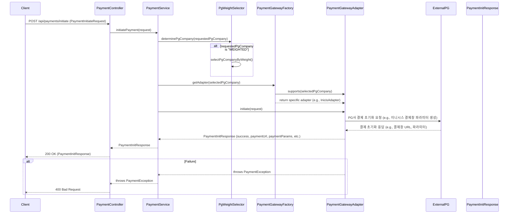

# Payment Processing and PG Integration Technical Specification

## 1. 개요
- **목적**: 본 문서는 VibePay 시스템의 결제 처리 및 PG(Payment Gateway) 연동 기능에 대한 기술 사양을 정의합니다. 이 기능은 사용자가 다양한 결제 수단(신용카드, 포인트 등)을 통해 상품/서비스를 구매하고, 이에 대한 승인, 취소, 환불 등의 결제 라이프사이클을 관리하며, 외부 PG사(이니시스, 나이스페이, 토스페이먼츠)와의 연동을 처리하는 것을 목표로 합니다.
- **System Design에서의 위치**: VibePay 백엔드 서비스의 핵심 모듈 중 하나로, 주문(Order) 모듈과 연동하여 결제 요청을 처리하고, 포인트(RewardPoints) 모듈과 연동하여 포인트 결제/환불을 처리합니다. 외부 PG사와의 통신을 담당하는 게이트웨이 역할을 수행합니다.
- **관련 컴포넌트 및 의존성**:
    - `PaymentController`: 결제 관련 API 엔드포인트 제공
    - `PaymentService`: 결제 비즈니스 로직 처리
    - `PaymentMapper`: 결제 데이터베이스 CRUD
    - `Payment`: 결제 엔티티
    - `PaymentInitiateRequest`, `PaymentConfirmRequest`, `PaymentInitResponse`, `PaymentConfirmResponse`, `PaymentCancelRequest`, `PaymentNetCancelRequest`: 결제 관련 DTO
    - `PaymentGatewayFactory`, `PaymentProcessorFactory`: 팩토리 패턴을 통한 PG 어댑터 및 결제 처리기 동적 선택
    - `PaymentGatewayAdapter` 인터페이스 및 구현체 (`InicisAdapter`, `NicePayAdapter`, `TossAdapter`): PG사별 연동 로직 캡슐화
    - `PaymentProcessor` 인터페이스 및 구현체 (`CreditCardPaymentProcessor`, `PointPaymentProcessor`): 결제 수단별 처리 로직 캡슐화
    - `PgWeightSelector`: PG사 가중치 기반 선택 로직
    - `PaymentInterfaceRequestLogMapper`: PG 연동 요청/응답 로그 기록
    - `WebClientUtil`: 외부 API 호출 유틸리티
    - `HashUtils`: 해싱 유틸리티 (서명 생성)
    - `enums` 패키지: `PgCompany`, `PaymentMethod`, `PayType`, `PaymentStatus`, `OrderStatus`, `TransactionType` 등 결제 관련 상태 및 타입 정의

## 2. 프로세스 흐름

### 2.1. 결제 초기화 (initiatePayment)


**단계별 상세 설명:**
1.  **Client -> PaymentController**: 클라이언트(프론트엔드)는 결제에 필요한 정보(회원 ID, 금액, 결제 수단, PG사 등)를 담아 `/api/payments/initiate` 엔드포인트로 `PaymentInitiateRequest`를 POST 요청합니다.
2.  **PaymentController -> PaymentService**: `PaymentController`는 요청을 받아 `PaymentService.initiatePayment()` 메서드를 호출합니다.
3.  **PaymentService -> PgWeightSelector**: `PaymentService`는 요청된 PG사(`request.getPgCompany()`)가 "WEIGHTED"인 경우 `PgWeightSelector`를 통해 가중치 기반으로 실제 사용할 PG사를 결정합니다. "WEIGHTED"가 아니면 요청된 PG사를 그대로 사용하며, 요청된 PG사가 `null`이면 기본값으로 "INICIS"를 사용합니다.
4.  **PaymentService -> PaymentGatewayFactory**: 결정된 PG사에 해당하는 `PaymentGatewayAdapter` 구현체를 `PaymentGatewayFactory`로부터 주입받습니다.
5.  **PaymentGatewayAdapter -> ExternalPG (결제창 준비)**: 선택된 `PaymentGatewayAdapter` (예: `InicisAdapter`)는 `initiate()` 메서드를 통해 PG사 결제 초기화 로직을 수행합니다. 이 단계에서는 **실제 PG사 API 호출은 발생하지 않으며**, 주로 클라이언트(프론트엔드)에서 PG사 결제창을 띄우기 위한 정보를 준비합니다. `PaymentInitResponse`에는 PG사 결제창의 URL과 함께, 해당 결제창에 전달해야 할 파라미터(가맹점 ID, 주문 ID, 금액, 상품명, 서명 등)가 포함됩니다. **각 PG사마다 결제창을 띄우는 방식(예: 팝업, 리다이렉트)과 필요한 파라미터의 구성이 상이하므로, 어댑터는 해당 PG사의 요구사항에 맞춰 `PaymentInitResponse`를 구성합니다.** 프론트엔드는 이 응답을 받아 PG사 결제창을 띄우고 결제를 진행하게 됩니다.
6.  **PaymentGatewayAdapter -> PaymentService**: PG사 초기화 응답을 `PaymentInitResponse` 객체로 반환합니다.
7.  **PaymentService -> PaymentController**: `PaymentInitResponse`를 `PaymentController`로 반환합니다.
8.  **PaymentController -> Client**: `PaymentController`는 `PaymentInitResponse`를 클라이언트에게 200 OK 응답으로 반환합니다. 클라이언트는 이 응답을 바탕으로 PG사 결제창을 띄웁니다.
9.  **Failure**: 결제 초기화 중 `PaymentException`이 발생하면, `PaymentController`는 400 Bad Request 응답을 반환합니다.

### 2.2. 결제 승인 (confirmPayment)
```mermaid
sequenceDiagram
    participant Client
    participant ExternalPG
    participant PaymentController
    participant PaymentService
    participant PaymentProcessorFactory
    participant PaymentProcessor
    participant PaymentGatewayFactory
    participant PaymentGatewayAdapter
    participant PaymentMapper
    participant PaymentInterfaceRequestLogMapper
    database Database

    Client->>ExternalPG: PG사 결제창에서 결제 진행
    ExternalPG->>Client: 결제 결과 (성공/실패)
    Client->>PaymentController: POST /api/payments/return (HttpServletRequest - PG사로부터의 리다이렉트)
    PaymentController->>PaymentService: confirmPayment(PaymentConfirmRequest)
    PaymentService->>PaymentProcessorFactory: getProcessor(request.getPaymentMethod())
    PaymentProcessorFactory-->>PaymentProcessor: return specific processor (e.g., CreditCardPaymentProcessor)
    PaymentService->>PaymentProcessor: processPayment(request)
    PaymentProcessor->>PaymentMapper: getNextPaymentSequence()
    PaymentProcessor->>PaymentGatewayFactory: getAdapter(request.getPgCompany())
    PaymentGatewayFactory-->>PaymentGatewayAdapter: return specific adapter (e.g., InicisAdapter)
    PaymentProcessor->>PaymentGatewayAdapter: confirm(request)
    PaymentGatewayAdapter->>PaymentInterfaceRequestLogMapper: insert(requestLog)
    PaymentGatewayAdapter->>ExternalPG: PG사 승인 API 호출 (e.g., 이니시스 승인 API)
    ExternalPG-->>PaymentGatewayAdapter: PG사 승인 API 응답 (e.g., InicisApprovalResponse)
    PaymentGatewayAdapter->>PaymentInterfaceRequestLogMapper: insert(responseLog)
    PaymentGatewayAdapter-->>PaymentProcessor: PaymentConfirmResponse (success, transactionId, etc.)
    PaymentProcessor->>Payment: create Payment entity
    PaymentProcessor->>PaymentMapper: insert(payment)
    PaymentProcessor-->>PaymentService: Payment (confirmed)
    PaymentService-->>PaymentController: Payment (confirmed)
    PaymentController-->>Client: 200 OK (PaymentReturnResponse)
    alt Failure
        PaymentGatewayAdapter--xPaymentProcessor: throws PaymentException
        PaymentProcessor--xPaymentService: throws PaymentException
        PaymentService--xPaymentController: throws PaymentException
        PaymentController--xClient: 400 Bad Request / 500 Internal Server Error
    end
```

**단계별 상세 설명:**
1.  **Client -> ExternalPG**: 클라이언트는 PG사 결제창에서 결제를 진행합니다.
2.  **ExternalPG -> Client**: PG사는 결제 결과를 클라이언트에게 리다이렉트(POST) 방식으로 전달합니다.
3.  **Client -> PaymentController (결제 결과 리다이렉트)**: PG사 결제창에서 결제가 완료되면, PG사는 설정된 `returnUrl`로 클라이언트를 리다이렉트(POST)합니다. 이때 결제 결과에 대한 파라미터(예: `resultCode`, `authToken`, `oid`, `price` 등)를 함께 전달합니다. **이 과정에서 팝업창으로 결제가 진행된 경우, 부모 창으로의 이벤트 전달(예: `window.opener.postMessage`) 또는 콜백 함수 호출을 통해 결제 결과를 부모 창에 알리고, 부모 창이 `/api/payments/return` 엔드포인트로 POST 요청을 보내는 복잡한 프론트엔드 로직이 필요합니다.** 현재 백엔드 `PaymentController`는 `HttpServletRequest`를 통해 이 파라미터들을 직접 수신합니다.
4.  **PaymentController -> PaymentService (결제 승인 요청)**: `PaymentController`는 `HttpServletRequest`로부터 PG사 응답 파라미터들을 수동으로 파싱하여 `PaymentConfirmRequest` 객체를 생성합니다. **이때 PG사마다 파라미터의 이름과 타입, 필수 여부가 상이하므로, 컨트롤러는 이니시스(예: `oid`를 `orderId`로 매핑)와 같은 특정 PG사의 응답 형식에 맞춰 파싱 로직을 수행합니다.** 생성된 `PaymentConfirmRequest`는 `PaymentService.confirmPayment()` 메서드로 전달되어 실제 결제 승인 처리를 시작합니다. 이 단계에서 이니시스의 경우 `resultCode`가 "0000"인 경우에만 승인 처리를 진행합니다.
5.  **PaymentService -> PaymentProcessorFactory**: `PaymentService`는 요청된 결제 수단(`request.getPaymentMethod()`)에 해당하는 `PaymentProcessor` 구현체를 `PaymentProcessorFactory`로부터 주입받습니다.
6.  **PaymentProcessor -> PaymentMapper**: `PaymentProcessor` (예: `CreditCardPaymentProcessor`)는 `paymentMapper.getNextPaymentSequence()`를 호출하여 새로운 `paymentId`를 생성합니다.
7.  **PaymentProcessor -> PaymentGatewayFactory**: `PaymentProcessor`는 PG사에 해당하는 `PaymentGatewayAdapter` 구현체를 `PaymentGatewayFactory`로부터 주입받습니다.
8.  **PaymentProcessor -> PaymentGatewayAdapter**: `PaymentProcessor`는 `PaymentGatewayAdapter.confirm()` 메서드를 호출하여 PG사에 실제 결제 승인 요청을 보냅니다.
9.  **PaymentGatewayAdapter -> PaymentInterfaceRequestLogMapper**: PG사 승인 API 요청 전, `PaymentInterfaceRequestLogMapper`를 통해 요청 정보를 로그로 기록합니다.
10. **PaymentGatewayAdapter -> ExternalPG**: `PaymentGatewayAdapter`는 PG사 승인 API를 호출합니다.
11. **ExternalPG -> PaymentGatewayAdapter**: PG사로부터 승인 API 응답을 받습니다.
12. **PaymentGatewayAdapter -> PaymentInterfaceRequestLogMapper**: PG사 승인 API 응답 후, `PaymentInterfaceRequestLogMapper`를 통해 응답 정보를 로그로 기록합니다.
13. **PaymentGatewayAdapter -> PaymentProcessor**: PG사 응답을 파싱하여 `PaymentConfirmResponse` 객체로 변환하여 `PaymentProcessor`에게 반환합니다. 이 단계에서 PG사 응답의 `resultCode` 및 금액 일치 여부 등을 확인하여 성공/실패를 판단합니다.
14. **PaymentProcessor -> PaymentMapper**: PG사 승인이 성공하면, `Payment` 엔티티를 생성하고 `paymentMapper.insert()`를 통해 데이터베이스에 결제 정보를 저장합니다.
15. **PaymentProcessor -> PaymentService**: 처리된 `Payment` 엔티티를 `PaymentService`로 반환합니다.
16. **PaymentService -> PaymentController**: `Payment` 엔티티를 `PaymentController`로 반환합니다.
17. **PaymentController -> Client**: `PaymentController`는 `Payment` 정보를 포함한 `PaymentReturnResponse`를 클라이언트에게 200 OK 응답으로 반환합니다.
18. **Failure**: 결제 승인 중 `PaymentException`이 발생하면, `PaymentController`는 400 Bad Request 또는 500 Internal Server Error 응답을 반환합니다. PG사 승인 실패 시에는 망취소(Net Cancel) 로직이 필요할 수 있습니다.

### 2.3. 결제 취소 (cancel)
```mermaid
sequenceDiagram
    participant Client
    participant PaymentProcessor
    participant PaymentGatewayFactory
    participant PaymentGatewayAdapter
    participant PaymentInterfaceRequestLogMapper
    participant ExternalPG
    database Database

    Client->>PaymentProcessor: processRefund(originalPayment)
    PaymentProcessor->>PaymentMapper: getNextPaymentSequence()
    PaymentProcessor->>Payment: create refund Payment entity
    PaymentProcessor->>PaymentMapper: insert(refundPayment)
    PaymentProcessor->>PaymentGatewayFactory: getAdapter(originalPayment.getPgCompany())
    PaymentGatewayFactory-->>PaymentGatewayAdapter: return specific adapter (e.g., InicisAdapter)
    PaymentProcessor->>PaymentGatewayAdapter: cancel(PaymentCancelRequest)
    PaymentGatewayAdapter->>PaymentInterfaceRequestLogMapper: insert(requestLog)
    PaymentGatewayAdapter->>ExternalPG: PG사 취소 API 호출
    ExternalPG-->>PaymentGatewayAdapter: PG사 취소 API 응답
    PaymentGatewayAdapter->>PaymentInterfaceRequestLogMapper: insert(responseLog)
    PaymentGatewayAdapter-->>PaymentProcessor: (void)
    PaymentProcessor-->>Client: Payment (refunded)
    alt Failure
        PaymentGatewayAdapter--xPaymentProcessor: throws RuntimeException
        PaymentProcessor--xClient: throws RuntimeException
    end
```

**단계별 상세 설명:**
1.  **Client -> PaymentProcessor**: 환불이 필요한 `originalPayment` 정보를 가지고 `PaymentProcessor.processRefund()` 메서드를 호출합니다. (이 호출은 일반적으로 OrderService 등 다른 서비스에서 발생할 수 있습니다.)
2.  **PaymentProcessor -> PaymentMapper**: `paymentMapper.getNextPaymentSequence()`를 호출하여 새로운 `paymentId`를 생성합니다.
3.  **PaymentProcessor -> Payment**: 환불 `Payment` 엔티티를 생성하고, `PayType`을 `REFUND`로, `OrderStatus`를 `CANCELLED`로 설정합니다.
4.  **PaymentProcessor -> PaymentMapper**: 생성된 환불 `Payment` 엔티티를 데이터베이스에 저장합니다.
5.  **PaymentProcessor -> PaymentGatewayFactory**: 원본 결제의 PG사에 해당하는 `PaymentGatewayAdapter` 구현체를 `PaymentGatewayFactory`로부터 주입받습니다.
6.  **PaymentProcessor -> PaymentGatewayAdapter**: `PaymentProcessor`는 `PaymentGatewayAdapter.cancel()` 메서드를 호출하여 PG사에 결제 취소 요청을 보냅니다. `PaymentCancelRequest`에는 원본 결제의 `transactionId`, `amount`, `reason` 등이 포함됩니다.
7.  **PaymentGatewayAdapter -> PaymentInterfaceRequestLogMapper**: PG사 취소 API 요청 전/후로 요청/응답 정보를 로그로 기록합니다.
8.  **PaymentGatewayAdapter -> ExternalPG**: `PaymentGatewayAdapter`는 PG사 취소 API를 호출합니다.
9.  **ExternalPG -> PaymentGatewayAdapter**: PG사로부터 취소 API 응답을 받습니다.
10. **PaymentGatewayAdapter -> PaymentProcessor**: 취소 처리 결과를 반환합니다. (현재 `void`로 구현되어 있으며, 내부적으로 예외 발생 시 `RuntimeException`을 던집니다.)
11. **PaymentProcessor -> Client**: 환불 처리된 `Payment` 엔티티를 반환합니다.
12. **Failure**: 취소 처리 중 예외 발생 시 `RuntimeException`이 던져집니다.

### 2.4. 망취소 (netCancel)
```mermaid
sequenceDiagram
    participant Client
    participant PaymentProcessor
    participant PaymentGatewayFactory
    participant PaymentGatewayAdapter
    participant PaymentInterfaceRequestLogMapper
    participant ExternalPG
    database Database

    Client->>PaymentProcessor: netCancel(PaymentNetCancelRequest)
    PaymentProcessor->>PaymentGatewayFactory: getAdapter(request.getPgCompany())
    PaymentGatewayFactory-->>PaymentGatewayAdapter: return specific adapter (e.g., InicisAdapter)
    PaymentProcessor->>PaymentGatewayAdapter: netCancel(request)
    PaymentGatewayAdapter->>PaymentInterfaceRequestLogMapper: insert(requestLog)
    PaymentGatewayAdapter->>ExternalPG: PG사 망취소 API 호출
    ExternalPG-->>PaymentGatewayAdapter: PG사 망취소 API 응답
    PaymentGatewayAdapter->>PaymentInterfaceRequestLogMapper: insert(responseLog)
    PaymentGatewayAdapter-->>PaymentProcessor: (void)
    alt Failure
        PaymentGatewayAdapter--xPaymentProcessor: throws RuntimeException
        PaymentProcessor--xClient: throws RuntimeException
    end
```

**단계별 상세 설명:**
1.  **Client -> PaymentProcessor**: 망취소가 필요한 `PaymentNetCancelRequest` 정보를 가지고 `PaymentProcessor.netCancel()` 메서드를 호출합니다. (이 호출은 일반적으로 결제 승인 실패 후 클라이언트 리다이렉트 과정에서 발생할 수 있습니다.)
2.  **PaymentProcessor -> PaymentGatewayFactory**: 요청된 PG사에 해당하는 `PaymentGatewayAdapter` 구현체를 `PaymentGatewayFactory`로부터 주입받습니다.
3.  **PaymentProcessor -> PaymentGatewayAdapter**: `PaymentProcessor`는 `PaymentGatewayAdapter.netCancel()` 메서드를 호출하여 PG사에 망취소 요청을 보냅니다. `PaymentNetCancelRequest`에는 `netCancelUrl`, `authToken`, `orderNumber`, `tid` 등이 포함됩니다.
4.  **PaymentGatewayAdapter -> PaymentInterfaceRequestLogMapper**: PG사 망취소 API 요청 전/후로 요청/응답 정보를 로그로 기록합니다.
5.  **PaymentGatewayAdapter -> ExternalPG**: `PaymentGatewayAdapter`는 PG사 망취소 API를 호출합니다.
6.  **ExternalPG -> PaymentGatewayAdapter**: PG사로부터 망취소 API 응답을 받습니다.
7.  **PaymentGatewayAdapter -> PaymentProcessor**: 망취소 처리 결과를 반환합니다. (현재 `void`로 구현되어 있으며, 내부적으로 예외 발생 시 `RuntimeException`을 던집니다.)
8.  **Failure**: 망취소 처리 중 예외 발생 시 `RuntimeException`이 던져집니다.

### 2.5. 사용자 결제 여정 상세 프로세스 (결제 버튼 클릭부터 주문 완료까지)

사용자가 상품을 선택하고 '결제하기' 버튼을 누른 후, 카드 선택 및 최종 주문 완료까지의 과정은 프론트엔드, 백엔드, 그리고 외부 PG사 간의 복잡한 상호작용으로 이루어집니다. 이 과정은 크게 **결제 초기화 (PG사 결제창 준비)**, **PG사 결제 진행 및 결과 통보**, **백엔드 결제 승인 및 주문 생성**의 세 단계로 나눌 수 있습니다.

#### 2.5.1. 결제 초기화 (PG사 결제창 준비)

1.  **사용자 액션**: 사용자가 주문 페이지에서 '결제하기' 버튼을 클릭하고, 결제 수단(예: 신용카드, 포인트)을 선택합니다.
2.  **프론트엔드 -> 백엔드 (결제 초기화 요청)**:
    *   프론트엔드는 사용자가 선택한 결제 정보(회원 ID, 주문 금액, 결제 수단, PG사 등)를 담아 백엔드의 `/api/payments/initiate` 엔드포인트로 POST 요청을 보냅니다.
    *   이때, 프론트엔드는 백엔드로부터 PG사 결제창을 띄우기 위한 정보를 받을 준비를 합니다.
3.  **백엔드 (`PaymentController` -> `PaymentService`)**:
    *   `PaymentController`는 `PaymentInitiateRequest`를 받아 `PaymentService.initiatePayment()`를 호출합니다.
    *   `PaymentService`는 요청된 PG사(`request.getPgCompany()`)에 따라 `PgWeightSelector`를 통해 실제 사용할 PG사를 결정합니다.
    *   결정된 PG사에 해당하는 `PaymentGatewayAdapter` (예: `InicisAdapter`)를 `PaymentGatewayFactory`로부터 주입받습니다.
4.  **백엔드 (`PaymentGatewayAdapter` - PG사 결제창 파라미터 생성)**:
    *   선택된 `PaymentGatewayAdapter`의 `initiate()` 메서드가 호출됩니다.
    *   **이 단계에서는 실제 PG사 API 호출은 발생하지 않습니다.** 대신, 프론트엔드가 PG사 결제창을 띄우는 데 필요한 파라미터(결제 URL, 가맹점 ID, 주문 ID, 금액, 상품명, 서명 등)를 생성하여 `PaymentInitResponse` 객체에 담습니다.
    *   **PG사마다 결제창을 띄우는 방식(팝업, 리다이렉트)과 필요한 파라미터의 구성이 상이하므로, 각 어댑터는 해당 PG사의 요구사항에 맞춰 `PaymentInitResponse`를 구성합니다.**
5.  **백엔드 -> 프론트엔드 (결제 초기화 응답)**:
    *   `PaymentService`는 `PaymentInitResponse`를 `PaymentController`로 반환하고, `PaymentController`는 이를 클라이언트에게 200 OK 응답으로 전달합니다.
    *   `PaymentInitResponse`에는 PG사 결제창 URL과 함께, 결제창에 전달할 파라미터들이 포함되어 있습니다.

#### 2.5.2. PG사 결제 진행 및 결과 통보

1.  **프론트엔드 -> PG사 (결제창 호출 및 결제 진행)**:
    *   프론트엔드는 백엔드로부터 받은 `PaymentInitResponse`의 `paymentUrl`과 `paymentParams`를 사용하여 PG사 결제창을 띄웁니다.
    *   **대부분의 PG사는 보안상의 이유로 팝업창을 통해 결제를 진행합니다.** 이 팝업창은 PG사의 도메인에서 실행되며, 사용자는 이 팝업창에서 카드 정보 입력, 인증 등의 결제 과정을 완료합니다.
2.  **PG사 -> 프론트엔드 (결제 결과 통보 - PG사별 상세)**:
    *   결제가 완료되면, PG사는 설정된 `returnUrl`로 클라이언트(팝업창 또는 부모 창)를 리다이렉트(POST)합니다. 이때 결제 결과에 대한 파라미터(예: `resultCode`, `authToken`, `oid`, `price` 등)를 함께 전달합니다.
    *   **팝업창으로 결제가 진행된 경우, 팝업창은 부모 창으로의 이벤트 전달(예: `window.opener.postMessage`) 또는 콜백 함수 호출을 통해 결제 결과를 부모 창에 알립니다.** 이 과정은 PG사별로 구현 방식이 다를 수 있으며, 프론트엔드 개발 시 주의 깊게 처리해야 하는 부분입니다.
    *   **이니시스 (INICIS)의 경우**:
        *   이니시스 결제창(팝업)에서 결제가 완료되면, `returnUrl`로 리다이렉트됩니다.
        *   이 `returnUrl`은 일반적으로 프론트엔드의 특정 페이지(예: `payment/return`)로 설정되며, 이 페이지는 팝업창 내에서 실행됩니다.
        *   팝업창 내의 프론트엔드 코드는 PG사로부터 전달받은 결제 결과 파라미터(예: `authToken`, `authUrl`, `netCancelUrl`, `mid`, `oid`, `price`, `resultCode`, `resultMsg` 등)를 파싱합니다.
        *   이 파라미터들을 `window.opener.postMessage()` 또는 `window.opener.callbackFunction()`과 같은 JavaScript 함수 호출을 통해 부모 창으로 전달합니다.
        *   부모 창은 이 메시지를 수신하여 백엔드의 `/api/payments/return` 엔드포인트로 최종 결제 승인 요청을 보냅니다.
    *   **나이스페이 (NICEPAY)의 경우**:
        *   나이스페이 결제창(팝업)에서 결제가 완료되면, `returnUrl`로 리다이렉트됩니다.
        *   이니시스와 유사하게 팝업창 내의 프론트엔드 코드는 PG사로부터 전달받은 결제 결과 파라미터(예: `AuthToken`, `TxTid`, `MID`, `Amt`, `EdiDate`, `SignData`, `NextAppURL` 등)를 파싱합니다.
        *   이 파라미터들을 `window.opener.postMessage()` 또는 콜백 함수 호출을 통해 부모 창으로 전달합니다.
        *   부모 창은 이 메시지를 수신하여 백엔드의 `/api/payments/return` 엔드포인트로 최종 결제 승인 요청을 보냅니다.
        *   **나이스페이의 경우, 이니시스와 달리 최종 승인 API 호출 시 `NextAppURL`이라는 추가적인 URL을 사용해야 하는 특징이 있습니다.** 이 `NextAppURL`은 PG사로부터 받은 응답에 포함되어 있으며, 백엔드에서 이 URL로 최종 승인 요청을 보내야 합니다.

#### 2.5.3. 백엔드 결제 승인 및 주문 생성

1.  **프론트엔드 -> 백엔드 (`PaymentController` - 결제 결과 리다이렉트)**:
    *   부모 창(또는 리다이렉트된 클라이언트)은 PG사로부터 받은 결제 결과 파라미터들을 백엔드의 `/api/payments/return` 엔드포인트로 POST 요청합니다.
    *   **현재 구현은 `HttpServletRequest`를 통해 이 파라미터들을 직접 수신하며, PG사마다 파라미터의 이름과 타입, 필수 여부가 상이하므로 컨트롤러에서 수동으로 파싱하는 로직을 포함합니다.**
2.  **백엔드 (`PaymentController` -> `PaymentService` - 결제 승인 요청)**:
    *   `PaymentController`는 파싱된 파라미터들을 바탕으로 `PaymentConfirmRequest` 객체를 생성하고, `PaymentService.confirmPayment()` 메서드를 호출합니다.
    *   `PaymentService`는 `PaymentConfirmRequest`에 포함된 결제 수단에 해당하는 `PaymentProcessor` (예: `CreditCardPaymentProcessor`)를 `PaymentProcessorFactory`로부터 주입받습니다.
3.  **백엔드 (`PaymentProcessor` -> `PaymentGatewayAdapter` - 최종 승인 API 호출)**:
    *   `PaymentProcessor`는 `PaymentGatewayFactory`로부터 PG사에 해당하는 `PaymentGatewayAdapter` (예: `InicisAdapter`)를 주입받아 `confirm()` 메서드를 호출합니다.
    *   `PaymentGatewayAdapter`는 PG사 승인 API를 호출하기 전에 요청 정보를 `PaymentInterfaceRequestLog`에 기록합니다.
    *   **이 단계에서 백엔드는 PG사로 최종 결제 승인 API를 호출합니다.** (예: 이니시스의 경우 `authToken`과 `authUrl`을 사용하여 최종 승인 요청).
    *   PG사로부터 승인 API 응답을 받으면, `PaymentGatewayAdapter`는 응답 정보를 `PaymentInterfaceRequestLog`에 기록하고, `PaymentConfirmResponse` 객체로 변환하여 `PaymentProcessor`에게 반환합니다.
    *   **PG사 응답의 `resultCode` 및 금액 일치 여부 등을 확인하여 결제 성공 여부를 판단합니다.**
4.  **백엔드 (`PaymentProcessor` - 결제 정보 저장)**:
    *   PG사 승인이 성공하면, `PaymentProcessor`는 새로운 `paymentId`를 생성하고, `Payment` 엔티티를 생성하여 결제 정보를 데이터베이스에 저장합니다.
    *   이후 `Payment` 엔티티를 `PaymentService`로 반환합니다.
5.  **백엔드 (`OrderService` - 주문 생성)**:
    *   (이 부분은 `OrderService.createOrder`에서 결제 승인 후 주문을 생성하는 로직과 연결됩니다. `PaymentService.confirmPayment`가 성공적으로 완료되면, `OrderService`는 주문 상품 정보를 바탕으로 `Order` 및 `OrderItem` 엔티티를 생성하고 DB에 저장합니다.)
6.  **백엔드 -> 프론트엔드 (최종 주문 완료 응답)**:
    *   `PaymentService`는 `Payment` 엔티티를 `PaymentController`로 반환하고, `PaymentController`는 `Payment` 정보를 포함한 `PaymentReturnResponse`를 클라이언트에게 200 OK 응답으로 반환합니다.
    *   프론트엔드는 이 응답을 받아 사용자에게 주문 완료 화면을 보여줍니다.

#### 2.5.4. 실패 처리 및 망취소

*   **결제 초기화 실패**: 백엔드에서 `PaymentException` 발생 시 400 Bad Request 응답.
*   **PG사 결제 진행 중 실패**: PG사 결제창에서 사용자가 결제를 취소하거나 실패하면, `returnUrl`로 실패 결과가 통보됩니다. 백엔드는 이를 받아 실패 처리 로직을 수행합니다.
*   **백엔드 결제 승인 실패**: PG사 최종 승인 API 호출 결과가 실패이거나, 금액 불일치 등의 문제가 발생하면 `PaymentException`이 발생합니다.
*   **결제 승인 후 주문 생성 실패**: 결제 승인은 성공했으나, 이후 백엔드에서 주문 생성 중 DB 오류 등 예상치 못한 문제가 발생하면, **자동으로 망취소(Net Cancel) 로직을 시도합니다.** 이는 PG사에 이미 승인된 결제를 취소하는 과정으로, `PaymentProcessor.netCancel()`을 통해 이루어집니다. 망취소마저 실패하면 심각한 데이터 불일치 상황이 발생할 수 있으므로, 이에 대한 모니터링 및 수동 처리 프로세스가 중요합니다.


## 3. 데이터 구조

### 3.1. 데이터베이스
`schema.sql` 또는 `pay.sql` 파일이 없으므로, `Payment` 엔티티와 `PaymentMapper.xml`을 기반으로 스키마를 유추합니다.

**`Payment` 테이블 (유추)**
```sql
CREATE TABLE payment (
    payment_id VARCHAR(255) PRIMARY KEY,
    member_id BIGINT NOT NULL,
    order_id VARCHAR(255),
    claim_id VARCHAR(255),
    amount BIGINT NOT NULL,
    payment_method VARCHAR(50) NOT NULL,
    pay_type VARCHAR(50) NOT NULL, -- PAYMENT, REFUND
    pg_company VARCHAR(50),
    status VARCHAR(50) NOT NULL, -- SUCCESS, FAILED, CANCELLED, PENDING
    order_status VARCHAR(50) NOT NULL, -- ORDERED, CANCELLED
    transaction_id VARCHAR(255),
    payment_date DATETIME NOT NULL
);

CREATE SEQUENCE payment_id_seq START WITH 1 INCREMENT BY 1;
CREATE SEQUENCE claim_id_seq START WITH 1 INCREMENT BY 1;

-- PaymentInterfaceRequestLog 테이블 (유추)
CREATE TABLE payment_interface_request_log (
    id BIGINT AUTO_INCREMENT PRIMARY KEY,
    payment_id VARCHAR(255),
    request_type VARCHAR(100) NOT NULL,
    request_payload TEXT,
    response_payload TEXT,
    timestamp DATETIME NOT NULL DEFAULT CURRENT_TIMESTAMP
);
```

**각 필드의 타입, 제약조건, 기본값, 인덱스:**
- `payment_id`: `VARCHAR(255)`, `PRIMARY KEY`, 결제 고유 ID. `YYYYMMDDP` + 8자리 시퀀스.
- `member_id`: `BIGINT`, `NOT NULL`, 회원 ID.
- `order_id`: `VARCHAR(255)`, 주문 ID.
- `claim_id`: `VARCHAR(255)`, 클레임 ID (환불 등).
- `amount`: `BIGINT`, `NOT NULL`, 결제/환불 금액.
- `payment_method`: `VARCHAR(50)`, `NOT NULL`, 결제 수단 (`CREDIT_CARD`, `POINT`).
- `pay_type`: `VARCHAR(50)`, `NOT NULL`, 결제 타입 (`PAYMENT`, `REFUND`).
- `pg_company`: `VARCHAR(50)`, PG사 (`INICIS`, `NICEPAY`, `TOSS`). 포인트 결제 시 `NULL`.
- `status`: `VARCHAR(50)`, `NOT NULL`, 결제 상태 (`SUCCESS`, `FAILED`, `CANCELLED`, `PENDING`).
- `order_status`: `VARCHAR(50)`, `NOT NULL`, 주문 상태 (`ORDERED`, `CANCELLED`).
- `transaction_id`: `VARCHAR(255)`, PG사 거래 ID (TID).
- `payment_date`: `DATETIME`, `NOT NULL`, 결제/환불 일시.

**`payment_interface_request_log` 테이블:**
- `id`: `BIGINT`, `AUTO_INCREMENT`, `PRIMARY KEY`, 로그 고유 ID.
- `payment_id`: `VARCHAR(255)`, 관련 결제 ID.
- `request_type`: `VARCHAR(100)`, `NOT NULL`, 요청 타입 (예: `INICIS_API_CALL`, `NICEPAY_CANCEL`).
- `request_payload`: `TEXT`, 요청 전문 (JSON 또는 폼 데이터).
- `response_payload`: `TEXT`, 응답 전문 (JSON 또는 폼 데이터).
- `timestamp`: `DATETIME`, `NOT NULL`, `DEFAULT CURRENT_TIMESTAMP`, 로그 기록 시각.

### 3.2. DTO/API 모델

#### `Payment` (Entity)
```java
package com.vibe.pay.backend.payment;

import lombok.AllArgsConstructor;
import lombok.Getter;
import lombok.NoArgsConstructor;
import lombok.Setter;

import java.time.LocalDateTime;

@Getter
@Setter
@NoArgsConstructor
@AllArgsConstructor
public class Payment {
    private String paymentId;
    private Long memberId;
    private String orderId;
    private String claimId;
    private Long amount;
    private String paymentMethod; // CREDIT_CARD, POINT
    private String payType;       // PAYMENT, REFUND
    private String pgCompany;     // INICIS, NICEPAY, TOSS
    private String status;        // SUCCESS, FAILED, CANCELLED, PENDING
    private String orderStatus;   // ORDERED, CANCELED
    private String transactionId; // PG사 거래 ID (TID)
    private LocalDateTime paymentDate;
}
```

#### `PaymentInitiateRequest` (Request DTO)
```java
package com.vibe.pay.backend.payment;

import lombok.Getter; // @Getter, @Setter 어노테이션이 없지만, getter/setter 메서드가 수동으로 구현되어 있음
import lombok.Setter;

public class PaymentInitiateRequest {
    private Long memberId;
    private Long amount;        // 금액(원), 정수 변환하여 사용
    private String paymentMethod; // CREDIT_CARD, POINT
    private String pgCompany;   // PG사 (INICIS, NICEPAY, TOSS, WEIGHTED)

    // 화면에서 넘어오는 정보 (PG사로 전달될 정보)
    private String goodName;
    private String buyerName;
    private String buyerTel;
    private String buyerEmail;
    private String orderId; // 클라이언트에서 생성하여 전달
    // ... (getter/setter 생략)
}
```
- **검증 규칙**:
    - `memberId`: `NOT NULL`, `Long` 타입.
    - `amount`: `NOT NULL`, `Long` 타입, 0보다 커야 함.
    - `paymentMethod`: `NOT NULL`, `String` 타입, `PaymentMethod` enum 값 중 하나여야 함.
    - `pgCompany`: `NOT NULL` (또는 `WEIGHTED` 허용), `String` 타입, `PgCompany` enum 값 중 하나 또는 "WEIGHTED"여야 함.
    - `goodName`, `buyerName`, `buyerTel`, `buyerEmail`, `orderId`: `String` 타입, PG사 연동에 필요한 정보. `orderId`는 클라이언트에서 생성하여 전달.

#### `PaymentInitResponse` (Response DTO)
```java
package com.vibe.pay.backend.payment.dto;

import lombok.Data;
import lombok.NoArgsConstructor;

@Data
@NoArgsConstructor
public class PaymentInitResponse {
    private boolean success;
    private String paymentUrl;      // PG사 결제창 URL
    private String paymentParams;   // PG사 결제창으로 전달할 파라미터 (JSON 또는 쿼리스트링)
    private String errorMessage;
    private String paymentId;       // 내부 생성된 결제 ID
    
    // Frontend compatibility fields (matching popup.vue form)
    private String mid;           // merchantId
    private String oid;           // orderId  
    private Long price;           // amount
    private String goodName;      // productName
    private String moId;          // merchantId (same as mid)
    
    // Standard fields (PG사 공통 파라미터)
    private String orderId;
    private Long amt;
    private String productName;
    private String buyerName;
    private String buyerTel;
    private String buyerEmail;
    private String timestamp;
    private String mKey;
    private String signature;
    private String verification;
    private String returnUrl;
    private String closeUrl;
    private String version;
    private String currency;
    private String gopaymethod;
    private String acceptmethod;
    
    // 나이스페이 특화 필드
    private String ediDate;
    private String SignData;
    
    // 실제 선택된 PG사 정보 (가중치 선택 시 사용)
    private String selectedPgCompany;
}
```

#### `PaymentConfirmRequest` (Request DTO)
```java
package com.vibe.pay.backend.payment;

import lombok.Getter;
import lombok.Setter;

@Getter
@Setter
public class PaymentConfirmRequest {
    private String status; // e.g., "SUCCESS", "FAILURE" (PG사 응답에서 파싱)
    private String transactionId; // PG사 거래 ID (TID)
    
    // 이니시스 승인 처리용 필드 (PG사로부터 리다이렉트 시 전달되는 파라미터)
    private String authToken;
    private String authUrl;
    private String netCancelUrl;
    private String mid;
    private String orderId; // 이니시스에서 전달되는 실제 필드명 (oid와 동일)
    private Long price;     // PG사에서 전달되는 금액
    
    // 결제 승인 시 필요한 추가 정보 (내부적으로 사용)
    private Long memberId;
    private String paymentId;
    private String paymentMethod; // CREDIT_CARD, POINT
    private String pgCompany;     // INICIS, NICEPAY, TOSS
    private String txTid;         // 나이스페이의 경우 TxTid
    private String nextAppUrl;    // 나이스페이의 경우 다음 승인 URL
}
```
- **검증 규칙**:
    - `authToken`, `authUrl`, `mid`, `orderId`, `price`: PG사 응답에 따라 필수 여부 및 타입 확인.
    - `memberId`, `paymentId`, `paymentMethod`, `pgCompany`: `PaymentService`에서 `PaymentConfirmRequest`를 구성할 때 설정되는 내부 정보.

#### `PaymentConfirmResponse` (Response DTO)
```java
package com.vibe.pay.backend.payment.dto;

import lombok.Getter; // @Getter, @Setter 어노테이션이 없지만, getter/setter 메서드가 수동으로 구현되어 있음
import lombok.Setter;

public class PaymentConfirmResponse {
    private boolean success;
    private String transactionId; // PG사 거래 ID (TID)
    private Long amount;
    private String status;        // SUCCESS, FAILED
    private String errorMessage;

    // ... (constructor, getter/setter 생략)
}
```

#### `PaymentCancelRequest` (Request DTO)
```java
package com.vibe.pay.backend.payment.dto;

import lombok.AllArgsConstructor;
import lombok.Getter;
import lombok.NoArgsConstructor;
import lombok.Setter;

@Getter
@Setter
@NoArgsConstructor
@AllArgsConstructor
public class PaymentCancelRequest {
    private String transactionId; // PG사 거래 ID (TID)
    private String paymentId;     // 내부 결제 ID
    private String orderId;
    private Long amount;
    private String reason;        // 취소 사유
}
```
- **검증 규칙**:
    - `transactionId`: `NOT NULL`, `String` 타입, 취소할 PG사 거래 ID.
    - `paymentId`: `NOT NULL`, `String` 타입, 내부 결제 ID.
    - `amount`: `NOT NULL`, `Long` 타입, 취소 금액.
    - `reason`: `NOT NULL`, `String` 타입, 취소 사유.

#### `PaymentNetCancelRequest` (Request DTO)
```java
package com.vibe.pay.backend.payment.dto;

import lombok.AllArgsConstructor;
import lombok.Getter;
import lombok.NoArgsConstructor;
import lombok.Setter;

@Getter
@Setter
@NoArgsConstructor
@AllArgsConstructor
public class PaymentNetCancelRequest {
    private String netCancelUrl;  // 망취소 URL
    private String authToken;     // PG사 인증 토큰
    private String orderNumber;   // 주문 번호 (이니시스 oid)
    private String paymentMethod;
    private String pgCompany;
    private String tid;           // PG사 거래 ID (TID)
    private Long amount;          // 망취소 금액
}
```
- **검증 규칙**:
    - `netCancelUrl`, `authToken`, `orderNumber`, `pgCompany`, `tid`: `NOT NULL`, `String` 타입.
    - `amount`: `NOT NULL`, `Long` 타입.

#### `InicisApprovalResponse` (이니시스 승인 응답 DTO)
```java
package com.vibe.pay.backend.payment;

import com.fasterxml.jackson.annotation.JsonProperty;
// ... (필드, getter/setter, toString 생략)
public class InicisApprovalResponse {
    @JsonProperty("resultCode") private String resultCode; // 결과 코드 (0000: 성공)
    @JsonProperty("resultMsg") private String resultMsg;   // 결과 메시지
    @JsonProperty("TotPrice") private Long totPrice;       // 총 결제 금액
    @JsonProperty("tid") private String tid;               // 거래 ID
    @JsonProperty("MOID") private String moid;             // 가맹점 주문번호
    // ... (카드 정보 등 이니시스 응답 전문 필드 다수)
}
```

#### `InicisRefundRequest` (이니시스 환불 요청 DTO)
```java
package com.vibe.pay.backend.payment;

// ... (필드, getter/setter, toString 생략)
public class InicisRefundRequest {
    private String mid;         // 가맹점 ID
    private String type;        // "refund" 고정
    private String timestamp;
    private String clientIp;
    private String hashData;    // 서명 데이터
    private RefundData data;    // 환불 상세 데이터

    public static class RefundData {
        private String tid;     // 취소할 거래 ID
        private String msg;     // 취소 사유
        // ... (getter/setter)
    }
}
```

#### `InicisRefundResponse` (이니시스 환불 응답 DTO)
```java
package com.vibe.pay.backend.payment;

import com.fasterxml.jackson.annotation.JsonProperty;
// ... (필드, getter/setter, toString 생략)
public class InicisRefundResponse {
    @JsonProperty("resultCode") private String resultCode; // 결과 코드 (00: 성공)
    @JsonProperty("resultMsg") private String resultMsg;   // 결과 메시지
    @JsonProperty("tid") private String tid;               // 거래 ID
    @JsonProperty("cancelDate") private String cancelDate; // 취소 일자
    @JsonProperty("cancelTime") private String cancelTime; // 취소 시간
    // ... (현금영수증 관련 필드)
}
```

## 4. API 명세

### 4.1. 결제 초기화
- **Endpoint**: `/api/payments/initiate`
- **HTTP Method**: `POST`
- **인증 요구사항**: 필요 (예: JWT 토큰을 통한 회원 인증)
- **Request 예시 (JSON)**:
    ```json
    {
        "memberId": 1,
        "amount": 15000,
        "paymentMethod": "CREDIT_CARD",
        "pgCompany": "INICIS",
        "goodName": "VibePay 상품",
        "buyerName": "홍길동",
        "buyerTel": "01012345678",
        "buyerEmail": "hong@example.com",
        "orderId": "ORDER_202510160001"
    }
    ```
- **검증 규칙**: `PaymentInitiateRequest` DTO 참조.
- **Success Response (예시)**:
    ```json
    {
        "success": true,
        "paymentUrl": "https://stgstdpay.inicis.com/stdpay/pay.ini",
        "paymentParams": null, // 이니시스의 경우 paymentUrl로 직접 이동, 파라미터는 폼 데이터로 전달
        "errorMessage": null,
        "paymentId": null, // initiate 단계에서는 paymentId가 생성되지 않음 (개선 필요)
        "mid": "INIpayTest",
        "oid": "ORDER_202510160001",
        "price": 15000,
        "goodName": "VibePay 상품",
        "moId": "INIpayTest",
        "orderId": "ORDER_202510160001",
        "amt": 15000,
        "productName": "VibePay 상품",
        "buyerName": "홍길동",
        "buyerTel": "01012345678",
        "buyerEmail": "hong@example.com",
        "timestamp": "20251016103000",
        "mKey": "...",
        "signature": "...",
        "verification": "...",
        "returnUrl": "http://localhost:3000/payment/return",
        "closeUrl": "http://localhost:3000/payment/close",
        "version": "1.0",
        "currency": "WON",
        "gopaymethod": "Card",
        "acceptmethod": "below1000",
        "ediDate": null,
        "SignData": null,
        "selectedPgCompany": "INICIS"
    }
    ```
- **Error Response**:
    - **HTTP Status**: `400 Bad Request`
    - **에러 코드**: `PAYMENT_INITIATION_FAILED`
    - **메시지**: "결제 초기화 실패: [상세 메시지]"
    - **상황**: 필수 파라미터 누락, 유효하지 않은 결제 수단/PG사, PG사 초기화 로직 오류 등.

### 4.2. 결제 결과 처리 (승인)
- **Endpoint**: `/api/payments/return`
- **HTTP Method**: `POST` (PG사로부터의 리다이렉트)
- **인증 요구사항**: 없음 (PG사로부터의 콜백이므로)
- **Request 예시 (Form Data)**: (이니시스 예시)
    ```
    resultCode=0000&resultMsg=결제성공&authToken=xxxxxxxxxxxxxxxxxxxxxxxxxxxxxxxxxxxxxxxx&authUrl=https://stgstdpay.inicis.com/stdpay/web/INIStdPayAppr.ini&netCancelUrl=https://stgstdpay.inicis.com/stdpay/web/INIStdPayNetCancel.ini&mid=INIpayTest&oid=ORDER_202510160001&price=15000&...
    ```
- **검증 규칙**: `HttpServletRequest`에서 파라미터 파싱 후 `PaymentConfirmRequest` DTO 참조. `resultCode`가 "0000"인지, `price`가 유효한지 등.
- **Success Response (예시)**:
    ```json
    {
        "success": true,
        "message": "결제가 성공적으로 완료되었습니다.",
        "resultCode": null,
        "payment": {
            "paymentId": "20251016P00000001",
            "memberId": 1,
            "orderId": "ORDER_202510160001",
            "claimId": null,
            "amount": 15000,
            "paymentMethod": "CREDIT_CARD",
            "payType": "PAYMENT",
            "pgCompany": "INICIS",
            "status": "SUCCESS",
            "orderStatus": "ORDERED",
            "transactionId": "INIpayTest_20251016103500_123456",
            "paymentDate": "2025-10-16T10:35:00"
        }
    }
    ```
- **Error Response**:
    - **HTTP Status**: `400 Bad Request` 또는 `500 Internal Server Error`
    - **에러 코드**: `PAYMENT_APPROVAL_FAILED`, `PG_SYSTEM_ERROR`
    - **메시지**: "결제 처리 중 오류가 발생했습니다: [상세 메시지]" 또는 "결제 실패: [PG사 메시지]"
    - **상황**: PG사 응답 파라미터 누락/오류, PG사 승인 실패, 금액 불일치, 내부 시스템 오류 등.

### 4.3. 결제 취소 (내부 API)
- **Endpoint**: (현재 `PaymentController`에 직접적인 취소 API는 없음. `PaymentService.updatePayment`를 통해 상태 변경 가능하나, PG사 연동 취소는 `PaymentProcessor.processRefund`를 통해 간접적으로 호출됨.)
    - **개선 방향**: 명시적인 취소 API 엔드포인트 (`POST /api/payments/{paymentId}/cancel`)를 추가하고, `PaymentCancelRequest`를 받아 `PaymentService.cancelPayment`와 같은 메서드를 호출하도록 변경 필요.
- **HTTP Method**: `POST` (제안)
- **인증 요구사항**: 필요 (관리자 또는 해당 회원)
- **Request 예시 (JSON)**: (제안)
    ```json
    {
        "paymentId": "20251016P00000001",
        "amount": 15000,
        "reason": "고객 변심"
    }
    ```
- **검증 규칙**: `PaymentCancelRequest` DTO 참조.
- **Success Response (예시)**: (제안)
    ```json
    {
        "success": true,
        "message": "결제가 성공적으로 취소되었습니다.",
        "refundPayment": {
            "paymentId": "20251016P00000002",
            "memberId": 1,
            "orderId": "ORDER_202510160001",
            "claimId": null,
            "amount": 15000,
            "paymentMethod": "CREDIT_CARD",
            "payType": "REFUND",
            "pgCompany": "INICIS",
            "status": "SUCCESS",
            "orderStatus": "CANCELLED",
            "transactionId": "INIpayTest_20251016103500_123456",
            "paymentDate": "2025-10-16T10:40:00"
        }
    }
    ```
- **Error Response**:
    - **HTTP Status**: `400 Bad Request` 또는 `500 Internal Server Error`
    - **에러 코드**: `PAYMENT_CANCEL_FAILED`, `PG_SYSTEM_ERROR`
    - **메시지**: "결제 취소 실패: [상세 메시지]"
    - **상황**: 유효하지 않은 `paymentId`, 이미 취소된 결제, PG사 취소 API 오류 등.

## 5. 비즈니스 로직 상세

### 5.1. PG사 가중치 기반 선택 (`PgWeightSelector`)
- **목적**: 여러 PG사 중 특정 PG사의 부하 분산 또는 프로모션 등을 위해 가중치 기반으로 PG사를 선택합니다.
- **입력 파라미터**: 없음 (요청 시점에 `payment.weight.inicis`, `payment.weight.nicepay` 설정 값 사용)
- **계산 로직**:
    ```java
    // PgWeightSelector.java
    @Value("${payment.weight.inicis:10}")
    private int inicisWeight;

    @Value("${payment.weight.nicepay:90}")
    private int nicepayWeight;

    public String selectPgCompanyByWeight() {
        int totalWeight = inicisWeight + nicepayWeight;

        if (totalWeight <= 0) {
            // 총 가중치가 0 이하인 경우, 기본값으로 INICIS 반환
            return "INICIS";
        }

        int randomValue = random.nextInt(totalWeight); // 0부터 totalWeight-1 사이의 난수 생성

        String selectedPg;
        if (randomValue < inicisWeight) { // 이니시스 가중치 범위 내에 있으면 이니시스 선택
            selectedPg = "INICIS";
        } else { // 아니면 나이스페이 선택
            selectedPg = "NICEPAY";
        }
        return selectedPg;
    }
    ```
- **제약조건**:
    - `inicisWeight`, `nicepayWeight`는 `application.yml` 또는 환경 변수로 설정됩니다.
    - 현재는 이니시스와 나이스페이만 가중치 선택 대상입니다. 토스페이먼츠는 포함되어 있지 않습니다.
- **에러 케이스**:
    - `totalWeight`가 0 이하인 경우, 기본값 "INICIS"를 반환하며 경고 로그를 남깁니다.

### 5.2. 결제 ID 생성 (`generatePaymentId`)
- **목적**: 시스템 내부에서 결제를 고유하게 식별하는 `paymentId`를 생성합니다.
- **입력 파라미터**: 없음
- **계산 로직**:
    ```java
    // CreditCardPaymentProcessor.java 또는 PointPaymentProcessor.java
    private String generatePaymentId() {
        // Payment ID 형식: YYYYMMDDP + 8자리 시퀀스 (총 17자리)
        // 예: 20250918P00000001

        // 현재 날짜를 YYYYMMDD 형식으로 가져오기
        java.time.LocalDate today = java.time.LocalDate.now();
        String datePrefix = today.format(Constants.DATE_FORMATTER_YYYYMMDD); // "yyyyMMdd"

        // 시퀀스 번호 가져오기 (8자리로 패딩)
        Long sequence = paymentMapper.getNextPaymentSequence(); // DB 시퀀스 사용
        String sequenceStr = String.format("%0" + Constants.SEQUENCE_PADDING_LENGTH + "d", sequence); // SEQUENCE_PADDING_LENGTH = 8

        // 최종 Payment ID 생성: YYYYMMDDP + 8자리 시퀀스
        return datePrefix + Constants.PAYMENT_ID_PREFIX + sequenceStr; // PAYMENT_ID_PREFIX = "P"
    }
    ```
- **제약조건**:
    - `payment_id_seq` 데이터베이스 시퀀스를 사용합니다.
    - `Constants.DATE_FORMATTER_YYYYMMDD`는 "yyyyMMdd" 형식입니다.
    - `Constants.SEQUENCE_PADDING_LENGTH`는 8입니다.
    - `Constants.PAYMENT_ID_PREFIX`는 "P"입니다.
- **에러 케이스**:
    - 데이터베이스 시퀀스 조회 실패 시 예외 발생.

### 5.3. 신용카드 결제 처리 (`CreditCardPaymentProcessor.processPayment`)
- **목적**: 신용카드 결제 승인 요청을 처리하고, PG사 연동 및 내부 결제 정보 저장을 수행합니다.
- **입력 파라미터**: `PaymentConfirmRequest request`
- **계산 로직**:
    ```java
    // CreditCardPaymentProcessor.java
    @Override
    public Payment processPayment(PaymentConfirmRequest request) {
        // 1. PaymentId 생성
        String paymentId = generatePaymentId();
        request.setPaymentId(paymentId); // request 객체에 paymentId 설정

        // 2. PG 어댑터를 사용하여 승인 처리
        PaymentGatewayAdapter pgAdapter = paymentGatewayFactory.getAdapter(request.getPgCompany());
        PaymentConfirmResponse pgResponse = pgAdapter.confirm(request); // PG사 승인 API 호출
        if (!pgResponse.isSuccess()) {
            // PG사 승인 실패 시 PaymentException 발생
            throw PaymentException.approvalFailed(pgResponse.getErrorMessage());
        }

        // 3. Payment 엔티티 생성 및 저장
        Payment payment = new Payment();
        payment.setPaymentId(paymentId);
        payment.setMemberId(request.getMemberId());
        payment.setOrderId(request.getOrderId());
        payment.setAmount(request.getPrice());
        payment.setPaymentMethod(PaymentMethod.CREDIT_CARD.getCode());
        payment.setPayType(PayType.PAYMENT.getCode());
        payment.setPgCompany(request.getPgCompany());
        payment.setStatus(PaymentStatus.SUCCESS.getCode());
        payment.setOrderStatus(OrderStatus.ORDERED.getCode());
        payment.setTransactionId(pgResponse.getTransactionId()); // PG사 거래 ID 저장
        payment.setPaymentDate(LocalDateTime.now());

        paymentMapper.insert(payment); // DB에 결제 정보 저장

        return payment;
    }
    ```
- **제약조건**:
    - `request` 객체에 `memberId`, `orderId`, `price`, `pgCompany` 등이 유효하게 설정되어 있어야 합니다.
    - `PaymentGatewayAdapter.confirm()` 메서드가 성공적으로 `PaymentConfirmResponse`를 반환해야 합니다.
- **에러 케이스**:
    - `PaymentId` 생성 실패.
    - PG사 어댑터 조회 실패.
    - PG사 승인 실패 (`pgResponse.isSuccess()`가 `false`).
    - 데이터베이스 저장 실패.
    - `PaymentException` 또는 `RuntimeException` 발생 시 롤백.

### 5.4. 포인트 결제 처리 (`PointPaymentProcessor.processPayment`)
- **목적**: 포인트 결제 요청을 처리하고, 내부 결제 정보 저장 및 포인트 사용 기록을 수행합니다.
- **입력 파라미터**: `PaymentConfirmRequest request`
- **계산 로직**:
    ```java
    // PointPaymentProcessor.java
    @Override
    public Payment processPayment(PaymentConfirmRequest request) {
        String paymentId = generatePaymentId();

        // 포인트 결제 기록 생성
        Payment payment = new Payment();
        payment.setPaymentId(paymentId);
        payment.setOrderId(request.getOrderId());
        payment.setClaimId(null);
        payment.setMemberId(request.getMemberId());
        payment.setAmount(request.getPrice());
        payment.setPaymentMethod(PaymentMethod.POINT.getCode());
        payment.setPayType(PayType.PAYMENT.getCode());
        payment.setPgCompany(null); // 포인트 결제는 PG사 없음
        payment.setStatus(PaymentStatus.SUCCESS.getCode());
        payment.setTransactionId(request.getTransactionId()); // (개선 필요: 포인트 결제는 transactionId가 없을 수 있음)
        payment.setPaymentDate(LocalDateTime.now());
        payment.setOrderStatus(OrderStatus.ORDERED.getCode());

        paymentMapper.insert(payment); // DB에 결제 정보 저장

        // 포인트 사용 기록 (PointHistoryService 연동)
        pointHistoryService.recordPointRefund( // (개선 필요: 메서드명이 recordPointRefund로 되어 있으나, 실제로는 포인트 사용을 기록해야 함)
                payment.getMemberId(),
                -payment.getAmount(), // 포인트 사용이므로 음수
                payment.getPaymentId(),
                "주문 취소로 인한 포인트 환불 - 주문번호: " + payment.getOrderId() // (개선 필요: 메시지가 포인트 사용이 아닌 환불로 되어 있음)
        );

        return payment;
    }
    ```
- **제약조건**:
    - `request` 객체에 `memberId`, `orderId`, `price` 등이 유효하게 설정되어 있어야 합니다.
    - `PointHistoryService`가 정상적으로 동작해야 합니다.
- **에러 케이스**:
    - `PaymentId` 생성 실패.
    - 데이터베이스 저장 실패.
    - `PointHistoryService` 연동 실패.


### 5.7. 상태 관리
- **Payment Status**:
    - `PENDING`: 결제 초기화 후 승인 대기 중.
    - `SUCCESS`: 결제 승인 완료.
    - `FAILED`: 결제 승인 실패.
    - `CANCELLED`: 결제 취소 완료.
- **Order Status**:
    - `ORDERED`: 주문 완료 (결제 성공 시).
    - `CANCELLED`: 주문 취소 (환불 성공 시).

### 5.8. 이니시스 어댑터 (`InicisAdapter`) 구현 상세
- **목적**: 이니시스 PG사와의 연동을 담당하며, 결제 초기화, 승인, 취소, 망취소 기능을 제공합니다.
- **`initiate(PaymentInitiateRequest request)`**:
    - **역할**: 클라이언트(프론트엔드)가 이니시스 결제창을 띄우기 위한 정보를 생성하여 `PaymentInitResponse`에 담아 반환합니다.
    - **프로세스**:
        1.  `PaymentInitResponse` 객체를 생성하고 `success`를 `true`로 설정합니다.
        2.  이니시스 결제창 URL (`https://stgstdpay.inicis.com/stdpay/pay.ini` - 테스트 환경)을 `paymentUrl`에 설정합니다.
        3.  `PaymentInitiateRequest`로부터 `goodName`, `buyerName`, `buyerTel`, `buyerEmail`, `orderId`, `amount` 등의 정보를 추출합니다.
        4.  현재 시각을 `YYYYMMDDHHMMSS` 형식으로 포맷하여 `timestamp`를 생성합니다.
        5.  `generateSignature()`, `generateMKey()`, `generateVerification()` 메서드를 호출하여 이니시스 결제창에 필요한 서명 및 검증 데이터를 생성합니다.
        6.  이니시스 가맹점 ID (`inicisMid`), `orderId` (`oid`), `amount` (`price`), `goodName`, `buyerName`, `buyerTel`, `buyerEmail`, `timestamp`, `mKey`, `signature`, `verification`, `returnUrl`, `closeUrl` 등 이니시스 결제창에 필요한 모든 파라미터를 `PaymentInitResponse`에 설정합니다.
        7.  `PaymentInitResponse`를 반환합니다.
    - **특징**: 실제 PG사 API 호출 없이, 프론트엔드가 이니시스 결제창을 직접 호출할 수 있도록 필요한 파라미터만 구성하여 전달합니다.
- **`confirm(PaymentConfirmRequest request)`**:
    - **역할**: 이니시스 결제 승인 API를 호출하여 결제를 최종 승인하고, 그 결과를 `PaymentConfirmResponse`로 반환합니다.
    - **프로세스**:
        1.  `PaymentConfirmRequest`로부터 `authToken`, `authUrl`, `mid`, `orderId`, `price` 등의 정보를 추출합니다.
        2.  현재 시각을 밀리초 단위의 `timestamp`로 생성합니다.
        3.  `authToken`과 `timestamp`를 이용하여 SHA-256 방식으로 이니시스 승인 요청에 필요한 `signature`를 생성합니다.
        4.  `mid`, `authToken`, `signature`, `timestamp`, `charset=UTF-8`, `format=JSON` 등의 파라미터를 `MultiValueMap`에 담습니다.
        5.  요청 정보를 `PaymentInterfaceRequestLog`에 기록합니다.
        6.  `WebClientUtil.postForm()`을 사용하여 `authUrl`로 이니시스 승인 API를 호출하고 `InicisApprovalResponse`를 수신합니다.
        7.  응답 정보를 `PaymentInterfaceRequestLog`에 기록합니다.
        8.  `InicisApprovalResponse`의 `resultCode`가 "0000"이고, 요청 금액(`request.getPrice()`)과 응답 금액(`inicisResponse.getTotPrice()`)이 일치하는지 확인하여 결제 성공 여부를 판단합니다.
        9.  `PaymentConfirmResponse`를 생성하여 `success`, `transactionId` (`inicisResponse.getTid()`), `amount`, `status`를 설정하고 반환합니다.
    - **특징**: 이니시스 결제창에서 `returnUrl`로 리다이렉트된 후, 프론트엔드에서 전달받은 `authToken`과 `authUrl`을 사용하여 백엔드에서 최종 승인 요청을 처리하는 방식입니다.
- **`cancel(PaymentCancelRequest request)`**:
    - **역할**: 이니시스 결제 취소 API를 호출하여 결제를 취소합니다.
    - **프로세스**:
        1.  `PaymentCancelRequest`로부터 `transactionId`, `reason` 등의 정보를 추출합니다.
        2.  현재 시각을 `YYYYMMDDhhmmss` 형식으로 포맷하여 `timestamp`를 생성합니다.
        3.  `InicisRefundRequest` 객체를 생성하고 `mid`, `timestamp`, `clientIp` (현재 "127.0.0.1"로 고정), `RefundData` (취소할 `tid`와 `msg`)를 설정합니다.
        4.  `inicisApiKey`, `mid`, `type` ("refund"), `timestamp`, `RefundData`의 JSON 문자열을 조합하여 SHA-512 방식으로 `hashData` (서명)를 생성합니다.
        5.  요청 정보를 `PaymentInterfaceRequestLog`에 기록합니다.
        6.  `RestTemplate`을 사용하여 `inicisRefundUrl`로 이니시스 취소 API를 JSON 형태로 호출하고 `InicisRefundResponse`를 수신합니다.
        7.  응답 정보를 `PaymentInterfaceRequestLog`에 기록합니다.
        8.  `InicisRefundResponse`의 `resultCode`가 "00"인지 확인하여 취소 성공 여부를 판단합니다. 실패 시 `RuntimeException`을 발생시킵니다.
- **`netCancel(PaymentNetCancelRequest request)`**:
    - **역할**: 이니시스 망취소 API를 호출하여 결제를 망취소합니다.
    - **프로세스**:
        1.  `PaymentNetCancelRequest`로부터 `netCancelUrl`, `authToken`, `orderNumber` 등의 정보를 추출합니다.
        2.  `authToken`과 현재 시각(`timestamp`)을 이용하여 SHA-256 방식으로 `signature`를 생성합니다.
        3.  `mid`, `authToken`, `signature`, `timestamp`, `charset=UTF-8`, `format=JSON` 등의 파라미터를 `MultiValueMap`에 담습니다.
        4.  `RestTemplate`을 사용하여 `netCancelUrl`로 이니시스 망취소 API를 호출합니다.
        5.  요청 및 응답 정보를 `PaymentInterfaceRequestLog`에 기록합니다.
- **`supports(String pgCompany)`**: `PgCompany.INICIS.getCode()`와 일치하는지 확인하여 이니시스 PG사를 지원하는지 여부를 반환합니다.

### 5.9. 나이스페이 어댑터 (`NicePayAdapter`) 구현 상세
- **목적**: 나이스페이 PG사와의 연동을 담당하며, 결제 초기화, 승인, 취소, 망취소 기능을 제공합니다.
- **`initiate(PaymentInitiateRequest request)`**:
    - **역할**: 클라이언트(프론트엔드)가 나이스페이 결제창을 띄우기 위한 정보를 생성하여 `PaymentInitResponse`에 담아 반환합니다.
    - **프로세스**:
        1.  현재 시각을 `YYYYMMDDHHMMSS` 형식으로 포맷하여 `ediDate`를 생성합니다.
        2.  나이스페이 가맹점 ID (`mid`), `amount`, `ediDate`, `merchantKey`를 조합하여 SHA-256 방식으로 `SignData`를 생성합니다.
        3.  `PaymentInitResponse` 객체를 생성하고 `success`를 `true`로 설정합니다.
        4.  나이스페이 결제창 URL (`https://web.nicepay.co.kr/v3/v3Payment.jsp`)을 `paymentUrl`에 설정합니다.
        5.  `PaymentInitiateRequest`로부터 `orderId` (`moid`), `amount` (`amt`), `goodName`, `buyerName`, `buyerTel`, `buyerEmail` 등의 정보를 추출합니다.
        6.  `mid`, `moid`, `amt`, `goodName`, `buyerName`, `buyerTel`, `buyerEmail`, `returnUrl`, `cancelUrl`, `ediDate`, `SignData` 등 나이스페이 결제창에 필요한 파라미터를 `PaymentInitResponse`에 설정합니다.
        7.  `PaymentInitResponse`를 반환합니다.
    - **특징**: 이니시스와 유사하게 실제 PG사 API 호출 없이, 프론트엔드가 나이스페이 결제창을 직접 호출할 수 있도록 필요한 파라미터만 구성하여 전달합니다.
- **`confirm(PaymentConfirmRequest request)`**:
    - **역할**: 나이스페이 결제 승인 API를 호출하여 결제를 최종 승인하고, 그 결과를 `PaymentConfirmResponse`로 반환합니다.
    - **프로세스**:
        1.  `PaymentConfirmRequest`로부터 `txTid` (나이스페이 거래 ID), `authToken`, `price` (`amt`), `nextAppUrl` 등의 정보를 추출합니다.
        2.  현재 시각을 `YYYYMMDDHHMMSS` 형식으로 포맷하여 `ediDate`를 생성합니다.
        3.  `authToken`, `mid`, `amt`, `ediDate`, `merchantKey`를 조합하여 SHA-256 방식으로 `SignData`를 생성합니다.
        4.  `NicePayConfirmRequest` DTO를 생성하고 `TID`, `AuthToken`, `MID`, `Amt`, `EdiDate`, `SignData`를 설정합니다.
        5.  `WebClientUtil.postDtoForDto()`를 사용하여 `nextAppUrl`로 나이스페이 승인 API를 호출하고 `NicePayConfirmResponse`를 수신합니다.
        6.  `NicePayConfirmResponse`의 `TID`, `MID`, `Amt`, `merchantKey`를 조합하여 응답 `Signature`를 검증합니다. 검증 실패 시 `RuntimeException`을 발생시킵니다.
        7.  `NicePayConfirmResponse`의 `resultCode`가 "3001" (신용카드 성공)인지 확인하여 결제 성공 여부를 판단합니다.
        8.  `PaymentConfirmResponse`를 생성하여 `success`, `transactionId` (`NicePayConfirmResponse.getTID()`), `amount`, `status`를 설정하고 반환합니다.
    - **특징**: 나이스페이는 이니시스와 달리 `nextAppUrl`이라는 추가 승인 URL을 통해 최종 승인을 진행합니다.
- **`cancel(PaymentCancelRequest request)`**:
    - **역할**: 나이스페이 결제 취소 API를 호출하여 결제를 취소합니다.
    - **프로세스**:
        1.  `PaymentCancelRequest`로부터 `transactionId`, `amount` (`cancelAmt`), `reason` (`cancelMsg`), `orderId` (`moid`) 등의 정보를 추출합니다.
        2.  현재 시각을 `YYYYMMDDHHMMSS` 형식으로 포맷하여 `ediDate`를 생성합니다.
        3.  `mid`, `cancelAmt`, `ediDate`, `merchantKey`를 조합하여 SHA-256 방식으로 `SignData`를 생성합니다.
        4.  `NicePayCancelRequest` DTO를 생성하고 `TID`, `MID`, `CancelAmt`, `CancelMsg`, `PartialCancelCode` ("0" - 전체 취소), `EdiDate`, `SignData`, `CharSet`, `Moid`를 설정합니다.
        5.  요청 정보를 `PaymentInterfaceRequestLog`에 기록합니다.
        6.  `WebClientUtil.postDtoForDto()`를 사용하여 나이스페이 취소 API URL (`https://webapi.nicepay.co.kr/webapi/cancel_process.jsp`)로 호출하고 `NicePayCancelResponse`를 수신합니다.
        7.  응답 정보를 `PaymentInterfaceRequestLog`에 기록합니다.
        8.  `NicePayCancelResponse`의 `resultCode`가 "2001" (취소 성공)인지 확인하여 취소 성공 여부를 판단합니다. 실패 시 `RuntimeException`을 발생시킵니다.
- **`netCancel(PaymentNetCancelRequest request)`**:
    - **역할**: 나이스페이 망취소 API를 호출하여 결제를 망취소합니다.
    - **프로세스**:
        1.  `PaymentNetCancelRequest`로부터 `tid`, `authToken`, `amount` (`amt`), `netCancelUrl` 등의 정보를 추출합니다.
        2.  현재 시각을 `YYYYMMDDHHMMSS` 형식으로 포맷하여 `ediDate`를 생성합니다.
        3.  `authToken`, `mid`, `amt`, `ediDate`, `merchantKey`를 조합하여 SHA-256 방식으로 `SignData`를 생성합니다.
        4.  `NicePayNetCancelRequest` DTO를 생성하고 `TID`, `AuthToken`, `MID`, `Amt`, `EdiDate`, `NetCancel` ("1" - 고정), `SignData`를 설정합니다.
        5.  `WebClientUtil.postDtoForText()`를 사용하여 `netCancelUrl`로 나이스페이 망취소 API를 호출합니다.
        6.  응답 정보를 로그로 기록합니다.
    - **특징**: `netCancel`은 `PaymentInterfaceRequestLog`에 명시적으로 기록하는 로직이 현재는 없습니다.
- **`supports(String pgCompany)`**: `PgCompany.NICEPAY.getCode()`와 일치하는지 확인하여 나이스페이 PG사를 지원하는지 여부를 반환합니다.


## 6. 에러 처리

- **에러 코드 체계**:
    - `PaymentException`을 통해 비즈니스 로직 관련 예외를 처리합니다.
    - `PaymentException.initiationFailed(message)`: 결제 초기화 실패.
    - `PaymentException.approvalFailed(message)`: 결제 승인 실패.
    - `PaymentException.pgSystemError(code, cause)`: PG사 시스템 오류 또는 예상치 못한 오류.
- **각 에러별 HTTP Status, 처리 방법, 사용자 메시지**:
    - **결제 초기화 실패**:
        - HTTP Status: `400 Bad Request`
        - 처리 방법: 클라이언트에게 오류 메시지 반환, 로그 기록.
        - 사용자 메시지: "결제 초기화 실패: [상세 메시지]"
    - **결제 승인 실패**:
        - HTTP Status: `400 Bad Request` 또는 `500 Internal Server Error`
        - 처리 방법: 클라이언트에게 오류 메시지 반환, 로그 기록, 필요한 경우 망취소(Net Cancel) 로직 호출.
        - 사용자 메시지: "결제 승인 실패: [상세 메시지]"
    - **PG사 시스템 오류**:
        - HTTP Status: `500 Internal Server Error`
        - 처리 방법: 클라이언트에게 일반적인 오류 메시지 반환, 상세 오류 로그 기록.
        - 사용자 메시지: "결제 시스템 오류가 발생했습니다. 잠시 후 다시 시도해주세요."
- **재시도 로직**: 현재 코드에는 명시적인 재시도 로직은 없습니다. PG사 연동 실패 시 클라이언트에게 오류를 반환하고 재시도를 유도하는 방식입니다.
    - **개선 방향**: PG사 연동 시 일시적인 네트워크 오류 등에 대한 재시도 메커니즘 (예: Spring Retry) 도입을 고려할 수 있습니다.

## 7. 트랜잭션 및 동시성

- **트랜잭션 경계**:
    - `PaymentService.initiatePayment()`: `@Transactional` 어노테이션이 적용되어 있으나, 현재 구현상 DB 쓰기 작업이 없어 실질적인 트랜잭션 범위는 없습니다. (PG사 초기화는 외부 호출이므로 트랜잭션에 포함되지 않음)
    - `PaymentService.confirmPayment()`: `@Transactional` 어노테이션이 적용되어 있으며, `PaymentProcessor.processPayment()` 내부의 `paymentMapper.insert()` 호출을 포함합니다. PG사 승인 API 호출은 트랜잭션 외부에서 이루어집니다.
- **동시성 문제 및 해결 방법**:
    - **`paymentId` 시퀀스 생성**: `paymentMapper.getNextPaymentSequence()`를 통해 데이터베이스 시퀀스를 사용하므로, 시퀀스 자체의 동시성 문제는 DB에서 관리됩니다. 하지만 `generatePaymentId()` 메서드 내에서 시퀀스를 가져와 문자열을 조합하는 과정에서 동시성 문제가 발생할 수 있습니다. (예: 동일한 `paymentId`가 생성될 가능성은 낮지만, 시퀀스 번호가 순차적이지 않을 수 있음)
    - **결제 승인 동시성**: 동일한 `orderId`에 대해 여러 번의 결제 승인 요청이 들어올 경우, 중복 결제가 발생할 수 있습니다. 현재 코드에는 이에 대한 명시적인 방어 로직(예: `orderId` 기반의 락 또는 중복 체크)이 없습니다.
    - **개선 방향**:
        - `paymentId` 생성 시 `synchronized` 블록을 사용하거나, UUID 등 충돌 가능성이 낮은 ID 생성 전략을 고려.
        - `PaymentService.confirmPayment()` 또는 `PaymentProcessor.processPayment()` 시작 시 `orderId` 또는 `paymentId`를 기준으로 중복 결제 여부를 확인하는 로직 추가. (예: `findByOrderId` 후 `status` 확인)
        - 낙관적/비관적 락(Optimistic/Pessimistic Lock)을 사용하여 결제 상태 변경 시 동시성 제어.

## 8. 성능 최적화

- **쿼리 최적화**:
    - `PaymentMapper`의 `findAll()`, `findByPaymentId()`, `findByOrderId()` 메서드는 기본적인 CRUD 작업을 수행합니다. `findByOrderId()`의 경우 `order_id` 컬럼에 인덱스가 필요할 수 있습니다.
    - `getNextPaymentSequence()`, `getNextClaimSequence()`는 데이터베이스 시퀀스를 사용하므로 성능상 큰 문제는 없습니다.
- **캐싱 전략**: 현재 코드에는 명시적인 캐싱 전략이 적용되어 있지 않습니다.
    - **개선 방향**: 자주 조회되는 결제 정보(예: 특정 `paymentId`로 조회)에 대해 캐싱(예: Redis, Ehcache)을 적용하여 DB 부하를 줄일 수 있습니다.
- **인덱스 전략**:
    - `payment` 테이블의 `order_id`, `member_id`, `payment_date`, `status` 컬럼에 대한 인덱스 추가를 고려하여 조회 성능을 향상시킬 수 있습니다.
    - `payment_interface_request_log` 테이블의 `payment_id`, `timestamp` 컬럼에 대한 인덱스 추가를 고려.

## 9. 보안

- **입력 검증**:
    - `PaymentInitiateRequest`, `PaymentConfirmRequest` 등 DTO에 대한 `@Valid` 어노테이션을 통한 입력값 검증이 현재는 명시적으로 보이지 않습니다. (Lombok `@Getter`, `@Setter`만 사용)
    - **개선 방향**: Spring `Validation` API를 사용하여 DTO 필드에 `@NotNull`, `@Min`, `@Size`, `@Pattern` 등의 어노테이션을 적용하고, `PaymentController`에서 `@Valid`를 사용하여 자동 검증을 수행해야 합니다.
- **민감정보 처리**:
    - PG사 연동 시 `inicis.apiKey`, `inicis.signKey`, `nicepay.merchantKey`, `toss.secretKey` 등 민감한 키 정보는 `application.yml`에 `@Value`로 주입받아 사용하고 있습니다. 이는 환경 변수나 외부 설정 관리 시스템(예: Vault)을 통해 안전하게 관리되어야 합니다.
    - 로그에 민감 정보(예: 카드 번호, PG사 API 키)가 직접 노출되지 않도록 주의해야 합니다. 현재 `PaymentInterfaceRequestLog`에 요청/응답 전문이 그대로 저장되므로, 민감 정보 마스킹 처리가 필요합니다.
- **인증/권한 체크**:
    - `PaymentController`의 API 엔드포인트에 대한 인증(Authentication) 및 권한(Authorization) 체크 로직이 명시적으로 보이지 않습니다. (예: `@PreAuthorize` 또는 인터셉터/필터)
    - **개선 방향**: 결제 초기화, 취소 등 중요한 API에 대해서는 로그인한 사용자만 접근 가능하도록 인증을 적용하고, 특정 역할(예: 관리자)만 취소/환불 API를 호출할 수 있도록 권한 체크를 구현해야 합니다.

## 10. 테스트 케이스

### 10.1. 정상 시나리오 (Happy Path)
- **결제 초기화**:
    - 유효한 `PaymentInitiateRequest`로 결제 초기화 요청 시, `PaymentInitResponse`가 성공적으로 반환되고 PG사별 필수 파라미터가 올바르게 포함되어 있는지 확인.
    - `pgCompany`가 "WEIGHTED"일 때 가중치 기반으로 PG사가 선택되는지 확인.
- **신용카드 결제 승인 (이니시스)**:
    - 이니시스에서 성공 응답 (`resultCode=0000`)이 왔을 때, `Payment` 엔티티가 `SUCCESS` 상태로 DB에 저장되고 `transactionId`가 올바르게 기록되는지 확인.
    - `PaymentInterfaceRequestLog`에 요청/응답 로그가 올바르게 기록되는지 확인.
- **포인트 결제 승인**:
    - 포인트 결제 요청 시, `Payment` 엔티티가 `SUCCESS` 상태로 DB에 저장되고 `PointHistoryService`가 호출되어 포인트 사용이 기록되는지 확인.
- **신용카드 결제 취소 (이니시스)**:
    - 유효한 `PaymentCancelRequest`로 취소 요청 시, PG사 취소 API가 성공적으로 호출되고, 환불 `Payment` 엔티티가 `REFUND`, `CANCELLED` 상태로 DB에 저장되는지 확인.
    - `PaymentInterfaceRequestLog`에 취소 요청/응답 로그가 올바르게 기록되는지 확인.
- **신용카드 망취소 (이니시스)**:
    - 유효한 `PaymentNetCancelRequest`로 망취소 요청 시, PG사 망취소 API가 성공적으로 호출되고 `PaymentInterfaceRequestLog`에 로그가 기록되는지 확인.

### 10.2. 예외 시나리오 (각 에러 케이스)
- **결제 초기화 실패**:
    - 필수 파라미터 누락 시 `400 Bad Request` 응답 및 적절한 에러 메시지 반환.
    - 유효하지 않은 `paymentMethod` 또는 `pgCompany` 값 전달 시 에러 처리.
    - PG사 초기화 로직 내부 오류 발생 시 에러 처리.
- **결제 승인 실패**:
    - PG사로부터 실패 응답 (`resultCode` != "0000")이 왔을 때, `Payment` 엔티티가 `FAILED` 상태로 저장되거나 (현재는 저장하지 않고 예외 발생) 적절한 에러 메시지 반환.
    - PG사 응답 금액과 요청 금액 불일치 시 에러 처리.
    - `PaymentConfirmRequest`에 필수 파라미터 누락 시 에러 처리.
    - `PaymentProcessor` 또는 `PaymentGatewayAdapter` 내부 오류 발생 시 에러 처리.
- **결제 취소 실패**:
    - 존재하지 않는 `paymentId`로 취소 요청 시 에러 처리.
    - 이미 취소된 결제에 대해 다시 취소 요청 시 에러 처리.
    - PG사 취소 API 호출 실패 시 에러 처리.
- **망취소 실패**:
    - `netCancelUrl` 또는 `authToken`이 유효하지 않을 때 망취소 실패 처리.
    - PG사 망취소 API 호출 실패 시 에러 처리.

### 10.3. 경계값 테스트
- `amount`가 0 또는 음수인 경우 (결제 초기화 시).
- `amount`가 최대/최소 허용 금액을 초과하는 경우.
- `orderId`, `paymentId` 등 ID 길이가 최대 길이를 초과하는 경우.

### 10.4. 동시성 테스트
- 동일한 `orderId`에 대해 여러 결제 승인 요청이 동시에 들어왔을 때, 중복 결제가 발생하지 않고 하나의 결제만 성공적으로 처리되는지 확인.
- `paymentId` 생성 시 동시성으로 인한 충돌이 발생하지 않는지 확인.

## 11. 알려진 이슈 및 개선 방향

### 11.1. 코드 품질 및 구조
- **Lombok 사용 일관성**: `PaymentInitiateRequest`, `PaymentConfirmRequest`, `PaymentConfirmResponse` 등 일부 DTO는 getter/setter를 수동으로 구현하거나 `@Getter`, `@Setter` 어노테이션이 누락되어 있습니다. 일관성 있게 `@Data` 또는 `@Getter/@Setter`를 적용해야 합니다.
- **`PaymentInitResponse` 필드 과다**: PG사별로 필요한 필드가 다름에도 불구하고 모든 PG사의 필드를 하나의 DTO에 포함하고 있습니다. 이는 DTO의 응집도를 떨어뜨리고 불필요한 필드를 포함하게 만듭니다.
    - **개선 방향**: PG사별 `PaymentInitResponse` DTO를 분리하거나, 공통 필드만 포함하고 PG사별 특화 필드는 `Map<String, Object> pgSpecificParams` 등으로 처리하는 것이 좋습니다.
- **`PaymentReturnResponse` 내부 클래스**: `PaymentController` 내부에 `PaymentReturnResponse` 클래스가 정의되어 있습니다. DTO는 별도의 파일로 분리하는 것이 좋습니다.
- **`PaymentService.updatePayment`의 오용**: `processPayment` 메서드가 제거되고 `updatePayment`로 대체되었는데, `processPayment`는 결제 승인 로직을 담당해야 하며 `updatePayment`는 단순히 결제 정보 업데이트를 담당해야 합니다. 현재 `processPayment`의 역할을 `updatePayment`가 수행하는 것은 의미상 맞지 않습니다.
    - **개선 방향**: `PaymentService`에 `processPayment` 또는 `approvePayment`와 같은 명확한 메서드를 다시 도입하고, `updatePayment`는 순수하게 DB 업데이트 기능만 제공하도록 분리해야 합니다.
- **`PointPaymentProcessor.recordPointRefund` 메서드명 오류**: 포인트 사용을 기록해야 하는 로직에서 `pointHistoryService.recordPointRefund`를 호출하고 있습니다. 메서드명과 실제 동작이 일치하지 않습니다. 또한 메시지도 "주문 취소로 인한 포인트 환불"로 되어 있습니다.
    - **개선 방향**: `PointHistoryService`에 `recordPointUse`와 같은 메서드를 추가하고, 해당 메서드를 호출하도록 수정해야 합니다. 메시지도 "포인트 결제" 등으로 변경해야 합니다.
- **`PointPaymentProcessor`의 `transactionId` 처리**: 포인트 결제는 PG사를 거치지 않으므로 `transactionId`가 없을 수 있습니다. 현재 `request.getTransactionId()`를 그대로 사용하고 있는데, `null` 또는 내부적으로 생성된 고유 ID를 할당하는 것이 좋습니다.
- **`InicisAdapter.cancel`의 `clientIp` 고정**: `clientIp`를 "127.0.0.1"로 고정하고 있습니다. 실제 서비스 환경에서는 클라이언트의 실제 IP를 전달해야 합니다.
- **`InicisAdapter.cancel`의 `dataForHash` JSON 변환**: `InicisRefundRequest.RefundData` 객체를 JSON 문자열로 변환하여 해싱에 사용하고 있는데, 이니시스 API 문서에 따르면 특정 포맷의 문자열을 요구할 수 있습니다. 정확한 해싱 포맷을 확인해야 합니다.
- **`TossAdapter.initiate`의 `paymentId`, `mid`, `mKey`, `signature`, `verification`, `returnUrl`, `closeUrl` 하드코딩**: 토스페이먼츠는 클라이언트 SDK를 통해 결제창을 띄우므로, 이 필드들이 `PaymentInitResponse`에 포함될 필요가 없거나, 하드코딩된 값은 실제 운영에 부적합합니다.
    - **개선 방향**: 토스페이먼츠의 `initiate`는 클라이언트 SDK에 필요한 최소한의 정보만 반환하고, 나머지 필드는 `null` 또는 의미 없는 값으로 설정해야 합니다.
- **`TossAdapter.netCancel` 미구현**: `netCancel` 메서드가 비어 있습니다. 토스페이먼츠의 망취소 정책을 확인하고 구현해야 합니다.
- **`PaymentController.handlePaymentReturn`의 `HttpServletRequest` 직접 사용**: `PaymentController`의 `handlePaymentReturn` 메서드에서 `HttpServletRequest`를 직접 사용하여 파라미터를 파싱하고 있습니다. 이는 Spring MVC의 컨트롤러에서 권장되지 않는 방식이며, 테스트 용이성 및 코드 가독성을 저해합니다.
    - **개선 방향**: PG사로부터 전달되는 파라미터에 해당하는 전용 DTO(예: `InicisReturnRequest`)를 정의하고, `@ModelAttribute`를 사용하여 DTO로 바인딩하도록 변경해야 합니다.
- **PG사별 상이한 처리 프로세스 및 프론트엔드 연동 복잡성**: 이니시스와 나이스페이 등 PG사마다 결제 초기화, 승인, 결과 통보 방식이 상이하며, 특히 팝업창을 통한 부모-자식 이벤트 처리, 백엔드-프론트엔드-PG사 간의 복잡한 통신 흐름으로 인해 개발 및 유지보수 난이도가 높습니다.
    - **개선 방향**: 각 PG사의 특성을 명확히 문서화하고, 프론트엔드 연동 가이드를 상세화하여 개발자가 쉽게 이해하고 구현할 수 있도록 해야 합니다. 또한, 공통된 인터페이스를 통해 PG사별 차이를 추상화하는 노력이 필요합니다.

### 11.2. 기능적 개선
- **결제 초기화 시 `paymentId` 생성**: 현재 `initiatePayment` 단계에서는 `paymentId`가 생성되지 않고, `confirmPayment` 단계에서 `CreditCardPaymentProcessor` 또는 `PointPaymentProcessor`에서 생성됩니다. 이로 인해 `PaymentInitResponse`에 `paymentId`가 `null`로 반환됩니다.
    - **개선 방향**: `initiatePayment` 단계에서 `paymentId`를 미리 생성하고, 이를 `PaymentInitResponse`에 포함하여 클라이언트에게 전달하는 것이 좋습니다. 이렇게 하면 클라이언트가 결제 진행 중에도 해당 결제를 식별할 수 있습니다.
- **결제 상태 관리 강화**: 현재 `Payment` 엔티티의 `status`와 `orderStatus`가 다소 중복되고 명확하지 않은 부분이 있습니다.
    - **개선 방향**: `PaymentStatus`를 결제 자체의 상태(예: `PENDING_APPROVAL`, `APPROVED`, `CANCELLED`, `REFUNDED`)로, `OrderStatus`를 주문의 상태(예: `PAYMENT_COMPLETED`, `PAYMENT_FAILED`, `ORDER_CANCELLED`)로 명확히 분리하여 관리하는 것이 좋습니다.
- **부분 취소/환불 기능**: 현재 취소 로직은 전체 취소만 고려하는 것으로 보입니다. 부분 취소/환불에 대한 요구사항이 있다면 해당 로직을 추가해야 합니다.
- **PG사별 에러 코드 매핑**: PG사마다 다른 에러 코드를 반환하므로, 이를 내부적인 표준 에러 코드로 매핑하여 클라이언트에게 일관된 에러 메시지를 제공하는 것이 좋습니다.
- **결제 검증 로직 강화**: PG사로부터의 `return` 콜백 시, `orderId`, `amount` 등 주요 파라미터에 대한 위변조 여부를 검증하는 로직이 필요합니다. 현재 `InicisAdapter.confirm`에서 `requestPrice`와 `responsePrice`를 비교하는 로직이 있지만, 추가적인 검증(예: `signature` 검증)이 필요할 수 있습니다.
- **PG사 연동 설정 외부화**: 현재 `application.yml`에 PG사별 키 정보가 직접 명시되어 있습니다. 이를 외부 설정 관리 시스템(예: Spring Cloud Config, HashiCorp Vault)을 통해 관리하는 것이 보안상 더 안전합니다.

### 11.3. 리팩토링 포인트
- **`PaymentController`의 `handlePaymentReturn` 메서드 복잡도**: PG사로부터의 리다이렉트 처리 로직이 `PaymentController`에 직접 구현되어 있으며, 파라미터 파싱, `PaymentConfirmRequest` 생성, 예외 처리 등 많은 로직이 포함되어 있습니다.
    - **개선 방향**: 이 로직을 `PaymentService` 또는 별도의 `PaymentCallbackHandler`와 같은 클래스로 분리하여 컨트롤러의 역할을 최소화해야 합니다.
- **`PaymentGatewayAdapter` 및 `PaymentProcessor` 인터페이스의 반환 타입 일관성**: `cancel` 및 `netCancel` 메서드가 `void`를 반환하고 예외 발생 시 `RuntimeException`을 던지는 방식입니다.
    - **개선 방향**: `PaymentConfirmResponse`와 유사하게 `PaymentCancelResponse` 또는 `PaymentNetCancelResponse`와 같은 응답 DTO를 반환하여 성공/실패 여부 및 상세 정보를 명확히 전달하는 것이 좋습니다.
- **`WebClientUtil` 또는 `RestTemplate` 사용 일관성**: `InicisAdapter`에서 `WebClientUtil`과 `RestTemplate`이 혼용되고 있습니다.
    - **개선 방향**: Spring 5부터 권장되는 `WebClient`로 통일하여 비동기/논블로킹 통신을 활용하는 것이 좋습니다.
- **로그 메시지 상세화**: `log.error` 호출 시 `e.getMessage()`만 로깅하는 경우가 많습니다. 스택 트레이스를 포함하여 상세한 오류 정보를 기록해야 합니다. (일부 로깅은 `e` 객체를 포함하고 있음)

### 11.4. 재구현 시 개선 제안
- **PG사별 연동 프로세스 표준화 및 프론트엔드 통합**: 나이스페이와 이니시스 등 PG사마다 결제 초기화, 승인, 결과 처리 방식이 상이하여 백엔드 및 프론트엔드 개발 시 복잡도가 가중됩니다. 특히 팝업창을 통한 결제 흐름에서 부모-자식 간의 이벤트 통신, 결제 완료 후 리다이렉션 처리 등 프론트엔드와 PG사, 백엔드 간의 유기적인 연동이 어렵습니다.
    - **개선 방향**:
        - **공통 인터페이스 및 추상화 계층 강화**: PG사별 어댑터 패턴을 더욱 고도화하여 백엔드에서 PG사별 차이를 최대한 추상화하고, 공통된 결제 흐름을 제공해야 합니다.
        - **프론트엔드 통합 라이브러리/SDK 활용**: PG사에서 제공하는 프론트엔드 SDK 또는 통합 결제 라이브러리를 적극 활용하여 팝업창 제어, 이벤트 처리, 결과 통보 등을 표준화하고 개발 복잡도를 줄여야 합니다.
        - **웹훅(Webhook) 기반 결과 통보**: 클라이언트 리다이렉션 방식 외에 PG사에서 백엔드로 직접 결제 결과를 통보하는 웹훅 방식을 도입하여 결제 결과의 신뢰성을 높이고 클라이언트 측의 복잡성을 줄일 수 있습니다.
        - **상세 연동 가이드 및 예제 코드 제공**: 프론트엔드 개발자가 PG사별 연동 방식을 쉽게 이해하고 구현할 수 있도록 상세한 연동 가이드와 예제 코드를 제공해야 합니다.
- **이벤트 기반 아키텍처 도입**: 결제 승인, 취소 등의 이벤트 발생 시, 이를 이벤트 큐(예: Kafka, RabbitMQ)에 발행하고 다른 서비스(예: 주문 서비스, 포인트 서비스)가 이 이벤트를 구독하여 각자의 비즈니스 로직을 처리하도록 변경합니다. 이는 서비스 간의 결합도를 낮추고 확장성을 높일 수 있습니다.
- **Saga 패턴 적용**: 분산 트랜잭션이 필요한 경우(예: 결제 성공 후 주문 상태 변경, 포인트 차감 등), Saga 패턴을 도입하여 각 단계의 성공/실패에 따른 보상 트랜잭션을 관리합니다.
- **PG사 연동 모듈 분리**: 각 PG사 연동 로직을 별도의 모듈(Maven/Gradle Submodule)로 분리하여 관리하면, 특정 PG사 변경 또는 추가 시 전체 시스템에 미치는 영향을 최소화할 수 있습니다.
- **결제 상태 머신 도입**: 결제 상태 전이를 명확하게 정의하고, 상태 머신 라이브러리(예: Spring State Machine)를 활용하여 복잡한 상태 전이 로직을 관리합니다.
- **API Gateway 도입**: 클라이언트와 백엔드 서비스 사이에 API Gateway를 두어 인증, 라우팅, 로깅, 부하 분산 등의 공통 기능을 처리하고, PG사 콜백 URL을 API Gateway를 통해 내부 서비스로 라우팅하도록 구성합니다.
